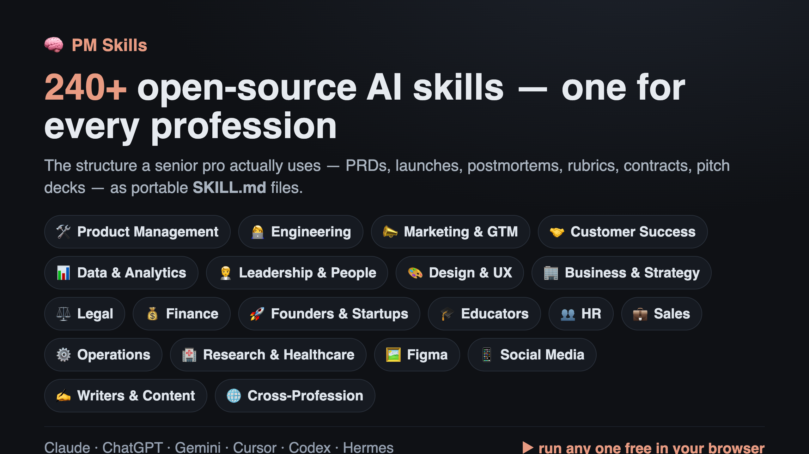

<p align="center">
  <a href="https://mohitagw15856.github.io/pm-claude-skills/">
    
  </a>
</p>

# 🧠 PM Skills — 232 Professional Agent Skills for Claude, ChatGPT, Gemini, Cursor, Codex & Hermes

[](https://github.com/mohitagw15856/pm-claude-skills/stargazers)
[](https://www.npmjs.com/package/pm-claude-skills)
[](https://www.npmjs.com/package/pm-claude-skills)
[](https://pypi.org/project/pm-skills/)
[](https://pypi.org/project/pm-skills/)
[](https://github.com/mohitagw15856/pm-claude-skills#-use-it-anywhere--the-ai-ecosystem)
[](mcp-remote/)
[](https://smithery.ai/servers/mohit15856/pm-skills)
[](https://github.com/mohitagw15856/pm-claude-skills)
[](https://mohitagw15856.github.io/pm-claude-skills/leaderboard.html)
[](agents/)
[](commands/)
[](output-styles/)
[](#-works-with--cross-tool-compatibility)
[](connectors/)
[](.github/workflows/skillcheck.yml)
[](.github/workflows/skill-audit.yml)
[](https://github.com/mohitagw15856/pm-claude-skills/releases)
[](https://github.com/mohitagw15856/pm-claude-skills#-quick-install-2-minutes)
[](LICENSE)
[](https://github.com/sponsors/mohitagw15856)

<p align="center">
  <a href="https://mohitagw15856.github.io/pm-claude-skills/">
    
  </a>
</p>

> **Generic AI gives you filler. These give you the structure a senior pro actually uses** — PRDs, exec updates, launch plans, postmortems, compliance docs — as open-source `SKILL.md` files. **232 skills across 31 bundles, 23 professions.** One source, every AI tool.

### ⭐ If this saves you time, [star the repo](https://github.com/mohitagw15856/pm-claude-skills) — it's the #1 way to help others find it.

## ⚡ Use it in 30 seconds — pick one

| You want to… | Do this |
|---|---|
| **Just try it** (no install) | Open the **[Playground](https://mohitagw15856.github.io/pm-claude-skills/)** → pick a skill → run it in your browser. |
| **Use it in Claude Code / Cursor / Codex** | `npx pm-claude-skills add --agent claude` &nbsp;*(or `cursor`, `codex`, `windsurf`…)* |
| **Have it in every AI session** | `claude mcp add pm-skills -- npx -y pm-claude-skills-mcp` |

*Not sure? Start with the Playground.* This is a **CLI, not a library** — you don't need `npm install`; `npx pm-claude-skills …` always runs the latest. Browse everything with `npx pm-claude-skills list`.

## 👋 New here? Start in 30 seconds

Ask any AI for a PRD or an exec update and you get *generic filler* you rewrite from scratch — it doesn't know what "good" looks like for professional work. Each skill is a battle-tested `SKILL.md` that teaches the AI the real structure and judgement a senior pro uses, so the first draft is one you can *ship*.

**Try these 5 first** — no install, run them in the [Playground](https://mohitagw15856.github.io/pm-claude-skills/):

| Skill | Give it… | Get back… |
|-------|----------|-----------|
| 📊 [Executive Update](skills/executive-update) | messy progress notes | a tight 250-word briefing for your CEO or board |
| 📋 [PRD Template](skills/prd-template) | a vague feature idea | a structured PRD with scope, metrics & risks |
| 🎯 [RICE Prioritisation](skills/rice-prioritisation) | a pile of backlog ideas | a ranked, defensible priority list |
| 🔭 [Competitor Teardown](skills/competitor-teardown) | "what are rivals up to?" | a positioning map, feature gaps & strategy |
| 📝 [Meeting Notes](skills/meeting-notes) | a raw transcript | decisions, owners & next steps |

→ See [**real sample outputs**](https://mohitagw15856.github.io/pm-claude-skills/examples.html) · [browse all 232 skills](#️-all-232-skills) · [one-page cheatsheet](CHEATSHEET.md) · [15-page Practical Guide](web/guide.html)

## 🧠 The Professional Brain — local-first memory for any AI agent

The most novel piece here. Generic AI forgets everything between sessions; the **[Professional Brain](BRAIN.md)** is a plain-markdown `brain/` folder (knowledge · decisions · hypotheses · stakeholders) your AI **reads before answering and writes to after** — grep-able, auditable, Obsidian-compatible, no vector DB. Every fact is provenance-tagged (`[data] [interview] [hunch]…`) so a hunch never poses as a measured result, and the [`action-runner`](skills/action-runner/) turns recommendations into real tickets/messages — dry-run, risk-rated, approval-gated. *Nothing acts silently.*

**→ [Architecture](BRAIN.md) · [5-min Quickstart](BRAIN_QUICKSTART.md) · [try it in the browser](https://mohitagw15856.github.io/pm-claude-skills/brain.html)**

## 🧩 Chain skills into workflows

Individual skills are great; **chaining** them is the superpower. A [**recipe**](WORKFLOWS.md) runs several skills in sequence and passes each output forward as context — a fuzzy idea comes out the other end as a finished, joined-up set of artifacts:

```
/ship-a-feature  →  ambiguity-resolver → prd-template → rice-prioritisation → roadmap-narrative → go-to-market
```

Run a recipe as a slash command or over MCP, build your own visually in the [**Workflow Canvas**](https://mohitagw15856.github.io/pm-claude-skills/canvas.html), or let the [**✨ Auto-Agent**](https://mohitagw15856.github.io/pm-claude-skills/agent.html) plan a chain from a plain-English goal. Curated role bundles (skill loadout + recipe + subagent) live in [**PERSONAS.md**](PERSONAS.md).

## ✅ Eval-verified quality — not just quantity

These aren't invented prompts — each skill encodes a proven method and cites it (RICE, Jobs-to-be-Done, Pyramid Principle, Google SRE, *Obviously Awesome*, AICPA SOC 2…). And it's **measured: 196 of 232 skills are eval-scored, averaging 4.8/5** by an LLM judge on structure, completeness, usefulness & grounding. A [**regression gate**](.github/workflows/skill-pr-check.yml) blocks any PR that drops a score, so quality can't quietly rot.

→ [🏆 Leaderboard](https://mohitagw15856.github.io/pm-claude-skills/leaderboard.html) · [open benchmark](https://mohitagw15856.github.io/pm-claude-skills/benchmark.html) · [case studies](CASE_STUDIES.md) · the Playground's **Compare** toggle runs the same input with vs. without the skill, side by side.

## 🚀 Quick Install (2 minutes)

```bash
# Recommended — installs skills + subagents + commands into your AI tool (Win/macOS/Linux, needs Node):
npx pm-claude-skills add --agent claude     # or: codex · cursor · windsurf · aider · hermes

# One-line MCP — all 232 skills + recipes in every session of any MCP client:
claude mcp add pm-skills -- npx -y pm-claude-skills-mcp

# Or the open `skills` CLI (works across 60+ agents) — browse & pick interactively:
npx skills add mohitagw15856/pm-claude-skills
```

**In Claude Code**, add the marketplace and install by profession:

```
/plugin marketplace add mohitagw15856/pm-claude-skills
claude plugin install pm-essentials@pm-claude-skills      # …or pm-engineering, pm-cs, pm-compliance, pm-growth, pm-ai, etc.
```

⚠️ **You don't need `npm install pm-claude-skills`** — it's a CLI, not a library. Use `npx` (always the latest). Full per-bundle list: [**All Plugin Bundles**](#️-all-232-skills).

## 🌍 Use It Anywhere — the AI Ecosystem

The same 232 skills reach you through every channel — pick whatever fits your stack:

| Channel | Get it |
|---|---|
| 🌐 **Browser playground** | [Run any skill free](https://mohitagw15856.github.io/pm-claude-skills/) with your own **Claude / OpenAI / Gemini / Ollama** key — or a free Gemini key / in-browser model (no key) |
| 📦 **npm** | `npx pm-claude-skills add --agent claude` (or codex · cursor · windsurf · aider · hermes · openclaw) |
| 🐍 **Python / PyPI** | `pip install pm-skills` → `search_skills` / `get_skill` + **LangChain & CrewAI** tools |
| 🧠 **MCP** | `npx -y pm-claude-skills-mcp` (local) or the hosted connector URL for **ChatGPT / Claude.ai / Cursor** — also on [Smithery](https://smithery.ai/servers/mohit15856/pm-skills) & the [MCP registry](server.json) |
| 🖥️ **IDE rules** | Generated exports for **Cursor, Windsurf, Aider, Cline, Continue, Zed, Roo** — [`exports/`](exports/) |
| 🔌 **Integrations** | [n8n](connectors/n8n.md) · [Lovable](connectors/lovable.md) · [Obsidian](connectors/obsidian.md) + a read-only [REST API](mcp-remote/) |
| 🤖 **Agents & answer engines** | [`llms.txt`](https://mohitagw15856.github.io/pm-claude-skills/llms.txt) makes the library discoverable & citable |

## 🔌 Works With — Cross-Tool Compatibility

Each `SKILL.md` is two portable parts — a tiny frontmatter block and a plain-English markdown body — so it works anywhere a capable model reads instructions. **Native `SKILL.md` agents** (Claude Code, Hermes, Codex, OpenClaw) read it as-is and auto-discover skills; **everything else** uses ready-made [exports](exports/) (ChatGPT, Gemini, Cursor, Windsurf, Aider, Cline, Continue, Zed, Roo). There's also a [VS Code extension](vscode-extension/), a [browser extension](extension/), and the [Playground](https://mohitagw15856.github.io/pm-claude-skills/) to run on your own key. Details + the full matrix: **[Works With guide](exports/)**.

## 🤖 Subagents, Slash Commands & Personas

Beyond skills: **subagents** ([`agents/`](agents/)) Claude delegates to (`pm-partner`, `sprint-master`, `cs-guardian`, `launch-captain`), **slash commands** ([`commands/`](commands/): `/prd`, `/rice`, `/sprint-plan`…), and **output-style personas** ([`output-styles/`](output-styles/)). Install everything for Claude Code with `npx pm-claude-skills add --agent claude`.

## 🏷️ Skill Tiers — start with the strongest

Skills are tiered **🟢 Production-Ready · 🔵 Stable · 🟡 Experimental** in [TIERS.md](TIERS.md) and on every skill page, so you know which are battle-tested. New? Start with the production tier.

## 🗂️ All 232 Skills

Browse all 232 across 31 bundles — **[interactive catalog](https://mohitagw15856.github.io/pm-claude-skills/)** · **[full list (SKILLS.md)](SKILLS.md)** · **[plugin bundles](.claude-plugin/marketplace.json)**. Bundles span Product, Engineering (44), Design/Figma, Customer Success, Sales, GTM/Growth, AI/ML, Compliance, Legal, Finance, HR, Founders, Data, Research/Healthcare, Social, Writers, Education, Operations, and more.

## 🤝 Contributing

PRs welcome — add a skill with `npm run new-skill`, follow the [authoring standard](SKILL-AUTHORING-STANDARD.md), and `npx skillcheck` must pass (the eval gate scores it). Easiest path: **[Skill Studio](https://mohitagw15856.github.io/pm-claude-skills/studio.html)** generates a compliant `SKILL.md` and opens a PR in one click. Got an idea? Add it to the [skill request board](SKILL_REQUEST.md). See [CONTRIBUTING.md](CONTRIBUTING.md) · [Code of Conduct](CODE_OF_CONDUCT.md) · [Security](SECURITY.md).

## 📋 Changelog & more

Full per-version history on the **[Releases page](https://github.com/mohitagw15856/pm-claude-skills/releases)** and in [CHANGELOG.md](CHANGELOG.md). Also: [Roadmap](ROADMAP.md) · [Article series](https://medium.com/product-powerhouse).

## ❤️ Sponsor & license

If this helps your work, **[sponsor the project](https://github.com/sponsors/mohitagw15856)** — it funds testing against new models and new skills from community requests. MIT licensed. Built by a PM, used by everyone.

**[⭐ Star the repo](https://github.com/mohitagw15856/pm-claude-skills/stargazers)** so the next person finds it.
