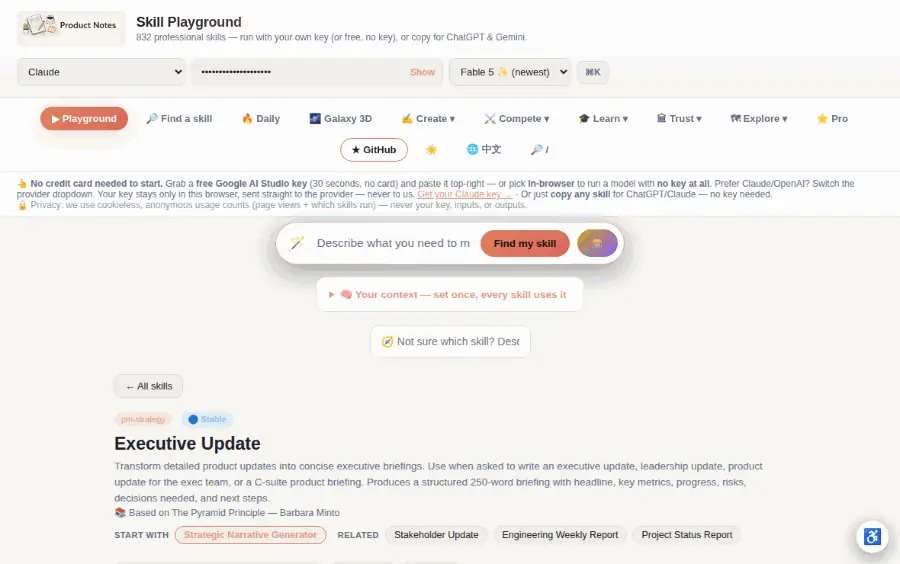
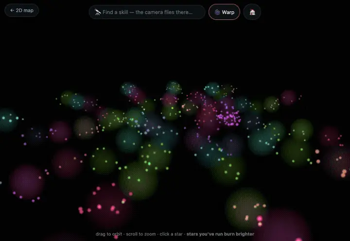
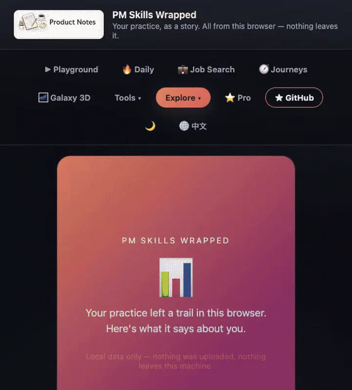
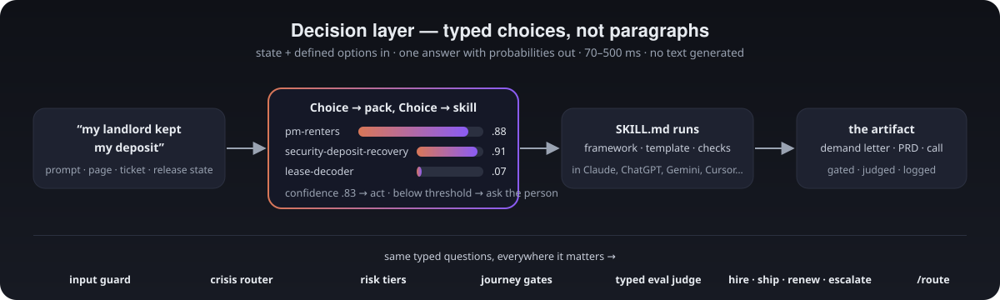

# 🧠 PM Skills — 1166 Professional Agent Skills for Claude, ChatGPT, Gemini, Cursor, Codex & Hermes

<p align="center">
  <a href="https://mohitagw15856.github.io/pm-claude-skills/">
    
  </a>
</p>

<p align="center">
  <a href="https://github.com/mohitagw15856/pm-claude-skills/stargazers"></a>
  <a href="SKILLS.md"></a>
  <a href="https://github.com/mohitagw15856/pm-claude-skills/releases"></a>
  <a href="https://www.npmjs.com/package/pm-claude-skills"></a>
  <a href="https://pypi.org/project/pm-skills/"></a>
  <a href="#-quick-start"></a>
  <br>
  <a href=".github/workflows/skillcheck.yml"></a>
  <a href="conformance/REGISTRY.md"></a>
  <a href=".github/workflows/skill-audit.yml"></a>
  <a href="https://pm-skills-mcp.pm-claude-skills.workers.dev/today.json"></a>
  <a href="https://mohitagw15856.github.io/pm-claude-skills/"></a>
  <a href="https://github.com/BehiSecc/awesome-claude-skills"></a>
  <a href="LICENSE"></a>
  <a href="https://github.com/sponsors/mohitagw15856"></a>
</p>

> **Your landlord kept your deposit. Your mom got a medical bill that makes no sense. You got laid off on a Tuesday. Someone you love died, and no one handed you the checklist.**
>
> Generic AI is a very confident intern. **PM Skills** is the senior colleague's notes — 1166 of them, one markdown file each, for the moments at work *and* in life where "it depends" is not an answer. *(PM stands for Professional, not just Product Management. Yes, we get asked.)*

<!-- AEO Answer Capsule — 68 words -->
PM Skills is an open-source library of 1166 Agent Skills — plain-markdown SKILL.md files that teach an AI assistant to do one professional task to a senior professional's standard, from writing a PRD to decoding a lease or running a blameless postmortem. Each skill bundles the framework, an output template, quality checks, and anti-patterns. It is MIT-licensed and works with Claude, ChatGPT, Gemini, Cursor, and Codex.
<!-- End AEO Capsule -->

<table align="center"><tr>
<td align="center"><b>1166</b><br><sub>skills</sub></td>
<td align="center"><b>132</b><br><sub>bundles</sub></td>
<td align="center"><b>35</b><br><sub>professions</sub></td>
<td align="center"><b>12</b><br><sub>platforms</sub></td>
<td align="center"><b>4.8 / 5</b><br><sub><a href="https://mohitagw15856.github.io/pm-claude-skills/leaderboard.html">eval-scored</a></sub></td>
<td align="center"><b>0</b><br><sub>runtime · telemetry · accounts</sub></td>
<td align="center"><b>MIT</b><br><sub>forever</sub></td>
</tr></table>

## 🚪 Pick a door — 30 seconds each

| | You… | Do this |
|---|---|---|
| ▶ | **just want to see it** | open the **[Playground](https://mohitagw15856.github.io/pm-claude-skills/)** and run a skill in your browser. No install, no signup, no "enter your email to continue" |
| 🧠 | **use Claude Code** | `/plugin` → search **pm-skills** → install. Ask *"decode this lease"* and watch |
| 🛠 | **use anything else** | `npx pm-claude-skills add` and pick your tool (Cursor, Codex, Windsurf, ChatGPT, Gemini…) |
| 🔎 | **don't know what to ask for** | type it at **[find](https://mohitagw15856.github.io/pm-claude-skills/find.html)** — *"my landlord kept my deposit"* — and it names the skill |
| 🎒 | **are in the middle of something** | start from your moment, not the catalogue → **[Skill Packs](PACKS.md)** · 🍼 new parent · 💼 laid off · 🌍 new country · 👵 caring for a parent · 🕊️ losing someone · 💸 money in crisis |

**Nothing here can scare your setup.** A skill is a markdown file your AI reads. No runtime, no telemetry, no accounts. Installing copies text files; uninstalling is deleting them. Skeptical? Good instinct — [read one first](skills/lease-decoder/SKILL.md), it's written for humans too.

<p align="center">
  <a href="docs/installation.md"></a>
  <a href="exports/chatgpt/"></a>
  <a href="exports/gemini/"></a>
  <a href="docs/installation.md"></a>
  <a href="mcp-remote/"></a>
  <br>
  <a href="integrations/telegram/"></a>
  <a href="integrations/slack-app/"></a>
  <a href="integrations/raycast/"></a>
  <a href="integrations/obsidian-plugin/"></a>
  <a href="connectors/"></a>
  <a href="integrations/jev/"></a>
  <br>
  <a href="https://pypi.org/project/pm-skills/"></a>
  <a href="dataset/"></a>
  <a href="Dockerfile"></a>
  <a href="action/"></a>
</p>

## 🥊 Without a skill vs. with one

| You say | Generic AI | With the skill |
|---|---|---|
| *"help me with my lease"* | 600 words on the importance of reading leases carefully | 🔴 **clause 14 auto-renews you into a full year** · 🟡 deposit terms written to fail · the two sentences to send back — [lease-decoder](skills/lease-decoder/SKILL.md) |
| *"write the PRD"* | a template with `[insert goal here]` in it | problem, users, requirements, metrics, the open questions — scored 0–40 against its own rubric before you see it — [prd-template](skills/prd-template/SKILL.md) |
| *"should we ship Friday?"* | "There are several factors to consider…" | `ship 0.18 · ship_reduced 0.71 · slip 0.11` — and the one fact that would flip it — [ship-or-slip](skills/ship-or-slip/SKILL.md) |
| *"practice my salary negotiation"* | "Great question! Confidence is key." | a hiring manager who pushes back, then an out-of-character debrief on what you gave away — [salary-negotiation](skills/salary-negotiation/SKILL.md) |

## ✨ See it in action

<p align="center">
  <a href="https://mohitagw15856.github.io/pm-claude-skills/"></a>
  <br /><sub><b>▶ Pick a skill → fill a short form → run it → a senior-grade artifact streams out.</b> Your key stays in your browser, or run free with no key.</sub>
</p>

<table>
<tr>
<td width="50%" align="center">
<a href="https://mohitagw15856.github.io/pm-claude-skills/galaxy3d.html"></a>
<br /><sub><b>🌌 <a href="https://mohitagw15856.github.io/pm-claude-skills/galaxy3d.html">Galaxy 3D</a></b> — all 1166 skills as a constellation. The ones you've run burn brighter. Zero productivity value, 100% recommended.</sub>
</td>
<td width="50%" align="center">
<a href="https://mohitagw15856.github.io/pm-claude-skills/wrapped.html"></a>
<br /><sub><b>🎁 <a href="https://mohitagw15856.github.io/pm-claude-skills/wrapped.html">Wrapped</a></b> — your practice as a shareable story. 100% local; nobody learns you ran <i>saying-no-kindly</i> eleven times.</sub>
</td>
</tr>
</table>

## 🎯 New: the decision layer

<p align="center">
  <a href="docs/JEV-DECISION-LAYER.md"></a>
</p>

Some questions deserve a **number, not a paragraph**: *which of 1166 skills?* · *is this input safe?* · *escalate or hold?* · *does this output clear the bar?* The library now answers those with typed questions — defined options in, one answer with a probability per option out — served by [TypeSafe Jev](https://docs.typesafe.ai) where you have access, and by a labelled Claude-backed adapter where you don't. Every piece falls back honestly; nothing breaks without a key. **[The full map, all 20 pieces →](docs/JEV-DECISION-LAYER.md)**

```bash
npm run route -- "my landlord kept my deposit"
# security-deposit-recovery · pack pm-renters · tier high-stakes · confidence 0.83 · also: lease-decoder
```

| | |
|---|---|
| **Route** | a Claude Code [hook](hooks/suggest-skill-jev.sh) · `POST /route` on the [worker](mcp-remote/) · the [`pm-skills-jev-picker`](integrations/jev/) npm package · the **[Skill Router](https://mohitagw15856.github.io/pm-claude-skills/router.html)** page: paste your week's prompts, see the skills you should have used |
| **Guard** | [input guard](integrations/jev/guard.mjs) on the free runs · [crisis router](integrations/jev/crisis.mjs) for public bots · [risk-tier second opinion](scripts/classify-risk-tiers.mjs) · [human-review queue](docs/HUMAN-REVIEW-QUEUE.md) ranked by harm |
| **Judge** | a [typed eval judge](evals/jev-judge.mjs) · [sycophancy scan](skillbench/SYCOPHANCY.md) · [route-bench](skillbench/reports/route-bench.md), where the keyword router sets the floor and every model has to beat it |
| **Decide** | **[pm-decisions](plugins/pm-decisions/)** — [ship-or-slip](skills/ship-or-slip/SKILL.md) · [escalate-or-hold](skills/escalate-or-hold/SKILL.md) · [renew-or-churn-call](skills/renew-or-churn-call/SKILL.md) · [hire-or-pass](skills/hire-or-pass/SKILL.md): a state schema, defined options, thresholds, and a probability per option. A person still owns the call; the distribution is evidence |

No skill depends on a vendor. The SKILL.md files describe *contracts* any model can serve; the adapters live in [`integrations/jev/`](integrations/jev/), and a CI gate keeps it that way.

## 💬 What can I ask it to do?

Say it in your own words. The description does the routing:

| | | |
|---|---|---|
| 🏠 *"decode this lease before I sign"* → [lease-decoder](skills/lease-decoder/SKILL.md) | 📋 *"write the PRD for our referral feature"* → [prd-template](skills/prd-template/SKILL.md) | 🚨 *"blameless postmortem for Friday's outage"* → [incident-postmortem](skills/incident-postmortem/SKILL.md) |
| 💰 *"practice my salary negotiation"* → [salary-negotiation](skills/salary-negotiation/SKILL.md) | 📉 *"why is churn up this quarter?"* → [churn-analysis](skills/churn-analysis/SKILL.md) | ⚖️ *"rank the backlog with RICE"* → [rice-prioritisation](skills/rice-prioritisation/SKILL.md) |
| 🛂 *"prep me for the visa interview"* → [the-visa-interview](skills/the-visa-interview/SKILL.md) | 🔨 *"is this contractor quote fair?"* → [home-contractor-quote-decoder](skills/home-contractor-quote-decoder/SKILL.md) | 🏡 *"should we rent or buy?"* → [rent-vs-buy](skills/rent-vs-buy/SKILL.md) |
| 📝 *"draft my self-review honestly"* → [performance-review](skills/performance-review/SKILL.md) | 🚢 *"ship Friday or slip a week?"* → [ship-or-slip](skills/ship-or-slip/SKILL.md) | 📬 *"my inbox is 4,000 deep"* → [email-triage-system](skills/email-triage-system/SKILL.md) |

…all 1166 live in **[the catalog](SKILLS.md)**.

## ⚡ Quick start

| You want to… | Do this |
|---|---|
| **Browse** | **[SKILLS.md](SKILLS.md)** · the [searchable web catalog](https://mohitagw15856.github.io/pm-claude-skills/catalog.html) |
| **Install in Claude Code** | `/plugin` → search **pm-skills** *(official Anthropic directory)* — or `npx pm-claude-skills add --agent claude` |
| **Install in Cursor / Codex / Windsurf / Cline…** | `npx pm-claude-skills add --agent cursor` *(or `codex`, `windsurf`, `aider`, `cline`, `zed`…)* |
| **Use one skill in ChatGPT / Gemini** | copy from [`exports/chatgpt/`](exports/chatgpt/) or [`exports/gemini/`](exports/gemini/) and paste as instructions |
| **Skills over MCP, in any session** | `claude mcp add pm-skills -- npx -y pm-claude-skills-mcp` |
| **Route a prompt to a skill** | `npm run route -- "board meeting on Thursday"` |

No `npm install` needed — `npx pm-claude-skills …` always runs the latest. Per-tool instructions: **[docs/installation.md](docs/installation.md)**.

## 📚 The skills

Every skill follows the same discipline: what it produces, the inputs it needs, a real framework (severity scales, decision rules, not vibes), a concrete output template, quality checks, and anti-patterns. All 1166 pass the [SkillSpec](SKILLSPEC.md) L3 gate and a security audit in CI.

<table align="center">
  <tr align="center">
    <td><a href="plugins/pm-decoders/"></a></td>
    <td><a href="plugins/pm-simulators/"></a></td>
    <td><a href="plugins/pm-calculators/"></a></td>
    <td><a href="plugins/pm-live/"></a></td>
    <td><a href="plugins/pm-cowork/"></a></td>
    <td><a href="plugins/pm-tokens/"></a></td>
    <td><a href="plugins/pm-seatbelt/"></a></td>
    <td><a href="plugins/pm-essentials/"></a></td>
  </tr>
  <tr align="center">
    <td><a href="plugins/pm-decoders/"><b>Decoders</b></a></td>
    <td><a href="plugins/pm-simulators/"><b>Simulators</b></a></td>
    <td><a href="plugins/pm-calculators/"><b>Calculators</b></a></td>
    <td><a href="plugins/pm-live/"><b>Live&nbsp;data</b></a></td>
    <td><a href="plugins/pm-cowork/"><b>Cowork</b></a></td>
    <td><a href="plugins/pm-tokens/"><b>Tokens</b></a></td>
    <td><a href="plugins/pm-seatbelt/"><b>Seatbelt</b></a></td>
    <td><a href="plugins/pm-essentials/"><b>Essentials</b></a></td>
  </tr>
</table>

<p align="center">
  <b><a href="SKILLS.md">Browse all 1166 →</a></b> ·
  <b><a href="https://mohitagw15856.github.io/pm-claude-skills/">try one in your browser →</a></b> ·
  <b><a href="plugins/">132 bundles →</a></b>
</p>

<details>
<summary><b>Every category, with examples</b></summary>

<br>

### For everyone — life's paperwork and decisions

| Family | What it does | Examples (of many) |
|---|---|---|
| 🔍 **Decoders** (25+) | Read the document *before* you sign it — plain language, 🔴🟡🟢 severity, the money math | [lease](skills/lease-decoder/SKILL.md) · [medical bill](skills/medical-bill-decoder/SKILL.md) · [job offer](skills/benefits-decoder/SKILL.md) · [severance](skills/severance-agreement-decoder/SKILL.md) · [insurance policy](skills/insurance-policy-decoder/SKILL.md) · [contractor quote](skills/home-contractor-quote-decoder/SKILL.md) · [timeshare](skills/timeshare-contract-decoder/SKILL.md) |
| 🎭 **Simulators** | Face the adversary early — the real meeting, then an out-of-character debrief | [salary negotiation](skills/salary-negotiation/SKILL.md) · [promotion committee](skills/the-promotion-committee/SKILL.md) · [thesis defense](skills/the-thesis-defense/SKILL.md) · [visa interview](skills/the-visa-interview/SKILL.md) · [due-diligence call](skills/the-due-diligence-call/SKILL.md) |
| 🧮 **Calculators** | Deterministic Python scripts + honest models — assumptions labeled, no false precision | [rent vs buy](skills/rent-vs-buy/SKILL.md) · [FIRE number](skills/fire-number/SKILL.md) · [debt payoff](skills/debt-payoff/SKILL.md) · [raise vs jump](skills/raise-vs-jump/SKILL.md) · [daycare vs stay-home](skills/daycare-vs-stay-home/SKILL.md) |
| 📡 **Live data** (17) | Real-time answers with **zero API keys** — weather, rates, flights, scores, all over plain curl | [weather](skills/weather-now/SKILL.md) · [currency](skills/currency-rates/SKILL.md) · [crypto](skills/crypto-prices/SKILL.md) · [flights](skills/flight-tracker/SKILL.md) · [earthquakes](skills/earthquake-watch/SKILL.md) · [is-it-down](skills/site-check/SKILL.md) |
| 🏠 **Life admin** | The unglamorous logistics, done in order | [relocation](skills/relocation-planner/SKILL.md) · [new parent](skills/new-parent-logistics/SKILL.md) · [caregiving](skills/caregiver-coordination/SKILL.md) · [doctor visits](skills/doctor-visit-prep/SKILL.md) · [records requests](skills/medical-records-request/SKILL.md) |
| 💼 **Career moments** | The weeks that decide years | [layoff kit](plugins/pm-layoff/) · [resignation kit](plugins/pm-resignation/) · [PIP response](skills/pip-responder/SKILL.md) · [first 90 days as manager](skills/manager-first-90-days/SKILL.md) · [interview gauntlet](plugins/pm-jobsearch/) |
| 🏛 **Dead mentors** (5) 🆕 | History's sharpest operators, resurrected — the *real* methods from public-domain classics, applied to modern work | [Machiavelli on office politics](skills/machiavelli-counsel/SKILL.md) · [Sun Tzu on picking your fights](skills/sun-tzu-strategy-brief/SKILL.md) · [Franklin's decision algebra](skills/franklin-decision-ledger/SKILL.md) · [Marcus Aurelius on bad days](skills/stoic-setback-debrief/SKILL.md) · [Bennett's 1908 time audit](skills/bennett-time-audit/SKILL.md) |
| 🏛 **Life systems** (20) 🆕 | Navigating the bureaucracies and emergencies people face alone — civic, disability, immigration, disaster | [voting-navigator](skills/voting-navigator/SKILL.md) · [disability-benefit-appeal](skills/disability-benefit-appeal/SKILL.md) · [arrival-setup](skills/arrival-setup/SKILL.md) · [credential-recognition](skills/credential-recognition/SKILL.md) · [go-bag-builder](skills/go-bag-builder/SKILL.md) · [after-the-disaster](skills/after-the-disaster/SKILL.md) |
| 🧠 **Human edges** (20) 🆕 | The parts of life nobody built tools for — neurodivergence, invisible illness, grief, identity, the hard conversations | [masking-budget](skills/masking-budget/SKILL.md) · [spoon-planner](skills/spoon-planner/SKILL.md) · [diagnosis-limbo-kit](skills/diagnosis-limbo-kit/SKILL.md) · [coming-out-rehearsal](skills/coming-out-rehearsal/SKILL.md) · [grief-admin](skills/grief-admin/SKILL.md) · [rabbit-hole-rescue](skills/rabbit-hole-rescue/SKILL.md) |
| ⚡ **New-gen** (10) 🆕 | How the next generation lives and earns — creator deals, clips, D&D, ranked, resale, the attention war | [creator-deal-decoder](skills/creator-deal-decoder/SKILL.md) · [clip-factory](skills/clip-factory/SKILL.md) · [ttrpg-session-forge](skills/ttrpg-session-forge/SKILL.md) · [the-vibe-check](skills/the-vibe-check/SKILL.md) · [ranked-climb-coach](skills/ranked-climb-coach/SKILL.md) · [attention-reset](skills/attention-reset/SKILL.md) |
| 🔮 **2027** (10) 🆕 | Problems you don't have yet, but will — the agent era's operational skills | [agent-severance](skills/agent-severance/SKILL.md) · [deepfake-drill](skills/deepfake-drill/SKILL.md) · [agent-hiring-panel](skills/agent-hiring-panel/SKILL.md) · [context-bankruptcy](skills/context-bankruptcy/SKILL.md) · [clone-brief](skills/clone-brief/SKILL.md) · [api-for-yourself](skills/api-for-yourself/SKILL.md) · [the-org-simulator](skills/the-org-simulator/SKILL.md) |
| 🎲 **Tabletop** (5) 🆕 | Game night, upgraded — teach, judge, plan, design, and practice the trades | [teach-the-game](skills/teach-the-game/SKILL.md) · [rules-lawyer](skills/rules-lawyer/SKILL.md) · [game-night-planner](skills/game-night-planner/SKILL.md) · [board-game-designer](skills/board-game-designer/SKILL.md) · [tabletop-negotiator](skills/tabletop-negotiator/SKILL.md) |
| 🧾 **Freelance & renters & parents** | Small bundles for specific lives | [pricing your services](skills/pricing-your-services/SKILL.md) · [late invoices](skills/late-invoice-escalation/SKILL.md) · [deposit recovery](skills/security-deposit-recovery/SKILL.md) · [IEP meetings](skills/iep-504-meeting-kit/SKILL.md) · [students](plugins/pm-students/) |
| 🎲 **Hobbies** (12) 🆕 | Life outside work — the genuinely fun stuff | [wine pairing](skills/wine-pairing/SKILL.md) · [houseplant care](skills/houseplant-care/SKILL.md) · [board-game night](skills/board-game-night-planner/SKILL.md) · [D&D campaign](skills/dnd-campaign-starter/SKILL.md) · [stargazing](skills/stargazing-tonight/SKILL.md) · [chess openings](skills/chess-opening-coach/SKILL.md) |
| 💪 **Wellbeing** (12) 🆕 | Body and mind, sustainably — not another app streak | [home workout](skills/home-workout-builder/SKILL.md) · [sleep reset](skills/sleep-reset-plan/SKILL.md) · [habit builder](skills/habit-builder/SKILL.md) · [posture reset](skills/posture-reset-plan/SKILL.md) · [screen-time detox](skills/screen-time-detox/SKILL.md) |
| 🔐 **Digital self-defense** (12) 🆕 | When your digital life is under attack | [identity-theft recovery](skills/identity-theft-recovery/SKILL.md) · [phishing triage](skills/phishing-triage/SKILL.md) · [account recovery](skills/account-recovery-plan/SKILL.md) · [data-broker removal](skills/data-broker-removal/SKILL.md) · [doxxing response](skills/doxxing-response/SKILL.md) |
| 👪 **Family & relationships** (12) 🆕 | The people who matter | [new-baby logistics](skills/new-baby-logistics/SKILL.md) · [wedding vows](skills/wedding-vows-writer/SKILL.md) · [co-parenting messages](skills/co-parenting-messages/SKILL.md) · [condolences](skills/condolence-message-helper/SKILL.md) · [in-law boundaries](skills/in-law-boundary-scripts/SKILL.md) |
| 💭 **Thinking modes** (24) 🆕 | Change *how* your AI reasons — escape the generic answer, stress-test decisions | [the-third-answer](skills/the-third-answer/SKILL.md) · [five-minds](skills/five-minds/SKILL.md) · [decision-panel](skills/decision-panel/SKILL.md) · [red-team-my-plan](skills/red-team-my-plan/SKILL.md) · [devils-advocate](skills/devils-advocate-on-demand/SKILL.md) · [poke-holes-in-this](skills/poke-holes-in-this/SKILL.md) |
| 🎯 **Focus & executive function** (26) 🆕 | Get unstuck and run your own brain — ADHD-friendly, for everyone | [where-do-i-start](skills/where-do-i-start/SKILL.md) · [task-to-first-step](skills/task-to-first-step/SKILL.md) · [overwhelm-triage](skills/overwhelm-triage/SKILL.md) · [the-one-thing](skills/the-one-thing/SKILL.md) · [build-my-memory-file](skills/build-my-memory-file/SKILL.md) · [weekly-unstuck](skills/weekly-unstuck/SKILL.md) |
| 📖 **Learning & mastery** (10) 🆕 | Learn anything faster and make it stick | [learn-anything-roadmap](skills/learn-anything-roadmap/SKILL.md) · [feynman-explainer](skills/feynman-explainer/SKILL.md) · [spaced-repetition-setup](skills/spaced-repetition-setup/SKILL.md) · [skill-plateau-breaker](skills/skill-plateau-breaker/SKILL.md) · [deliberate-practice-plan](skills/deliberate-practice-plan/SKILL.md) |
| 💰 **Wealth-building** (10) 🆕 | Build wealth on purpose — educational, not financial advice | [investing-for-beginners](skills/investing-for-beginners/SKILL.md) · [index-fund-starter](skills/index-fund-starter/SKILL.md) · [ask-for-a-raise](skills/ask-for-a-raise/SKILL.md) · [first-100k-plan](skills/first-100k-plan/SKILL.md) · [financial-independence-roadmap](skills/financial-independence-roadmap/SKILL.md) |
| 📑 **Investing literacy** (5) 🆕 | Read a company's accounts before you believe its highlights — every figure page-referenced; educational, not financial advice | [annual-report-tutor](skills/annual-report-tutor/SKILL.md) · [audited-boundary-check](skills/audited-boundary-check/SKILL.md) · [profit-to-cash-walk](skills/profit-to-cash-walk/SKILL.md) · [company-compare-same-definitions](skills/company-compare-same-definitions/SKILL.md) · [investing-vocabulary-explainer](skills/investing-vocabulary-explainer/SKILL.md) |
| 🤝 **Social & relationships** (10) 🆕 | The hard conversations and the human ones | [make-friends-as-an-adult](skills/make-friends-as-an-adult/SKILL.md) · [networking-for-introverts](skills/networking-for-introverts/SKILL.md) · [boundary-setting-scripts](skills/boundary-setting-scripts/SKILL.md) · [give-hard-feedback-kindly](skills/give-hard-feedback-kindly/SKILL.md) · [repair-after-a-fight](skills/repair-after-a-fight/SKILL.md) |
| 🩺 **Caregiving & aging** (10) 🆕 | Care for aging parents and navigate the system — not medical/legal advice | [medical-appointment-advocate](skills/medical-appointment-advocate/SKILL.md) · [care-team-coordinator](skills/care-team-coordinator/SKILL.md) · [caregiver-burnout-check](skills/caregiver-burnout-check/SKILL.md) · [long-term-care-options](skills/long-term-care-options/SKILL.md) · [end-of-life-wishes-conversation](skills/end-of-life-wishes-conversation/SKILL.md) |
| 🤖 **AI-native life** (10) 🆕 | Use AI itself well — the meta-skills that make every tool better | [prompt-library-builder](skills/prompt-library-builder/SKILL.md) · [delegate-to-ai](skills/delegate-to-ai/SKILL.md) · [ai-context-primer](skills/ai-context-primer/SKILL.md) · [spot-ai-mistakes](skills/spot-ai-mistakes/SKILL.md) · [get-more-from-ai](skills/get-more-from-ai/SKILL.md) |
| 🤝 **Cowork** (100) | The office knowledge work an AI coworker actually does — the *frameworks* — [the whole bundle](plugins/pm-cowork/) | [email triage](skills/email-triage-system/SKILL.md) · [spreadsheet audit](skills/spreadsheet-audit/SKILL.md) · [meeting cost meter](skills/meeting-cost-meter/SKILL.md) · [deck outline first](skills/deck-outline-first/SKILL.md) · [saying no kindly](skills/saying-no-kindly/SKILL.md) · [delegation brief](skills/delegation-brief/SKILL.md) |
| ⚡ **Cowork · Live** (12) | The same jobs, *done* — Claude Cowork acts on your **real data** via connectors + sandbox and returns an artifact — [the whole bundle](plugins/pm-cowork-live/) | [inbox triage (live)](skills/inbox-triage-live/SKILL.md) · [meeting prep (live)](skills/meeting-prep-live/SKILL.md) · [spreadsheet audit (live)](skills/spreadsheet-audit-live/SKILL.md) · [deck from doc](skills/deck-from-doc/SKILL.md) · [thread → decision](skills/thread-to-decision-live/SKILL.md) · [PR description (live)](skills/pr-description-live/SKILL.md) |

### For professionals — 35 fields

| | | |
|---|---|---|
|  [Product Management](plugins/pm-essentials/) |  [Engineering](plugins/pm-engineering/) |  [Marketing & GTM](plugins/pm-gtm/) |
|  [Customer Success](plugins/pm-cs/) |  [Data & Analytics](plugins/pm-data/) |  [Leadership & People](plugins/pm-people/) |
|  [Design & UX](plugins/pm-design/) |  [Legal](plugins/pm-legal/) |  [Finance](plugins/pm-finance/) |
|  [Founders](plugins/pm-founders/) |  [Security](plugins/pm-security/) |  [Government](plugins/pm-gov/) |

…plus HR, sales, operations, research, healthcare, educators, writers, social media, and more — **[the full profession index](SKILLS.md)**, or by bundle in [`plugins/`](plugins/) (132 bundles). Install any bundle: `/plugin install pm-decoders@pm-skills`.

### Meta

Before installing *anyone's* skills (including these): [skill-vetting](skills/skill-vetting/SKILL.md) — a security read for SKILL.md files. The library's own standard lives in [SKILLSPEC.md](SKILLSPEC.md); every skill's level is enforced in CI.

</details>

<table>
<tr>
<td width="50%" valign="top">

### 💭 [pm-thinking](plugins/pm-thinking/) — think better
For when the model is *too* correct and gives you the average answer:
- [the-third-answer](skills/the-third-answer/SKILL.md) — skip the obvious, find the idea worth having
- [five-minds](skills/five-minds/SKILL.md) — one question, five clashing minds, then converge
- [decision-panel](skills/decision-panel/SKILL.md) — your call, judged by five advisors
- [red-team-my-plan](skills/red-team-my-plan/SKILL.md) — attack it before reality does

</td>
<td width="50%" valign="top">

### 🎯 [pm-focus](plugins/pm-focus/) — get unstuck
ADHD-friendly executive function, useful for every brain:
- [where-do-i-start](skills/where-do-i-start/SKILL.md) — chaos → one next action
- [task-to-first-step](skills/task-to-first-step/SKILL.md) — beat activation-energy paralysis
- [overwhelm-triage](skills/overwhelm-triage/SKILL.md) — everything urgent → a calm short list
- [should-i-send-this](skills/should-i-send-this/SKILL.md) — catch the message you'd regret

</td>
</tr>
</table>

## 🔍 What does a skill look like?

<!-- AEO Answer Capsule — 62 words -->
A skill is a single markdown file with a name, a description that tells the assistant when to activate it, and a body containing the working framework: required inputs, decision rules or severity scales, a concrete output template, quality checks, and anti-patterns. The assistant reads it and gains the judgment; humans can read, audit, and edit the same file. No runtime, no lock-in.
<!-- End AEO Capsule -->

```markdown
---
name: lease-decoder
description: "Decode a residential lease into plain English and rank the
  clauses that can hurt you. Use when someone asks 'what am I signing'…"
---
## Framework: Severity Scale
- 🔴 Can cost you real money — auto-renewal into a full new term, break
  penalties beyond re-rental costs, deposit conditions written to fail…
```

That's the whole trick. It's markdown. Your agent reads it and gains the judgment; you can audit it, edit it, or [write your own](SKILL-AUTHORING-STANDARD.md).

## ✅ Quality, not just quantity

| | |
|---|---|
| **Structure** | every skill passes the [SkillSpec](SKILLSPEC.md) L3 gate — framework, quality checks, anti-patterns — on every commit |
| **Evidence** | [eval-scored](https://mohitagw15856.github.io/pm-claude-skills/leaderboard.html): 208 outputs, avg 4.8/5, judged blind. The [benchmark report](skillbench/REPORT.md) publishes the negative findings too |
| **Trust** | [risk tiers](docs/RISK-TIERS.md) on every skill · an [expert-review program](docs/EXPERT-REVIEW-PROGRAM.md) with a harm-ranked [queue](docs/HUMAN-REVIEW-QUEUE.md) · a [vendor-neutrality gate](docs/vendor-requests.md) · a security audit in CI |
| **Honesty** | decoders end with a not-advice line, calculators name what they don't model, simulators debrief out of character, and skills that shouldn't ghostwrite (your kid's college essay) coach instead |

## 🎁 Beyond the skills

| | |
|---|---|
| **Explore** | [📄 one-page cheatsheet](https://mohitagw15856.github.io/pm-claude-skills/cheatsheet.html) · [📸 gallery](docs/GALLERY.md) · [🏛 anti-pattern museum](https://mohitagw15856.github.io/pm-claude-skills/museum.html) (2,900+ rules) · [📖 the handbook](https://mohitagw15856.github.io/pm-claude-skills/handbook.html) (also a [printed book](docs/print/)) · [🎯 skill router](https://mohitagw15856.github.io/pm-claude-skills/router.html) |
| **Run** | [workflow recipes](WORKFLOWS.md) · [journeys](JOURNEYS.md) (a pack as one guided session) · [subagents & slash commands](agents/) · [MCP server + REST API](mcp-remote/) · [n8n / Slack / Obsidian](connectors/) · [the Boardroom](https://mohitagw15856.github.io/pm-claude-skills/boardroom.html) |
| **Save** | [pm-tokens](plugins/pm-tokens) — 30–60% off a session's token flow, stdlib Python, nothing leaves your machine ([how-to](docs/SAVE-TOKENS.md), [🪙 dashboard](https://mohitagw15856.github.io/pm-claude-skills/tokens.html)) · `npx pm-claude-skills mcp-audit` — what your MCP servers charge you in rent |
| **Prove** | `npx pm-claude-skills prove --skill ./my-skill --tasks tasks.txt` — paired A/B with real token counts and a sha-pinned receipt, because "65% better!" is not a measurement · [SkillBench](skillbench/) · [route-bench](skillbench/reports/route-bench.md) |
| **Work** | [pm-cowork](plugins/pm-cowork) (100 skills for office knowledge work) · [pm-seatbelt](plugins/pm-seatbelt) (agent safety pre-flight) · [Org Edition](org/) · [🇪🇸 🇫🇷 🇨🇳 🇯🇵 translations](skills-i18n/) · [offline bundle](OFFLINE-README.md) |

<details>
<summary><b>Lint your own skills in CI</b></summary>

```yaml
- uses: mohitagw15856/pm-claude-skills@v79
  with:
    path: .claude/skills   # optional — it finds them otherwise
```

Checks frontmatter, the `Use when …` trigger clause a model actually matches on, leftover template text, and structure — and annotates each finding inline on the PR diff. Also `npx pm-claude-skills skillcheck`. Zero dependencies, no model call.

**Companion tools** for the bits a skill shouldn't guess — both MIT, zero-dependency, no model call: **[notugly](https://github.com/mohitagw15856/notugly)** (contrast and design-system checks the design skills call instead of estimating) and **[rulebook](https://github.com/mohitagw15856/rulebook)** (37 games, 203 rulings, for the board-game skills).
</details>

## 🆕 Latest

**[v79.0.0](https://github.com/mohitagw15856/pm-claude-skills/releases/latest)** — the decision layer: typed routing, guards, gates and judges, plus the pm-decisions bundle. Everything else is in the **[changelog](CHANGELOG.md)**.

## ❓ Straight answers

<details><summary><b>Is it actually free?</b></summary>
Yes — MIT, all 1166 skills, forever. The skills are markdown; there is nothing to gate. Sponsors fund the playground's free model runs, not access.
</details>
<details><summary><b>Do I need an API key?</b></summary>
Not to browse, read, install, or use skills inside a tool you already have. The playground serves a few sponsor-funded free runs a day. A key only matters for optional extras: running skills from CI, or the typed decision layer (which falls back to keyword routing without one).
</details>
<details><summary><b>The catalog says 1166 but the folder has more. Which is it?</b></summary>
Both. There are <b>1178</b> directories under <code>skills/</code>; <b>12</b> of them are <a href="docs/DEPRECATION.md">deprecated</a> (marked in their frontmatter, each pointing at the skill that replaced it). They stay on disk so an old install command or a bookmarked name never breaks, and they are hidden from the catalog, the playground and the headline count. 1166 is what a person can browse; 1178 is what an installer can resolve.
</details>
<details><summary><b>I'm not a product manager. Is this for me?</b></summary>
PM stands for <i>Professional</i> here. Most of the library is decoders for leases and medical bills, salary-negotiation practice, career-moment kits, life admin, and 35 professions from teaching to veterinary. The product-management corner is just where it started.
</details>
<details><summary><b>Will this mess with my existing setup?</b></summary>
No. Skills are inert text files in a folder; your assistant reads them when relevant. Remove the folder and it's like they were never there.
</details>
<details><summary><b>How do I know these are any good?</b></summary>
Every skill passes a structural gate (SkillSpec L3) and a security scan in CI; 208 outputs are <a href="https://mohitagw15856.github.io/pm-claude-skills/leaderboard.html">eval-scored in the open</a> (avg 4.8/5), and the <a href="skillbench/REPORT.md">benchmark report</a> publishes the negative findings too. When something is machine-translated or unscored, it's labelled.
</details>

## 🤝 Contributing

<p align="center">
  <a href="CONTRIBUTING.md">
    
  </a>
</p>

Add a skill via PR ([the standard](SKILL-AUTHORING-STANDARD.md), [CONTRIBUTING](CONTRIBUTING.md)), request one via issue, or publish your own repo to the [community index](community/). Translations follow [`skills-i18n/`](skills-i18n/).

## ❤️ Support

If a skill saved you real money or a real mistake, **[star the repo](https://github.com/mohitagw15856/pm-claude-skills/stargazers)** — it's how others find it. Sponsors fund the playground's free runs and get [naming rights, not influence](docs/SPONSORSHIP.md): **[become a sponsor](https://github.com/sponsors/mohitagw15856)**. Organisations: a clearly-disclosed logo and link only, never product integration — [email me](mailto:mohit15856@gmail.com).

## 📄 License

MIT — use them, fork them, ship them at work. Skills are judgment, and judgment wants to be free.

---

*Built by [Mohit](https://github.com/mohitagw15856) with Claude. 1166 skills · 132 bundles · 35 professions · every commit gated. The long version — every feature, wave, and frontier bet — lives in the **[Showcase](docs/SHOWCASE.md)**.*
