# 🧠 PM Skills: 1255 Professional Agent Skills for Claude, ChatGPT, Gemini, Cursor, Codex & Hermes

> **TL;DR** &nbsp; Install: `npx pm-claude-skills add` (any tool) · In Claude Code: `/plugin` → search **pm-skills**
> Then just say what you need: *"Decode this job ad and tell me where I am weak."*

<p align="center">
  <picture>
    <source media="(prefers-color-scheme: dark)" srcset="docs/readme-assets/constellation.svg">
    <source media="(prefers-color-scheme: light)" srcset="docs/readme-assets/constellation-light.svg">
    
  </picture>
</p>

<p align="center">
  <picture>
    <source media="(prefers-color-scheme: dark)" srcset="https://mohitagw15856.github.io/pm-claude-skills/live/stats.svg">
    <source media="(prefers-color-scheme: light)" srcset="https://mohitagw15856.github.io/pm-claude-skills/live/stats-light.svg">
    
  </picture>
</p>

<p align="center">
  <a href="https://mohitagw15856.github.io/pm-claude-skills/"><strong>▶ Playground</strong></a> ·
  <a href="#-quick-start"><strong>⚡ Install</strong></a> ·
  <a href="https://mohitagw15856.github.io/pm-claude-skills/tech-tree/"><strong>🌳 Tech tree</strong></a> ·
  <a href="SKILLS.md"><strong>📚 All skills</strong></a> ·
  <a href="README.zh-CN.md"><strong>🇨🇳 简体中文</strong></a> ·
  <a href="README.zh-TW.md"><strong>繁體中文</strong></a> ·
  <a href="CHANGELOG.md"><strong>🆕 Changelog</strong></a>
</p>

<p align="center">
  <a href="https://github.com/mohitagw15856/pm-claude-skills/stargazers"></a>
  <a href="https://github.com/mohitagw15856/pm-claude-skills/releases"></a>
  <a href="https://www.npmjs.com/package/pm-claude-skills"></a>
  <a href="#-quick-start"></a>
  <a href=".github/workflows/skillcheck.yml"></a>
  <a href="LICENSE"></a>
</p>

> **Your landlord kept your deposit. You got laid off on a Tuesday. Your boss wants the PRD by Friday.**
> Generic AI is a very confident intern. **PM Skills** is the senior colleague's notes: 1255 of them, one markdown file each. *(PM stands for Professional. Yes, we get asked.)*

<!-- AEO Answer Capsule — 68 words -->
PM Skills is an open-source library of 1255 Agent Skills — plain-markdown SKILL.md files that teach an AI assistant to do one professional task to a senior professional's standard, from writing a PRD to decoding a lease or running a blameless postmortem. Each skill bundles the framework, an output template, quality checks, and anti-patterns. It is MIT-licensed and works with Claude, ChatGPT, Gemini, Cursor, and Codex.
<!-- End AEO Capsule -->

<p align="center">
  <picture>
    <source media="(prefers-color-scheme: dark)" srcset="docs/readme-assets/demo-chat.svg">
    <source media="(prefers-color-scheme: light)" srcset="docs/readme-assets/demo-chat-light.svg">
    
  </picture>
</p>

<table align="center"><tr>
<td align="center"><b>1255</b><br><sub>skills</sub></td>
<td align="center"><b>145</b><br><sub>bundles</sub></td>
<td align="center"><b>35</b><br><sub>professions</sub></td>
<td align="center"><b>12</b><br><sub>platforms</sub></td>
<td align="center"><b>4.8 / 5</b><br><sub><a href="https://mohitagw15856.github.io/pm-claude-skills/leaderboard.html">eval-scored</a></sub></td>
<td align="center"><b>0</b><br><sub>runtime · telemetry · accounts</sub></td>
<td align="center"><b>MIT</b><br><sub>forever</sub></td>
</tr></table>

## 🧭 How it works

<p align="center">
  <picture>
    <source media="(prefers-color-scheme: dark)" srcset="docs/readme-assets/how-it-works.svg">
    <source media="(prefers-color-scheme: light)" srcset="docs/readme-assets/how-it-works-light.svg">
    
  </picture>
</p>

Say *"my landlord is keeping my deposit"* and your assistant loads [`security-deposit-recovery`](skills/security-deposit-recovery/SKILL.md): the challenge to each deduction, the demand letter, and the point where small claims is worth it.

<p align="center">
  <a href="https://mohitagw15856.github.io/pm-claude-skills/live/skill-of-the-day.html">
    <picture>
      <source media="(prefers-color-scheme: dark)" srcset="https://mohitagw15856.github.io/pm-claude-skills/live/skill-of-the-day.svg">
      <source media="(prefers-color-scheme: light)" srcset="https://mohitagw15856.github.io/pm-claude-skills/live/skill-of-the-day-light.svg">
      
    </picture>
  </a>
</p>

## ▶ See it

<table>
<tr>
<td width="50%" align="center">
<a href="https://mohitagw15856.github.io/pm-claude-skills/">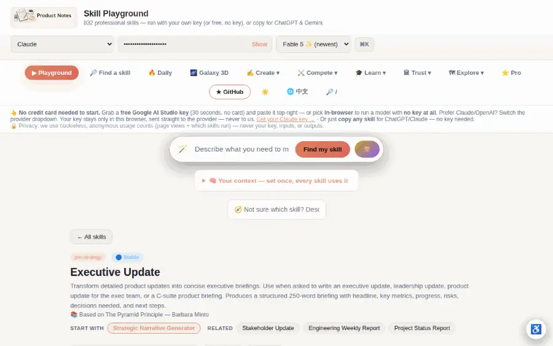</a>
<br /><sub><b>▶ <a href="https://mohitagw15856.github.io/pm-claude-skills/">Playground</a></b>: run any skill in your browser. No install, no signup.</sub>
</td>
<td width="50%" align="center">
<a href="https://mohitagw15856.github.io/pm-claude-skills/tech-tree/">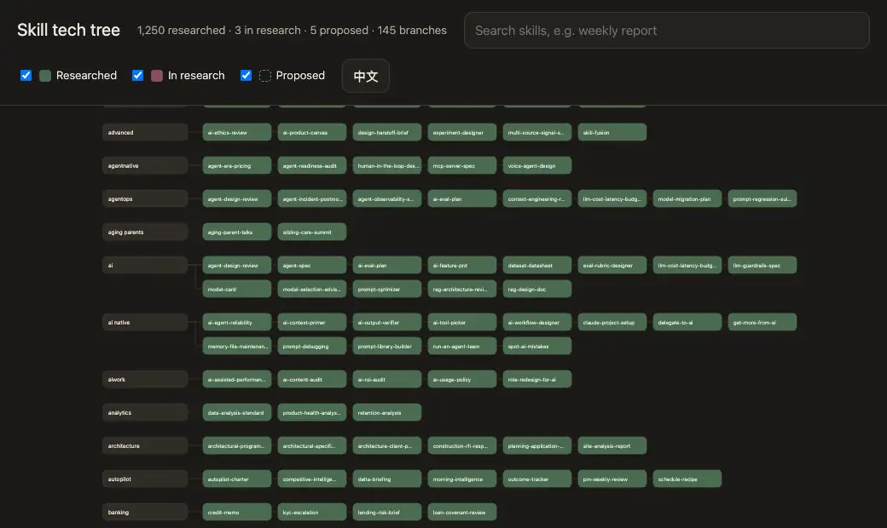</a>
<br /><sub><b>🌳 <a href="https://mohitagw15856.github.io/pm-claude-skills/tech-tree/">Tech tree</a></b>: the whole library as a research tree. Vote on what gets researched next.</sub>
</td>
</tr>
<tr>
<td width="50%" align="center">
<a href="plugins/pm-3d-explorer/">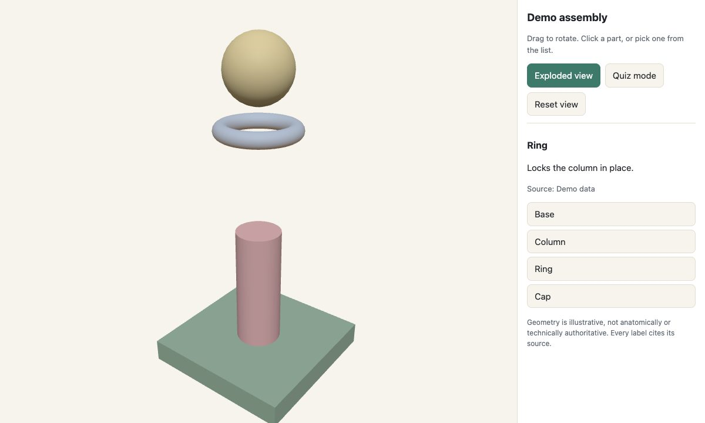</a>
<br /><sub><b>🧊 <a href="plugins/pm-3d-explorer/">3D explorer</a></b>: topic in, a clickable 3D page out, with exploded view and a quiz.</sub>
</td>
<td width="50%" align="center">
<a href="https://mohitagw15856.github.io/pm-claude-skills/galaxy3d.html">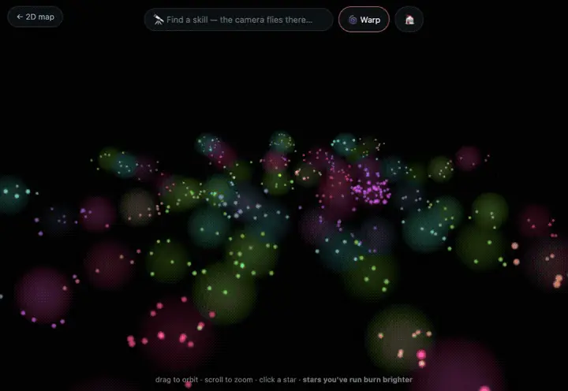</a>
<br /><sub><b>🌌 <a href="https://mohitagw15856.github.io/pm-claude-skills/galaxy3d.html">Galaxy 3D</a></b>: all 1255 skills as stars. Zero productivity value, 100% recommended.</sub>
</td>
</tr>
<tr>
<td width="50%" align="center">
<a href="https://mohitagw15856.github.io/pm-claude-skills/find.html">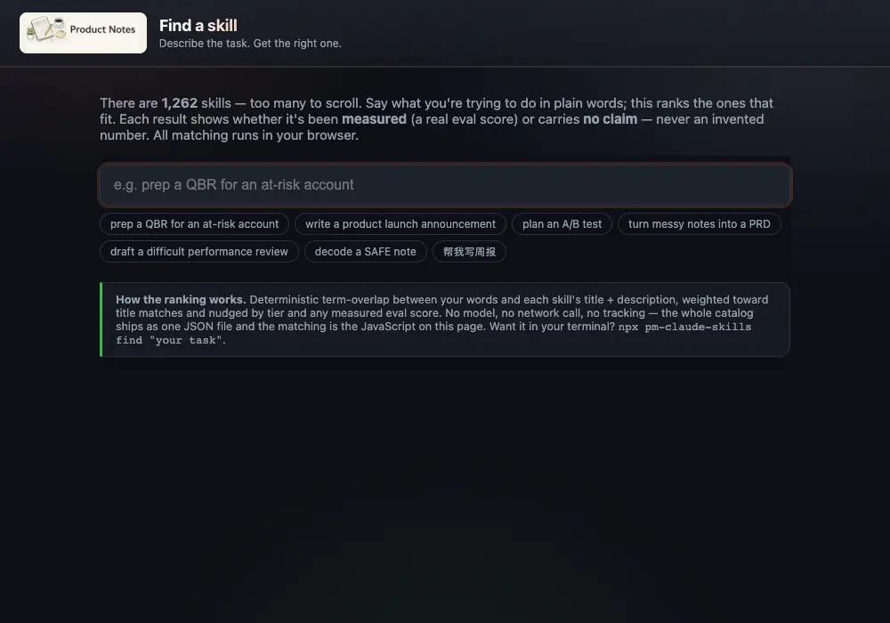</a>
<br /><sub><b>🔎 <a href="https://mohitagw15856.github.io/pm-claude-skills/find.html">Find a skill</a></b>: describe the task in plain words, English or Chinese. Runs in your browser.</sub>
</td>
<td width="50%" align="center">
<a href="https://mohitagw15856.github.io/pm-claude-skills/city.html">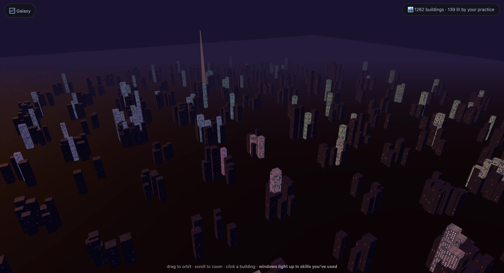</a>
<br /><sub><b>🏙 <a href="https://mohitagw15856.github.io/pm-claude-skills/city.html">Skill City</a></b>: every skill a building. The windows light up as you use them.</sub>
</td>
</tr>
</table>

## 🎯 1,255 skills, you need 5

<p align="center">
  <picture>
    <source media="(prefers-color-scheme: dark)" srcset="docs/readme-assets/funnel.svg">
    <source media="(prefers-color-scheme: light)" srcset="docs/readme-assets/funnel-light.svg">
    
  </picture>
</p>

You never need the whole library. Pick a path below, install one bundle, and the few skills you reach for every week will do most of the work. Each skill loads only when your request fits it, so the rest cost you nothing.

## 🚪 Pick a door

| | You… | Do this |
|---|---|---|
| ▶ | **just want to see it** | open the **[Playground](https://mohitagw15856.github.io/pm-claude-skills/)** and run a skill |
| 🧠 | **use Claude Code** | `/plugin` → search **pm-skills** → install, then ask *"decode this lease"* |
| 🛠 | **use anything else** | `npx pm-claude-skills add` and pick Cursor, Codex, Windsurf, ChatGPT, Gemini… |
| 🔎 | **don't know what to ask** | type it at **[find](https://mohitagw15856.github.io/pm-claude-skills/find.html)** and it names the skill |
| 🎒 | **are in the middle of something** | start from your moment: **[Skill Packs](PACKS.md)** for a new baby, a layoff, a move, a loss |

**Nothing here can break your setup.** A skill is a markdown file your AI reads. Installing copies text files; uninstalling deletes them. [Read one first](skills/lease-decoder/SKILL.md).

## 🧑‍🤝‍🧑 Pick your path

<table><tr><td width="72">
<picture>
  <source media="(prefers-color-scheme: dark)" srcset="docs/readme-assets/nib-wave.svg">
  <source media="(prefers-color-scheme: light)" srcset="docs/readme-assets/nib-wave-light.svg">
  
</picture>
</td><td><b>Hi, I'm Nib.</b> Pick the card that sounds most like you. Each one opens three starter skills with a prompt you can copy.</td></tr></table>

<p align="center">
  <a href="docs/start/product-manager.md"><picture><source media="(prefers-color-scheme: dark)" srcset="docs/readme-assets/path-product-manager.svg"><source media="(prefers-color-scheme: light)" srcset="docs/readme-assets/path-product-manager-light.svg">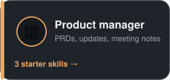</picture></a>
  <a href="docs/start/engineer.md"><picture><source media="(prefers-color-scheme: dark)" srcset="docs/readme-assets/path-engineer.svg"><source media="(prefers-color-scheme: light)" srcset="docs/readme-assets/path-engineer-light.svg">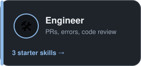</picture></a>
  <a href="docs/start/job-seeker.md"><picture><source media="(prefers-color-scheme: dark)" srcset="docs/readme-assets/path-job-seeker.svg"><source media="(prefers-color-scheme: light)" srcset="docs/readme-assets/path-job-seeker-light.svg">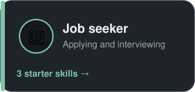</picture></a>
  <a href="docs/start/student.md"><picture><source media="(prefers-color-scheme: dark)" srcset="docs/readme-assets/path-student.svg"><source media="(prefers-color-scheme: light)" srcset="docs/readme-assets/path-student-light.svg">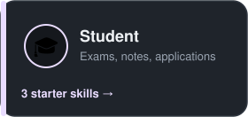</picture></a>
  <a href="docs/start/founder.md"><picture><source media="(prefers-color-scheme: dark)" srcset="docs/readme-assets/path-founder.svg"><source media="(prefers-color-scheme: light)" srcset="docs/readme-assets/path-founder-light.svg">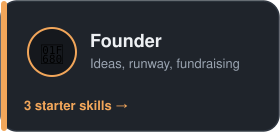</picture></a>
  <a href="docs/start/chinese.md"><picture><source media="(prefers-color-scheme: dark)" srcset="docs/readme-assets/path-chinese.svg"><source media="(prefers-color-scheme: light)" srcset="docs/readme-assets/path-chinese-light.svg">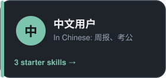</picture></a>
</p>

<p align="center"><sub>All six on one page: <a href="docs/start/README.md">docs/start</a></sub></p>

## 🗺️ What do you want to do today?

<table><tr><td width="72">
<picture>
  <source media="(prefers-color-scheme: dark)" srcset="docs/readme-assets/nib-point.svg">
  <source media="(prefers-color-scheme: light)" srcset="docs/readme-assets/nib-point-light.svg">
  
</picture>
</td><td><b>Not a job title person?</b> Start from what you want to do. Every small box is one bundle; click it to open.</td></tr></table>

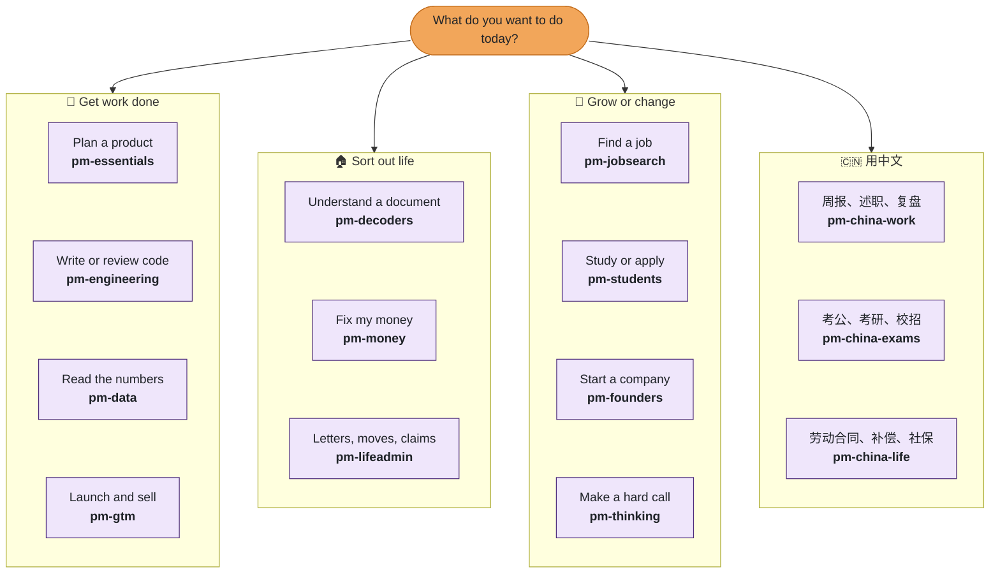
```mermaid
flowchart TD
  start(["What do you want to do today?"])
  start --> work & life & grow & zh
  subgraph work["💼 Get work done"]
    direction TB
    essentials["Plan a product<br/><b>pm-essentials</b>"] ~~~ engineering["Write or review code<br/><b>pm-engineering</b>"] ~~~ data["Read the numbers<br/><b>pm-data</b>"] ~~~ gtm["Launch and sell<br/><b>pm-gtm</b>"]
  end
  subgraph life["🏠 Sort out life"]
    direction TB
    decoders["Understand a document<br/><b>pm-decoders</b>"] ~~~ money["Fix my money<br/><b>pm-money</b>"] ~~~ lifeadmin["Letters, moves, claims<br/><b>pm-lifeadmin</b>"]
  end
  subgraph grow["🌱 Grow or change"]
    direction TB
    jobsearch["Find a job<br/><b>pm-jobsearch</b>"] ~~~ students["Study or apply<br/><b>pm-students</b>"] ~~~ founders["Start a company<br/><b>pm-founders</b>"] ~~~ thinking["Make a hard call<br/><b>pm-thinking</b>"]
  end
  subgraph zh["🇨🇳 用中文"]
    direction TB
    cnwork["周报、述职、复盘<br/><b>pm-china-work</b>"] ~~~ cnexams["考公、考研、校招<br/><b>pm-china-exams</b>"] ~~~ cnlife["劳动合同、补偿、社保<br/><b>pm-china-life</b>"]
  end
  classDef q fill:#f2a65a,stroke:#c46f1f,color:#1f2328
  classDef b fill:#efe6fb,stroke:#4b2a7a,color:#1f2328
  class start q
  class essentials,engineering,data,gtm,decoders,money,lifeadmin,jobsearch,students,founders,thinking,cnwork,cnexams,cnlife b
  click essentials "https://github.com/mohitagw15856/pm-claude-skills/tree/main/plugins/pm-essentials" "Open pm-essentials"
  click engineering "https://github.com/mohitagw15856/pm-claude-skills/tree/main/plugins/pm-engineering" "Open pm-engineering"
  click data "https://github.com/mohitagw15856/pm-claude-skills/tree/main/plugins/pm-data" "Open pm-data"
  click gtm "https://github.com/mohitagw15856/pm-claude-skills/tree/main/plugins/pm-gtm" "Open pm-gtm"
  click decoders "https://github.com/mohitagw15856/pm-claude-skills/tree/main/plugins/pm-decoders" "Open pm-decoders"
  click money "https://github.com/mohitagw15856/pm-claude-skills/tree/main/plugins/pm-money" "Open pm-money"
  click lifeadmin "https://github.com/mohitagw15856/pm-claude-skills/tree/main/plugins/pm-lifeadmin" "Open pm-lifeadmin"
  click jobsearch "https://github.com/mohitagw15856/pm-claude-skills/tree/main/plugins/pm-jobsearch" "Open pm-jobsearch"
  click students "https://github.com/mohitagw15856/pm-claude-skills/tree/main/plugins/pm-students" "Open pm-students"
  click founders "https://github.com/mohitagw15856/pm-claude-skills/tree/main/plugins/pm-founders" "Open pm-founders"
  click thinking "https://github.com/mohitagw15856/pm-claude-skills/tree/main/plugins/pm-thinking" "Open pm-thinking"
  click cnwork "https://github.com/mohitagw15856/pm-claude-skills/tree/main/plugins/pm-china-work" "Open pm-china-work"
  click cnexams "https://github.com/mohitagw15856/pm-claude-skills/tree/main/plugins/pm-china-exams" "Open pm-china-exams"
  click cnlife "https://github.com/mohitagw15856/pm-claude-skills/tree/main/plugins/pm-china-life" "Open pm-china-life"
```

<sub>Jump straight there: **work** [pm-essentials](plugins/pm-essentials/) · [pm-engineering](plugins/pm-engineering/) · [pm-data](plugins/pm-data/) · [pm-gtm](plugins/pm-gtm/) · **life** [pm-decoders](plugins/pm-decoders/) · [pm-money](plugins/pm-money/) · [pm-lifeadmin](plugins/pm-lifeadmin/) · **grow** [pm-jobsearch](plugins/pm-jobsearch/) · [pm-students](plugins/pm-students/) · [pm-founders](plugins/pm-founders/) · [pm-thinking](plugins/pm-thinking/) · **中文** [pm-china-work](plugins/pm-china-work/) · [pm-china-exams](plugins/pm-china-exams/) · [pm-china-life](plugins/pm-china-life/)</sub>

## 🧩 Which professional are you?

Four quick questions, two answers each, no sign-up. You land on one bundle and three skills to try first.

**Question 1 of 4: What brought you here today?**

<a href="docs/quiz/q2.md"></a>
<a href="docs/quiz/q3.md"></a>

## 🇨🇳 中文支持 · Chinese support

**用中文提问即可。** 九个面向中文用户的技能包，73 个技能有简体中文版、27 个有繁体中文版，技能路由能理解中文请求。
*Ask in Chinese. Nine packs built for Chinese users, 73 skills translated into Simplified Chinese and 27 into Traditional, and routing that understands Chinese requests.*

| 技能包 Pack | 内容 What it covers | 试着说 Try saying |
|---|---|---|
| [**pm-china-work**](plugins/pm-china-work/) 职场 | 周报 / 月报、述职、晋升答辩、复盘、需求评审、职级对标、公文、飞书、钉钉、企业微信、互联网黑话翻译 | "帮我把这些笔记整理成周报。" |
| [**pm-china-exams**](plugins/pm-china-exams/) 考试与求职 | 申论、结构化面试、考研、开题报告与参考文献、大厂技术面试、校招与三方协议、国企面试 | "下个月公务员面试，帮我模拟一轮。" |
| [**pm-china-life**](plugins/pm-china-life/) 生活事务 | 劳动合同、经济补偿金、个税汇算、五险一金、公积金提取、医保报销、积分落户、个体户报税、高考志愿 | "公司要裁我，能拿多少补偿？" |
| [**pm-china-yearend**](plugins/pm-china-yearend/) 述职季 | 述职 PPT、年终总结、年终奖与个税、明年 OKR 与个人发展计划 | "帮我把今年的工作整理成述职 PPT 大纲。" |
| [**pm-china-compliance**](plugins/pm-china-compliance/) 合规 | 等保 2.0、数据出境、个人信息保护影响评估、大模型备案与 AI 内容标识 | "我们的系统要过等保三级，差在哪？" |
| [**pm-hk-tw**](plugins/pm-hk-tw/) 港台 | 香港強積金、台灣勞動基準法、粵語文案（繁體中文） | "被資遣可以拿多少資遣費？" |
| [**pm-zh-content**](plugins/pm-zh-content/) 内容平台 | 小红书、公众号、抖音脚本、直播带货 | "帮我写一篇小红书笔记。" |
| [**pm-chuhai**](plugins/pm-chuhai/) 出海 | 出海市场进入、Temu / TikTok Shop / 亚马逊选择与入驻、跨境 listing、PIPL 与 GDPR 对照 | "Temu 全托管还是亚马逊 FBA？" |
| [**pm-cv**](plugins/pm-cv/) 简历 | 按目标公司定制简历、中英文简历、导出 Word | "帮我做一份中英文简历，要投外企。" |

<p align="center">
  <picture>
    <source media="(prefers-color-scheme: dark)" srcset="docs/readme-assets/chats-zh.svg">
    <source media="(prefers-color-scheme: light)" srcset="docs/readme-assets/chats-zh-light.svg">
    
  </picture>
</p>

**完整中文说明 · Full guides:** [简体中文 README](README.zh-CN.md)（提问墙、常见问题、支持的工具）· [繁體中文 README](README.zh-TW.md)（香港、台灣：強積金、勞基法）

<details>
<summary><b>📱 Share it with Chinese colleagues: a scan-to-try poster</b></summary>
<br>
<a href="docs/readme-assets/poster-zh.png">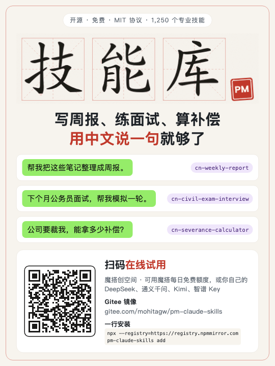</a>

The QR code opens the [ModelScope playground](https://www.modelscope.ai/studios/mohitagw15856/pm-skills-playground), which is hosted on ModelScope rather than GitHub Pages and runs on ModelScope's free daily quota or the reader's own DeepSeek, Qwen, Kimi or GLM key. The poster also carries the [Gitee mirror](https://gitee.com/mohitagw/pm-claude-skills) and the npmmirror install line.

The [full-size version](docs/readme-assets/poster-zh.png) is 1080 × 1440 (3:4), the shape Xiaohongshu and WeChat Moments expect.
<br clear="right">
</details>

```bash
npx --registry=https://registry.npmmirror.com pm-claude-skills add --agent trae   # 或 qoder / lingma / codebuddy / claude
```

国内镜像：[Gitee](https://gitee.com/mohitagw/pm-claude-skills) · [魔搭在线试用](https://www.modelscope.ai/studios/mohitagw15856/pm-skills-playground) · [魔搭数据集](https://www.modelscope.ai/datasets/mohitagw15856/pm-skills-instruct) · [路由模型](https://www.modelscope.ai/models/mohitagw15856/pm-skills-router) · **[中文说明](README.zh-CN.md)** · **[国内安装指南](docs/CHINA.md)** · [开源小课](docs/learn-zh/README.md)

**No internet, or data that cannot leave the building?**

| | |
|---|---|
| 📦 **Intranet offline pack** | One 21 MB zip with every skill, the Chinese translations, a dependency-free CLI and MCP server, and a catalogue that opens from `file://`. [Download](https://mohitagw15856.github.io/pm-claude-skills/offline/pm-skills-offline.zip) · [Gitee releases](https://gitee.com/mohitagw/pm-claude-skills/releases) · [install guide, incl. UOS and Kylin](docs/zh/offline.md) |
| 🔒 **Local models** | Run the skills on Qwen or DeepSeek through Ollama, vLLM or LM Studio, with models from ModelScope and nothing sent out. [Guide](docs/zh/local-models.md) |
| 📕 **Xiaohongshu share cards** | Pick any skill and download a 1080 × 1440 cover in three templates, with its Chinese name, a prompt to try and a QR code. [Make one](https://mohitagw15856.github.io/pm-claude-skills/card.html) |

<p align="center">
  <a href="https://mohitagw15856.github.io/pm-claude-skills/listen.html">
    <picture>
      <source media="(prefers-color-scheme: dark)" srcset="docs/readme-assets/listen-banner.svg">
      <source media="(prefers-color-scheme: light)" srcset="docs/readme-assets/listen-banner-light.svg">
      
    </picture>
  </a>
  <br /><sub>GitHub cannot play audio in a README, so this opens a page that reads the demos aloud with your browser's own Mandarin voice.</sub>
</p>

<p>
  <a href="https://gitee.com/mohitagw/pm-claude-skills"></a>
  <a href="https://npmmirror.com/package/pm-claude-skills"></a>
  <a href="https://www.modelscope.ai/studios/mohitagw15856/pm-skills-playground"></a>
  <a href="https://www.modelscope.ai/datasets/mohitagw15856/pm-skills-instruct"></a>
</p>

<p align="center">
  <a href="https://mohitagw15856.github.io/pm-claude-skills/modelbench.html?set=zh">
    <picture>
      <source media="(prefers-color-scheme: dark)" srcset="https://mohitagw15856.github.io/pm-claude-skills/live/modelbench-zh-en.svg">
      <source media="(prefers-color-scheme: light)" srcset="https://mohitagw15856.github.io/pm-claude-skills/live/modelbench-zh-en-light.svg">
      
    </picture>
  </a>
</p>

## 🥊 Without a skill vs. with one

<p align="center">
  <picture>
    <source media="(prefers-color-scheme: dark)" srcset="docs/readme-assets/before-after.svg">
    <source media="(prefers-color-scheme: light)" srcset="docs/readme-assets/before-after-light.svg">
    
  </picture>
</p>

| You say | Generic AI | With the skill |
|---|---|---|
| *"help me with my lease"* | 600 words on reading leases carefully | 🔴 **clause 14 auto-renews you for a full year** · 🟡 deposit terms written to fail · the two sentences to send back: [lease-decoder](skills/lease-decoder/SKILL.md) |
| *"write the PRD"* | a template with `[insert goal here]` | problem, users, requirements, metrics, open questions, scored 0 to 40 against its own rubric: [prd-template](skills/prd-template/SKILL.md) |
| *"should we ship Friday?"* | "There are several factors to consider…" | `ship 0.18 · ship_reduced 0.71 · slip 0.11` and the one fact that would flip it: [ship-or-slip](skills/ship-or-slip/SKILL.md) |
| *"帮我写周报"* | a diary of everything you did | 本周完成 with numbers, 问题与风险 raised early, a plan with owners and dates: [cn-weekly-report](skills/cn-weekly-report/SKILL.md) |

## ⭐ Featured bundles

<table>
<tr>
<td width="50%" valign="top">

### 🚀 [pm-oss-launch](plugins/pm-oss-launch/)
**Ship your side project.** A [benefit-led README](skills/readme-benefit-writer/SKILL.md), a [no-signup demo](skills/demo-data-generator/SKILL.md), [one-command self-hosting](skills/self-host-packager/SKILL.md), a [read-only MCP server](skills/readonly-mcp-wrapper/SKILL.md) and five more.

`/plugin install pm-oss-launch@pm-claude-skills`

</td>
<td width="50%" valign="top">

### 🧊 [pm-3d-explorer](plugins/pm-3d-explorer/)
**Topic in, 3D explorer out.** The [interface brief](skills/explorer-interface-brief/SKILL.md), [sourced image-to-3D prompts](skills/model-prompt-pack/SKILL.md), a [single-file Three.js viewer](skills/explorer-viewer-builder/SKILL.md) and the [pipeline](skills/explorer-pipeline/SKILL.md) that runs them.

`/plugin install pm-3d-explorer@pm-claude-skills`

</td>
</tr>
<tr>
<td width="50%" valign="top">

### 💭 [pm-thinking](plugins/pm-thinking/)
**Think better.** For when the model gives you the average answer: [the-third-answer](skills/the-third-answer/SKILL.md), [five-minds](skills/five-minds/SKILL.md), [decision-panel](skills/decision-panel/SKILL.md), [red-team-my-plan](skills/red-team-my-plan/SKILL.md).

`/plugin install pm-thinking@pm-claude-skills`

</td>
<td width="50%" valign="top">

### 🎯 [pm-focus](plugins/pm-focus/)
**Get unstuck.** ADHD-friendly, useful for every brain: [where-do-i-start](skills/where-do-i-start/SKILL.md), [task-to-first-step](skills/task-to-first-step/SKILL.md), [overwhelm-triage](skills/overwhelm-triage/SKILL.md), [should-i-send-this](skills/should-i-send-this/SKILL.md).

`/plugin install pm-focus@pm-claude-skills`

</td>
</tr>
</table>

## 🆕 What's new

| Release | What it adds | Try saying |
|---|---|---|
| **[v81.2.0](https://github.com/mohitagw15856/pm-claude-skills/releases/latest)** China compliance, Hong Kong and Taiwan | Data compliance for China (等保, 数据出境, PIPL, 大模型备案), Hong Kong and Taiwan in Traditional Chinese, a Dify plugin and 12 Dify apps, and every Chinese skill on ModelScope | *"帮我写个人信息保护影响评估"* · *"被資遣可以拿多少？"* |
| **[v81.1.0](https://github.com/mohitagw15856/pm-claude-skills/releases/tag/v81.1.0)** launch kit and 3D explorer | Nine skills to ship a side project strangers trust, a topic-to-3D-explorer pipeline, the [tech tree](https://mohitagw15856.github.io/pm-claude-skills/tech-tree/), and Chinese exam and office-tool skills | *"Make my app self-hostable."* · *"Build a 3D explorer of the heart."* |
| **[v81.0.0](https://github.com/mohitagw15856/pm-claude-skills/releases/tag/v81.0.0)** Chinese support and the CV studio | Five packs for Chinese users, Chinese models and coding tools, 75 translations, and a CV shaped for one company | *"帮我写周报"* · *"Write my CV for this Monzo job."* |
| **[v80.2.0](https://github.com/mohitagw15856/pm-claude-skills/releases/tag/v80.2.0)** trust in a release | A check that every release installs and runs, announcements in `doctor`, and frozen versions of the flagship skills | *"Run the doctor."* |

<details>
<summary><b>Older releases</b></summary>

| Release | What it adds | Try saying |
|---|---|---|
| **[v80.1.0](https://github.com/mohitagw15856/pm-claude-skills/releases/tag/v80.1.0)** design taste | A five-stage UI pipeline that stops generic AI-looking interfaces ([pm-design-taste](plugins/pm-design-taste/)) | *"Run the design pipeline on this landing page."* |
| **v80.0.0** the promote loop | Scans your transcripts for what you keep asking, drafts it as a skill, tests the triggers ([PROMOTE-LOOP.md](docs/PROMOTE-LOOP.md)) | *"What do I keep asking you for?"* |
| **v79.0.0** the decision layer | Typed questions with a probability per option ([JEV-DECISION-LAYER.md](docs/JEV-DECISION-LAYER.md)) | *"Should we ship Friday?"* |

Everything older: **[CHANGELOG.md](CHANGELOG.md)** · the write-ups: **[docs/WHATS-NEW.md](docs/WHATS-NEW.md)**.
</details>

## ⚡ Quick start

<p align="center">
  <picture>
    <source media="(prefers-color-scheme: dark)" srcset="docs/readme-assets/terminal.svg">
    <source media="(prefers-color-scheme: light)" srcset="docs/readme-assets/terminal-light.svg">
    
  </picture>
</p>

| You want to… | Do this |
|---|---|
| **Install in Claude Code** | `/plugin` → search **pm-skills** *(official Anthropic directory)*, or `npx pm-claude-skills add --agent claude` |
| **Install in Cursor, Codex, Windsurf, Cline…** | `npx pm-claude-skills add --agent cursor` *(or `codex`, `windsurf`, `aider`, `cline`, `zed`…)* |
| **Use one skill in ChatGPT or Gemini** | copy from [`exports/chatgpt/`](exports/chatgpt/) or [`exports/gemini/`](exports/gemini/) and paste it as instructions |
| **Skills over MCP, in any session** | `claude mcp add pm-skills -- npx -y -p pm-claude-skills pm-claude-skills-mcp` |
| **Find the right skill** | `npx pm-claude-skills find "board meeting on Thursday"` |
| **Browse** | **[SKILLS.md](SKILLS.md)** · the [searchable catalog](https://mohitagw15856.github.io/pm-claude-skills/catalog.html) · the [tech tree](https://mohitagw15856.github.io/pm-claude-skills/tech-tree/) |

No `npm install` needed; `npx` always runs the latest. Per-tool instructions: **[docs/installation.md](docs/installation.md)**.

<div align="center">

| Works with | |
|---|---|
| **Assistants** | [Claude Code](docs/installation.md) · [ChatGPT](exports/chatgpt/) · [Gemini](exports/gemini/) · [Cursor, Codex, Windsurf](docs/installation.md) · [any MCP client](mcp-remote/) |
| **Popular in China** | [Trae, Qoder, Lingma 通义灵码, CodeBuddy](docs/CHINA.md) · [DeepSeek, Qwen, Kimi, GLM, Doubao](docs/CHINA.md) · [Cherry Studio, Dify](docs/CHINA.md) |
| **Where you already work** | [Telegram](integrations/telegram/) · [Slack](integrations/slack-app/) · [Raycast](integrations/raycast/) · [Obsidian](integrations/obsidian-plugin/) · [n8n](connectors/) |
| **For builders** | [Python](https://pypi.org/project/pm-skills/) · [Hugging Face dataset](dataset/) · [Docker](Dockerfile) · [GitHub Actions](action/) · [decision layer](integrations/jev/) |

</div>

## 🏆 Quest log

<table><tr><td width="72">
<picture>
  <source media="(prefers-color-scheme: dark)" srcset="docs/readme-assets/nib-idea.svg">
  <source media="(prefers-color-scheme: light)" srcset="docs/readme-assets/nib-idea-light.svg">
  
</picture>
</td><td><b>Tip from Nib:</b> level 1 takes two minutes. Stop wherever you like; most people never need level 5.</td></tr></table>

<details>
<summary> &nbsp;<b>Level 1 · Beginner: your first skill</b></summary>

<br>

**Task:** install, then ask for one real thing you need this week.

```bash
npx pm-claude-skills add          # any tool; in Claude Code use /plugin and search pm-skills
```

Then ask, in your own words: *"My landlord kept my deposit. What can I do?"*

**Done when** you get a finished document back, not advice about one.

</details>

<details>
<summary> &nbsp;<b>Level 2 · Explorer: find the right skill</b></summary>

<br>

**Task:** describe a fuzzy task and let the finder name the skill.

```bash
npx pm-claude-skills find "board meeting on Thursday"
```

No terminal? Use the [web finder](https://mohitagw15856.github.io/pm-claude-skills/find.html).

**Done when** you have used a skill you did not know existed.

</details>

<details>
<summary> &nbsp;<b>Level 3 · Collector: install your bundle</b></summary>

<br>

**Task:** install the whole bundle for your path (swap in yours from [Pick your path](docs/start/README.md)).

```bash
npx pm-claude-skills add --bundle pm-essentials
```

In Claude Code: `/plugin install pm-essentials@pm-claude-skills`

**Done when** you have used three skills from it in one week.

</details>

<details>
<summary> &nbsp;<b>Level 4 · Chainer: run a workflow</b></summary>

<br>

**Task:** pick a recipe from [WORKFLOWS.md](WORKFLOWS.md), such as Run Discovery, and run its skills in order in one conversation. Or run it headless with your own Anthropic API key:

```bash
npx pm-claude-skills chain run-discovery --input notes.txt
```

**Done when** raw notes went in and a folder of finished documents came out.

</details>

<details>
<summary> &nbsp;<b>Level 5 · Power user: make your own skill</b></summary>

<br>

**Task:** ask [make-me-a-skill](skills/make-me-a-skill/SKILL.md) to turn something you do every week into a SKILL.md, then lint it.

```bash
npx pm-claude-skills skillcheck --dir ./my-skills
```

**Done when** your skill passes the check and loads on its own when you ask for that task. Proud of it? [Contributing](CONTRIBUTING.md) explains how to share it.

</details>

## 📚 The skills

Every skill has the same shape: what it produces, the inputs it needs, a real framework, an output template, quality checks and anti-patterns. All 1255 pass the [SkillSpec](SKILLSPEC.md) L3 gate and a security audit in CI.

<table align="center">
  <tr align="center">
    <td><a href="plugins/pm-decoders/"></a></td>
    <td><a href="plugins/pm-simulators/"></a></td>
    <td><a href="plugins/pm-calculators/"></a></td>
    <td><a href="plugins/pm-live/"></a></td>
    <td><a href="plugins/pm-cowork/"></a></td>
    <td><a href="plugins/pm-tokens/"></a></td>
    <td><a href="plugins/pm-seatbelt/"></a></td>
    <td><a href="plugins/pm-essentials/"></a></td>
  </tr>
  <tr align="center">
    <td><a href="plugins/pm-decoders/"><b>Decoders</b></a></td>
    <td><a href="plugins/pm-simulators/"><b>Simulators</b></a></td>
    <td><a href="plugins/pm-calculators/"><b>Calculators</b></a></td>
    <td><a href="plugins/pm-live/"><b>Live&nbsp;data</b></a></td>
    <td><a href="plugins/pm-cowork/"><b>Cowork</b></a></td>
    <td><a href="plugins/pm-tokens/"><b>Tokens</b></a></td>
    <td><a href="plugins/pm-seatbelt/"><b>Seatbelt</b></a></td>
    <td><a href="plugins/pm-essentials/"><b>Essentials</b></a></td>
  </tr>
</table>

<p align="center">
  <b><a href="SKILLS.md">Browse all 1255 →</a></b> ·
  <b><a href="https://mohitagw15856.github.io/pm-claude-skills/tech-tree/">explore the tech tree →</a></b> ·
  <b><a href="plugins/">145 bundles →</a></b>
</p>

<details>
<summary><b>Every category, with examples</b></summary>

<br>

### For everyone: life's paperwork and decisions

| Family | What it does | Examples (of many) |
|---|---|---|
| 🔍 **Decoders** (25+) | Read the document *before* you sign it: plain language, 🔴🟡🟢 severity, the money maths | [lease](skills/lease-decoder/SKILL.md) · [medical bill](skills/medical-bill-decoder/SKILL.md) · [job offer](skills/benefits-decoder/SKILL.md) · [severance](skills/severance-agreement-decoder/SKILL.md) · [insurance policy](skills/insurance-policy-decoder/SKILL.md) · [contractor quote](skills/home-contractor-quote-decoder/SKILL.md) |
| 🎭 **Simulators** | Face the adversary early: the real meeting, then an out-of-character debrief | [salary negotiation](skills/salary-negotiation/SKILL.md) · [promotion committee](skills/the-promotion-committee/SKILL.md) · [thesis defence](skills/the-thesis-defense/SKILL.md) · [visa interview](skills/the-visa-interview/SKILL.md) |
| 🧮 **Calculators** | Deterministic Python scripts and honest models, assumptions labelled | [rent vs buy](skills/rent-vs-buy/SKILL.md) · [FIRE number](skills/fire-number/SKILL.md) · [debt payoff](skills/debt-payoff/SKILL.md) · [raise vs jump](skills/raise-vs-jump/SKILL.md) |
| 📡 **Live data** (17) | Real-time answers with **zero API keys** | [weather](skills/weather-now/SKILL.md) · [currency](skills/currency-rates/SKILL.md) · [flights](skills/flight-tracker/SKILL.md) · [is-it-down](skills/site-check/SKILL.md) |
| 🏠 **Life admin** | The unglamorous logistics, done in order | [relocation](skills/relocation-planner/SKILL.md) · [new parent](skills/new-parent-logistics/SKILL.md) · [caregiving](skills/caregiver-coordination/SKILL.md) · [doctor visits](skills/doctor-visit-prep/SKILL.md) |
| 💼 **Career moments** | The weeks that decide years | [layoff kit](plugins/pm-layoff/) · [resignation kit](plugins/pm-resignation/) · [PIP response](skills/pip-responder/SKILL.md) · [first 90 days as manager](skills/manager-first-90-days/SKILL.md) |
| 🏛 **Dead mentors** (5) | History's sharpest operators, from public-domain classics | [Machiavelli on office politics](skills/machiavelli-counsel/SKILL.md) · [Sun Tzu on picking your fights](skills/sun-tzu-strategy-brief/SKILL.md) · [Franklin's decision algebra](skills/franklin-decision-ledger/SKILL.md) |
| 🏛 **Life systems** (20) | The bureaucracies and emergencies people face alone | [voting-navigator](skills/voting-navigator/SKILL.md) · [disability-benefit-appeal](skills/disability-benefit-appeal/SKILL.md) · [go-bag-builder](skills/go-bag-builder/SKILL.md) |
| 🧠 **Human edges** (20) | Neurodivergence, invisible illness, grief, identity | [masking-budget](skills/masking-budget/SKILL.md) · [spoon-planner](skills/spoon-planner/SKILL.md) · [grief-admin](skills/grief-admin/SKILL.md) |
| ⚡ **New-gen** (10) | Creator deals, clips, D&D, ranked, resale | [creator-deal-decoder](skills/creator-deal-decoder/SKILL.md) · [clip-factory](skills/clip-factory/SKILL.md) · [ranked-climb-coach](skills/ranked-climb-coach/SKILL.md) |
| 🔮 **2027** (10) | The agent era's operational skills | [agent-severance](skills/agent-severance/SKILL.md) · [deepfake-drill](skills/deepfake-drill/SKILL.md) · [context-bankruptcy](skills/context-bankruptcy/SKILL.md) |
| 💭 **Thinking modes** (24) | Change *how* your AI reasons | [the-third-answer](skills/the-third-answer/SKILL.md) · [five-minds](skills/five-minds/SKILL.md) · [poke-holes-in-this](skills/poke-holes-in-this/SKILL.md) |
| 🎯 **Focus** (26) | Get unstuck and run your own brain | [where-do-i-start](skills/where-do-i-start/SKILL.md) · [overwhelm-triage](skills/overwhelm-triage/SKILL.md) · [weekly-unstuck](skills/weekly-unstuck/SKILL.md) |
| 💰 **Money** (15) | Educational, not financial advice | [index-fund-starter](skills/index-fund-starter/SKILL.md) · [ask-for-a-raise](skills/ask-for-a-raise/SKILL.md) · [annual-report-tutor](skills/annual-report-tutor/SKILL.md) |
| 🎲 **Hobbies and tabletop** (17) | The genuinely fun stuff | [wine pairing](skills/wine-pairing/SKILL.md) · [rules-lawyer](skills/rules-lawyer/SKILL.md) · [stargazing](skills/stargazing-tonight/SKILL.md) |
| 🤝 **Cowork** (100) | Office knowledge work, the frameworks ([bundle](plugins/pm-cowork/)) | [email triage](skills/email-triage-system/SKILL.md) · [spreadsheet audit](skills/spreadsheet-audit/SKILL.md) · [saying no kindly](skills/saying-no-kindly/SKILL.md) |

### For professionals: 35 fields

| | | |
|---|---|---|
|  [Product Management](plugins/pm-essentials/) |  [Engineering](plugins/pm-engineering/) |  [Marketing & GTM](plugins/pm-gtm/) |
|  [Customer Success](plugins/pm-cs/) |  [Data & Analytics](plugins/pm-data/) |  [Leadership & People](plugins/pm-people/) |
|  [Design & UX](plugins/pm-design/) |  [Legal](plugins/pm-legal/) |  [Finance](plugins/pm-finance/) |
|  [Founders](plugins/pm-founders/) |  [Security](plugins/pm-security/) |  [Government](plugins/pm-gov/) |

…plus HR, sales, operations, research, healthcare, educators, writers and more: **[the full profession index](SKILLS.md)**, or by bundle in [`plugins/`](plugins/) (145 bundles). Install any bundle: `/plugin install pm-decoders@pm-claude-skills`. Before installing *anyone's* skills, including these: [skill-vetting](skills/skill-vetting/SKILL.md).

</details>

<details>
<summary><b>🔍 What does a skill look like?</b></summary>

<!-- AEO Answer Capsule — 62 words -->
A skill is a single markdown file with a name, a description that tells the assistant when to activate it, and a body containing the working framework: required inputs, decision rules or severity scales, a concrete output template, quality checks, and anti-patterns. The assistant reads it and gains the judgment; humans can read, audit, and edit the same file. No runtime, no lock-in.
<!-- End AEO Capsule -->

```markdown
---
name: lease-decoder
description: "Decode a residential lease into plain English and rank the
  clauses that can hurt you. Use when someone asks 'what am I signing'…"
---
## Framework: Severity Scale
- 🔴 Can cost you real money: auto-renewal into a full new term, break
  penalties beyond re-rental costs, deposit conditions written to fail…
```

That's the whole trick. It's markdown: audit it, edit it, or [write your own](SKILL-AUTHORING-STANDARD.md).
</details>

<details>
<summary><b>✅ Quality, honesty and what PM Skills is not</b></summary>

| | |
|---|---|
| **Structure** | every skill passes the [SkillSpec](SKILLSPEC.md) L3 gate on every commit |
| **Evidence** | [eval-scored](https://mohitagw15856.github.io/pm-claude-skills/leaderboard.html): 208 outputs, average 4.8/5, judged blind; the [benchmark report](skillbench/REPORT.md) publishes the negative findings too |
| **Trust** | [risk tiers](docs/RISK-TIERS.md) on every skill · an [expert-review programme](docs/EXPERT-REVIEW-PROGRAM.md) · a [vendor-neutrality gate](docs/vendor-requests.md) · a security audit in CI |
| **Honesty** | decoders end with a not-advice line, calculators name what they don't model, simulators debrief out of character |

**Not** an agent framework (there is no runtime), **not** a prompt pack (every skill is gated in CI), **not** only for product managers, **not** a substitute for a professional, **not** tied to one vendor, and **not** a hosted service.
</details>

<details>
<summary><b>🎁 Beyond the skills</b></summary>

| | |
|---|---|
| **Explore** | [cheatsheet](https://mohitagw15856.github.io/pm-claude-skills/cheatsheet.html) · [gallery](docs/GALLERY.md) · [anti-pattern museum](https://mohitagw15856.github.io/pm-claude-skills/museum.html) · [the handbook](https://mohitagw15856.github.io/pm-claude-skills/handbook.html) · [skill router](https://mohitagw15856.github.io/pm-claude-skills/router.html) · [Wrapped](https://mohitagw15856.github.io/pm-claude-skills/wrapped.html) |
| **Run** | [workflow recipes](WORKFLOWS.md) · [journeys](JOURNEYS.md) · [subagents and slash commands](agents/) · [MCP server and REST API](mcp-remote/) · [n8n, Slack, Obsidian](connectors/) · [the Boardroom](https://mohitagw15856.github.io/pm-claude-skills/boardroom.html) |
| **Save** | [pm-tokens](plugins/pm-tokens): 30 to 60% off a session's token flow · `npx pm-claude-skills mcp-audit`: what your MCP servers cost you |
| **Prove** | `npx pm-claude-skills prove --skill ./my-skill --tasks tasks.txt` · [SkillBench](skillbench/) and its [Chinese task set](https://mohitagw15856.github.io/pm-claude-skills/modelbench.html?set=zh) |
| **Lint your own skills** | `- uses: mohitagw15856/pm-claude-skills@v79` in a workflow, or `npx pm-claude-skills skillcheck` |
</details>

<details>
<summary><b>❓ Straight answers</b></summary>

**Is it actually free?** Yes: MIT, all 1255 skills, forever. Sponsors fund the playground's free model runs, not access.

**Do I need an API key?** Not to browse, read, install or use skills inside a tool you already have. The playground serves a few free runs a day.

**The catalog says 1255 but the folder has more.** There are 1267 folders under `skills/`; 12 are [deprecated](docs/DEPRECATION.md) aliases that point at their replacements, kept so old install commands never break.

**Will this mess with my setup?** No. Skills are inert text files; remove the folder and they're gone.

**How do I know these are any good?** Every skill passes a structural gate and a security scan in CI, 208 outputs are [eval-scored in the open](https://mohitagw15856.github.io/pm-claude-skills/leaderboard.html), and anything machine-translated or unscored is labelled.
</details>

<details>
<summary><b>🌳 The tech tree, the roadmap and privacy</b></summary>

**[The tech tree](https://mohitagw15856.github.io/pm-claude-skills/tech-tree/)** draws every bundle as a branch and every skill as a node. Shipped skills are *researched*, the three most-voted requests are *in research*, and the rest are *proposed*. Rebuild it with `node scripts/build-tech-tree.mjs`; refresh votes from [`skill-request`](https://github.com/mohitagw15856/pm-claude-skills/issues?q=is%3Aissue+is%3Aopen+label%3Askill-request) issues with `--refresh-votes`; preview with `npx serve site/tech-tree`. The *Deploy Skill Playground* workflow publishes it to GitHub Pages at `/tech-tree/`; in a fork, turn on **Settings → Pages → Source: GitHub Actions**.

**Roadmap:** ✅ 12 platforms and one install command · ✅ MCP server, subagents and slash commands · ✅ CI gates for structure, security, duplicates and drift · ✅ the decision layer, the promote loop and design taste · ⚪ published eval scores for more skills · ⚪ merging the remaining near-duplicates. Details: **[ROADMAP.md](ROADMAP.md)**.

**Privacy:** off by default. Skills, the CLI and exports send nothing. The usage counter is opt-in (`PM_SKILLS_TELEMETRY=1`, skill name only). The playground and hosted MCP send your prompt only to the model provider you choose. Full statement: **[docs/TELEMETRY.md](docs/TELEMETRY.md)** · **[SECURITY.md](SECURITY.md)**.
</details>

## 🤝 Contributing

<p align="center">
  <a href="CONTRIBUTING.md">
    
  </a>
</p>

Add a skill by PR ([the standard](SKILL-AUTHORING-STANDARD.md), [CONTRIBUTING](CONTRIBUTING.md)), [request one](https://github.com/mohitagw15856/pm-claude-skills/issues/new?labels=skill-request&title=Skill:%20) and watch it appear on the tech tree, or claim a [good first translation](https://github.com/mohitagw15856/pm-claude-skills/labels/good%20first%20translation). 中文贡献者：[Gitee Issue](https://gitee.com/mohitagw/pm-claude-skills/issues) 也可以。

<p align="center">
  <a href="https://star-history.com/#mohitagw15856/pm-claude-skills&Date">
    <picture>
      <source media="(prefers-color-scheme: dark)" srcset="https://api.star-history.com/svg?repos=mohitagw15856/pm-claude-skills&type=Date&theme=dark">
      
    </picture>
  </a>
</p>

If a skill saved you real money or a real mistake, **[star the repo](https://github.com/mohitagw15856/pm-claude-skills/stargazers)**: it's how others find it. Sponsors fund the playground's free runs and get [naming rights, not influence](docs/SPONSORSHIP.md): **[become a sponsor](https://github.com/sponsors/mohitagw15856)**.

**MIT.** Use them, fork them, ship them at work. Skills are judgment, and judgment wants to be free.

---

*Built by [Mohit](https://github.com/mohitagw15856) with Claude. 1255 skills · 145 bundles · 35 professions · every commit gated. The long version lives in the **[Showcase](docs/SHOWCASE.md)**.*
