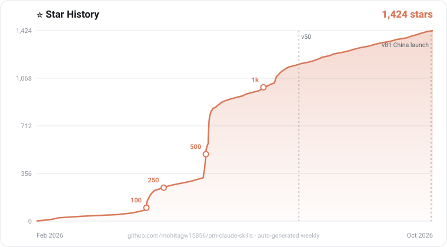

# PM Skills：专业 Agent Skills，用中文提问就能用

> **公司要裁员，你不知道该拿多少补偿；明天要开需求评审，PRD 还缺一半；下个月公务员面试，没人陪你练。**
> 通用 AI 像一个很自信的实习生。**PM Skills** 是资深同事的笔记：1285 份，每份一个 Markdown 文件。（PM 指 Professional，专业人士，不只是产品经理。）

<p align="center">
  <a href="https://mohitagw15856.github.io/pm-claude-skills/">
    <picture>
      <source media="(prefers-color-scheme: dark)" srcset="docs/readme-assets/banner-zh.svg">
      <source media="(prefers-color-scheme: light)" srcset="docs/readme-assets/banner-zh-light.svg">
      
    </picture>
  </a>
</p>

<p align="center">
  <picture>
    <source media="(prefers-color-scheme: dark)" srcset="https://mohitagw15856.github.io/pm-claude-skills/live/stats-zh.svg">
    <source media="(prefers-color-scheme: light)" srcset="https://mohitagw15856.github.io/pm-claude-skills/live/stats-zh-light.svg">
    
  </picture>
</p>

<p align="center">
  <a href="README.md">English</a> · <b>简体中文</b> · <a href="README.zh-TW.md">繁體中文</a> · <a href="README.ko.md">한국어</a> · <a href="docs/CHINA.md">在中国使用</a> · <a href="docs/zh/start.md">导览</a> · <a href="https://mohitagw15856.github.io/pm-claude-skills/tech-tree/">技能科技树</a> · <a href="SKILLS.md">全部技能</a> · <a href="docs/learn-zh/README.md">开源小课</a> · <a href="CHANGELOG.md">更新日志</a>
</p>

<p align="center">
  <a href="https://github.com/mohitagw15856/pm-claude-skills/stargazers"></a>
  <a href="https://gitee.com/mohitagw/pm-claude-skills"></a>
  <a href="https://www.modelscope.ai/studios/mohitagw15856/pm-skills-playground"></a>
  <a href="https://www.npmjs.com/package/pm-claude-skills"></a>
  <a href="LICENSE"></a>
</p>

## 安装（全部走国内网络）

```bash
# Trae（也可以换成 qoder、lingma 通义灵码、codebuddy、cursor、claude、codex、windsurf）
npx --registry=https://registry.npmmirror.com pm-claude-skills add --agent trae

# 只装中文技能包
npx --registry=https://registry.npmmirror.com pm-claude-skills add --agent trae --bundle pm-china-work,pm-china-exams,pm-china-life
```

然后直接说你要什么：*"帮我把这些笔记整理成周报。"* 技能就是 Markdown 文件，装了不会影响你的环境，删掉文件夹就卸载了。各工具的写入路径和注意事项见 [导览](docs/zh/start.md)；Qwen Code、Kimi CLI、文心快码等走 MCP 接入，见 [在中国使用](docs/CHINA.md)。

| 你想… | 国内地址 |
|---|---|
| 下载源码 | `git clone https://gitee.com/mohitagw/pm-claude-skills.git` |
| 在 Python 智能体里用 | `pip install -i https://pypi.tuna.tsinghua.edu.cn/simple pm-skills` |
| 在线试用 | [魔搭创空间](https://www.modelscope.ai/studios/mohitagw15856/pm-skills-playground)，用你自己的 DeepSeek、通义千问、Kimi、智谱或豆包 Key |
| 找到合适的技能 | [魔搭路由模型](https://www.modelscope.ai/models/mohitagw15856/pm-skills-router)，或 `npx pm-claude-skills find "写周报"` |
| 训练数据 | [魔搭数据集](https://www.modelscope.ai/datasets/mohitagw15856/pm-skills-instruct) |
| 在 Cherry Studio、Dify、FastGPT、MaxKB 里用 | 见 [在中国使用](docs/CHINA.md) |
| 在不能上网的电脑上用（内网） | [内网离线包](https://mohitagw15856.github.io/pm-claude-skills/offline/pm-skills-offline.zip)（约 21 MB，也在 [Gitee 发行版](https://gitee.com/mohitagw/pm-claude-skills/releases)附件里），统信 UOS、银河麒麟安装见 [离线包说明](docs/zh/offline.md) |
| 数据不出域，用本地模型 | Ollama / vLLM 跑通义千问、DeepSeek，模型从魔搭下载，见 [本地模型部署指南](docs/zh/local-models.md) |
| 做一张小红书分享卡 | [分享卡生成器](https://mohitagw15856.github.io/pm-claude-skills/card.html)：3:4 封面图，三种模板，带二维码 |

<p>
  <a href="https://gitee.com/mohitagw/pm-claude-skills"></a>
  <a href="https://npmmirror.com/package/pm-claude-skills"></a>
  <a href="https://www.modelscope.ai/studios/mohitagw15856/pm-skills-playground"></a>
  <a href="https://www.modelscope.ai/datasets/mohitagw15856/pm-skills-instruct"></a>
</p>

## 看个对比

<p align="center">
  <picture>
    <source media="(prefers-color-scheme: dark)" srcset="docs/readme-assets/before-after-zh.svg">
    <source media="(prefers-color-scheme: light)" srcset="docs/readme-assets/before-after-zh-light.svg">
    
  </picture>
</p>

例如问"公司要裁我，能拿多少补偿？"，AI 助手会加载 [`cn-severance-calculator`](skills/cn-severance-calculator/SKILL.md)：判断适用 N、N+1 还是 2N，一步步算清楚，并列出签字前要核对的事项。

## 选择你的路径

<p align="center">
  <a href="docs/start/chinese.md"><picture><source media="(prefers-color-scheme: dark)" srcset="docs/readme-assets/path-chinese-zh.svg"><source media="(prefers-color-scheme: light)" srcset="docs/readme-assets/path-chinese-zh-light.svg"></picture></a>
  <a href="docs/start/product-manager.md"><picture><source media="(prefers-color-scheme: dark)" srcset="docs/readme-assets/path-product-manager-zh.svg"><source media="(prefers-color-scheme: light)" srcset="docs/readme-assets/path-product-manager-zh-light.svg"></picture></a>
  <a href="docs/start/job-seeker.md"><picture><source media="(prefers-color-scheme: dark)" srcset="docs/readme-assets/path-job-seeker-zh.svg"><source media="(prefers-color-scheme: light)" srcset="docs/readme-assets/path-job-seeker-zh-light.svg"></picture></a>
</p>

<p align="center"><sub>中文用户点第一张卡。六条路径、按场景选包的地图、四题小测验、五关任务清单、"打工人的一天"和全部示例提问都在 <a href="docs/zh/start.md">中文导览</a>。</sub></p>

## 中文技能包

| 技能包 | 内容 | 试着说 |
|---|---|---|
| [**pm-china-work**](plugins/pm-china-work/) 职场 | 周报 / 月报、述职、晋升答辩、复盘、需求评审、职级对标、公文、飞书、钉钉、企业微信、互联网黑话翻译 | "帮我把这些笔记整理成周报。" |
| [**pm-china-exams**](plugins/pm-china-exams/) 考试与求职 | 申论、结构化面试、考研、开题报告与参考文献、大厂技术面试、校招与三方协议、国企面试 | "下个月公务员面试，帮我模拟一轮。" |
| [**pm-china-life**](plugins/pm-china-life/) 生活事务 | 劳动合同、经济补偿金、个税汇算、五险一金、公积金提取、医保报销、积分落户、个体户报税、高考志愿、帮爸妈办事（长辈版） | "公司要裁我，能拿多少补偿？" |
| [**pm-china-yearend**](plugins/pm-china-yearend/) 述职季 | 述职 PPT、年终总结、年终奖与个税、明年 OKR 与个人发展计划 | "帮我把今年的工作整理成述职 PPT 大纲。" |
| [**pm-china-teachers**](plugins/pm-china-teachers/) 教师 | 新课标教案、主题班会、家长会发言稿、期末评语、公开课与说课稿 | "帮我写一份七年级数学新授课教案。" |
| [**pm-china-parents**](plugins/pm-china-parents/) 家长 | 幼升小与小升初规划、家校沟通、兴趣班与双减、辅导作业不代写 | "孩子明年幼升小，现在要准备什么？" |
| [**pm-china-trade**](plugins/pm-china-trade/) 外贸 | 询盘回复（中英文）、信用证审单、报价单与 Incoterms 2020、报关单证 | "帮我审一下这份信用证有没有软条款。" |
| [**pm-china-manufacturing**](plugins/pm-china-manufacturing/) 制造业 | 8D 报告、5S / 6S 检查表、质量追溯、作业指导书 | "客户投诉要我们三天内回 8D，帮我写。" |
| [**pm-china-compliance**](plugins/pm-china-compliance/) 合规 | 等保 2.0、数据出境、个人信息保护影响评估、大模型备案与 AI 内容标识 | "我们的系统要过等保三级，差在哪？" |
| [**pm-hk-tw**](plugins/pm-hk-tw/) 港台 | 香港強積金、台灣勞動基準法、粵語文案（繁體中文） | "被資遣可以拿多少資遣費？" |
| [**pm-zh-content**](plugins/pm-zh-content/) 内容平台 | 小红书、公众号、抖音脚本、直播带货 | "帮我写一篇小红书笔记。" |
| [**pm-chuhai**](plugins/pm-chuhai/) 出海 | 出海市场进入、Temu / TikTok Shop / 亚马逊选择与入驻、跨境 listing、PIPL 与 GDPR 对照 | "Temu 全托管还是亚马逊 FBA？" |
| [**pm-cv**](plugins/pm-cv/) 简历 | 按目标公司定制简历、中英文简历、导出 Word | "帮我做一份中英文简历，要投外企。" |

另外还有一千多个通用技能，覆盖产品、工程、数据、设计、市场、销售、人力、法律、财务等 35 个职业，见 [SKILLS.md](SKILLS.md)。[`skills-i18n/zh/`](skills-i18n/zh/) 有 73 个技能的简体中文版，[`skills-i18n/zh-TW/`](skills-i18n/zh-TW/) 有 27 个繁体中文版。

📅 订阅 [中国工作日历](https://mohitagw15856.github.io/pm-claude-skills/live/cn-calendar.ics)：二十四节气、节日、考试和 618、双 11 备战节点，每个事件都附上对应的技能。考试倒计时、拜年语和祝福语生成器、调休规划器都在 [中文导览](docs/zh/start.md)。

## 复制一句，马上就用

装好以后，把下面任意一句发给你的 AI 助手（省略号换成你自己的情况），它会自动加载对应的技能。

- "帮我把这些笔记整理成周报：……" → [`cn-weekly-report`](skills/cn-weekly-report/SKILL.md)
- "公司要裁我，工作 6 年半，月薪 3 万，能拿多少补偿？" → [`cn-severance-calculator`](skills/cn-severance-calculator/SKILL.md)
- "下个月公务员面试，帮我模拟一轮结构化面试，答完给我打分。" → [`cn-civil-exam-interview`](skills/cn-civil-exam-interview/SKILL.md)
- "Temu 全托管、TikTok Shop 还是亚马逊 FBA？帮我对比一下。" → [`crossborder-platform-playbook`](skills/crossborder-platform-playbook/SKILL.md)

职场、学业与考试、生活、出海的完整示例列表（每句都标了对应技能）：[中文导览](docs/zh/start.md)。

## 质量

<p align="center">
  <a href="https://mohitagw15856.github.io/pm-claude-skills/modelbench.html?set=zh">
    <picture>
      <source media="(prefers-color-scheme: dark)" srcset="https://mohitagw15856.github.io/pm-claude-skills/live/modelbench-zh.svg">
      <source media="(prefers-color-scheme: light)" srcset="https://mohitagw15856.github.io/pm-claude-skills/live/modelbench-zh-light.svg">
      
    </picture>
  </a>
</p>

每次提交都会在 CI 里跑结构检查（SkillSpec L3，全部 1285 个技能）、安全扫描、重复检测、数量一致性检查、108 种语言的译文对齐检查和提示注入测试。1285 个技能中 389 个带有评测用例，28 个有盲评得分；155 个被标为高风险的技能（法律、税务、劳动等）目前 0 个经过执业人士审读，[专家审读计划](docs/EXPERT-REVIEW-PROGRAM.md) 欢迎有资质的朋友认领。涉及法律、税务、劳动的技能会给出明确的免责声明，并指向应当咨询的机构；它能帮你把问题弄清楚、把材料准备好，但不能代替专业意见。

## ❓ 常见问题

<details>
<summary><b>这个和直接问 DeepSeek 有什么区别？</b></summary>

直接问，模型凭印象回答，每次的结构和深度都不一样。加载技能后，模型照着一份写好的专业流程做：先问清缺的信息，再按固定结构产出，最后用清单自查。比如问补偿，[`cn-severance-calculator`](skills/cn-severance-calculator/SKILL.md) 会先判断适用 N、N+1 还是 2N，再一步步算，并列出签字前要核对的事项。技能不替代模型，DeepSeek 照样可以用：在线试用和 MCP 都能接 DeepSeek。
</details>

<details>
<summary><b>国内能用吗？要翻墙吗？</b></summary>

安装和下载都可以只走国内网络：npm 用 npmmirror 镜像，源码用 [Gitee](https://gitee.com/mohitagw/pm-claude-skills)，Python 包用清华 PyPI 镜像，在线试用在 [魔搭创空间](https://www.modelscope.ai/studios/mohitagw15856/pm-skills-playground)。本地 MCP 服务也不依赖海外网络。两处例外：托管在 `workers.dev` 的远程 MCP 在大陆无法访问，GitHub Pages 上的网页有时较慢。详见 [在中国使用](docs/CHINA.md)。
</details>

<details>
<summary><b>收费吗？</b></summary>

不收费。MIT 开源协议，可以商用、修改、放进公司内部工具。唯一的费用是你自己调用模型的费用，由模型服务商收取；魔搭每天有免费额度，智谱也有免费模型。
</details>

<details>
<summary><b>数据会上传吗？</b></summary>

技能库本身不上传任何东西。安装后技能就是你电脑上的 Markdown 文件，没有运行时、没有账号、默认没有遥测。你的对话内容只会发给你自己选的 AI 工具和模型，按它们的隐私政策处理。在线试用里的 API Key 只存在你的浏览器里，请求直接发给模型服务商。命令行的 `run` 子命令有一个可选的使用统计，只有设置 `PM_SKILLS_TELEMETRY=1` 才会发送，而且只发技能名，不发内容。
</details>

<details>
<summary><b>支持哪些工具？Trae、通义灵码能用吗？</b></summary>

能。`--agent` 支持 Trae、通义灵码、Qoder、CodeBuddy、Cursor、Claude Code、Codex、Windsurf 等，各工具的写入路径见 [中文导览](docs/zh/start.md)。规则按描述智能生效，不会每次对话都全部加载。
</details>

<details>
<summary><b>不会写代码，能用吗？</b></summary>

能。最简单的是打开 [魔搭创空间](https://www.modelscope.ai/studios/mohitagw15856/pm-skills-playground)，选一个技能，用中文说你要做什么。也可以在 Cherry Studio 里加一个 MCP 服务，或者把 [Dify 应用模板](integrations/dify-templates/) 导入 Dify。
</details>

<details>
<summary><b>技能是中文写的吗？</b></summary>

中文技能包里的技能（多数以 `cn-` 开头）专门按国内的实际写：周报的结构、N+1 的算法、GB/T 7714 的格式、公文的版式。技能说明多数用英文写，但会要求模型用简体中文回答。[`skills-i18n/zh/`](skills-i18n/zh/) 有 73 个技能的简体中文译本，[`skills-i18n/zh-TW/`](skills-i18n/zh-TW/) 有 27 个繁体中文译本。你只管用中文提问。
</details>

<details>
<summary><b>劳动、税务这类答案靠谱吗？</b></summary>

技能会把计算过程和依据写出来，列出需要你核实的数字，并给出明确的免责声明和应当咨询的机构（劳动仲裁、税务机关、律师）。它能帮你把问题弄清楚、把材料准备好，但不能代替专业意见。各地政策不同，以当地最新规定为准。
</details>

<details>
<summary><b>怎么更新？</b></summary>

重新运行一次安装命令即可。用 Gitee 克隆的，`git pull` 就行，镜像会在每次 GitHub 更新后自动同步。想看装了哪些、哪些过时了，运行 `npx pm-claude-skills doctor`。
</details>

<details>
<summary><b>哪里不准，怎么反馈？</b></summary>

用中文提 Issue，[GitHub](https://github.com/mohitagw15856/pm-claude-skills/issues) 和 [Gitee](https://gitee.com/mohitagw/pm-claude-skills/issues) 都可以。某个技能不符合国内实际，或者你想要新技能，都欢迎告诉我们。
</details>

## 参与贡献

- 某个技能不符合国内实际情况？用中文提 Issue，[GitHub](https://github.com/mohitagw15856/pm-claude-skills/issues) 和 [Gitee](https://gitee.com/mohitagw/pm-claude-skills/issues) 都可以
- 想要新技能？在 [科技树](https://mohitagw15856.github.io/pm-claude-skills/tech-tree/) 上投票，或者开一个 `skill-request` Issue
- 想帮忙翻译？在 [翻译认领板](docs/zh/translation-board.md) 挑一个技能，或认领一个 [good first translation](https://github.com/mohitagw15856/pm-claude-skills/labels/good%20first%20translation) Issue
- 想学怎么写技能？看 [开源小课](docs/learn-zh/README.md)

参见 [CONTRIBUTING.md](CONTRIBUTING.md)。项目地址：https://github.com/mohitagw15856/pm-claude-skills

### 🙌 贡献者

<p align="center">
  <a href="https://github.com/mohitagw15856/pm-claude-skills/graphs/contributors">
    
  </a>
</p>

### 🈶 译者榜

<p align="center">
  <a href="docs/zh/translation-board.md">
    
  </a>
</p>

想上榜？在 [翻译认领板](docs/zh/translation-board.md) 上挑一个技能，按"对中文用户有多大用处"排好了序，点"认领"就能开始。在学校里推广，见 [校园资料包](docs/campus/README.md) 和 [校园大使计划](docs/campus/ambassadors.md)。

### ⭐ Star 历史

<p align="center">
  <a href="https://github.com/mohitagw15856/pm-claude-skills/stargazers">
    
  </a>
</p>

## 协议

MIT。用吧，改吧，拿去工作里用。
