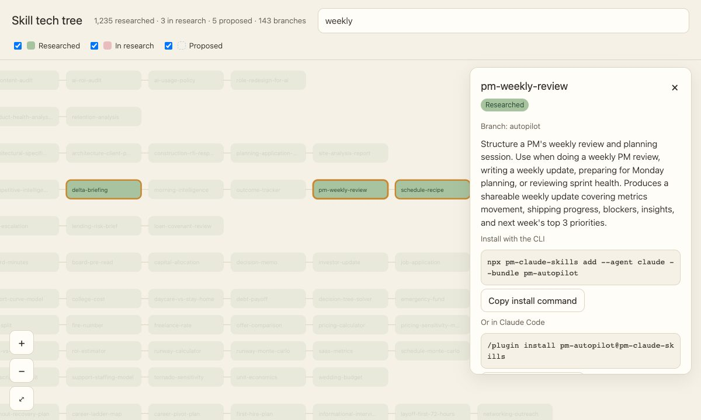

# PM Skills：1250 个专业 Agent Skills，用中文提问就能用

<p align="center">
  <a href="README.md">English</a> · <b>简体中文</b> · <a href="docs/CHINA.md">在中国使用</a> · <a href="https://mohitagw15856.github.io/pm-claude-skills/tech-tree/">技能科技树</a> · <a href="SKILLS.md">全部技能</a> · <a href="docs/learn-zh/README.md">开源小课</a> · <a href="CHANGELOG.md">更新日志</a>
</p>

<p align="center">
  <a href="https://github.com/mohitagw15856/pm-claude-skills/stargazers"></a>
  <a href="https://gitee.com/mohitagw/pm-claude-skills"></a>
  <a href="https://www.modelscope.ai/studios/mohitagw15856/pm-skills-playground"></a>
  <a href="https://www.npmjs.com/package/pm-claude-skills"></a>
  <a href="LICENSE"></a>
</p>

> **公司要裁员，你不知道该拿多少补偿；明天要开需求评审，PRD 还缺一半；下个月公务员面试，没人陪你练。**
> 通用 AI 像一个很自信的实习生。**PM Skills** 是资深同事的笔记：1250 份，每份一个 Markdown 文件。（PM 指 Professional，专业人士，不只是产品经理。）

<p align="center">
  <picture>
    <source media="(prefers-color-scheme: dark)" srcset="docs/readme-assets/demo-chat-zh.svg">
    <source media="(prefers-color-scheme: light)" srcset="docs/readme-assets/demo-chat-zh-light.svg">
    
  </picture>
</p>

## 它是怎么工作的

<p align="center">
  <picture>
    <source media="(prefers-color-scheme: dark)" srcset="docs/readme-assets/how-it-works-zh.svg">
    <source media="(prefers-color-scheme: light)" srcset="docs/readme-assets/how-it-works-zh-light.svg">
    
  </picture>
</p>

例如问"公司要裁我，能拿多少补偿？"，AI 助手会加载 [`cn-severance-calculator`](skills/cn-severance-calculator/SKILL.md)：判断适用 N、N+1 还是 2N，一步步算清楚，并列出签字前要核对的事项。

MIT 开源协议，永久免费。没有运行时，没有遥测，不需要账号。

## 安装（全部走国内网络）

```bash
# Trae（也可以换成 qoder、lingma 通义灵码、codebuddy、claude）
npx --registry=https://registry.npmmirror.com pm-claude-skills add --agent trae

# 只装中文技能包
npx --registry=https://registry.npmmirror.com pm-claude-skills add --agent trae --bundle pm-china-work,pm-china-exams,pm-china-life
```

| 你想… | 国内地址 |
|---|---|
| 下载源码 | `git clone https://gitee.com/mohitagw/pm-claude-skills.git` |
| 在 Python 智能体里用 | `pip install -i https://pypi.tuna.tsinghua.edu.cn/simple pm-skills` |
| 在线试用 | [魔搭创空间](https://www.modelscope.ai/studios/mohitagw15856/pm-skills-playground)，用你自己的 DeepSeek、通义千问、Kimi、智谱或豆包 Key |
| 找到合适的技能 | [魔搭路由模型](https://www.modelscope.ai/models/mohitagw15856/pm-skills-router)，或 `npx pm-claude-skills find "写周报"` |
| 训练数据 | [魔搭数据集](https://www.modelscope.ai/datasets/mohitagw15856/pm-skills-instruct) |
| 在 Cherry Studio、Dify、FastGPT、MaxKB 里用 | 见 [在中国使用](docs/CHINA.md) |

## 中文技能包

| 技能包 | 内容 | 试着说 |
|---|---|---|
| [**pm-china-work**](plugins/pm-china-work/) 职场 | 周报 / 月报、述职、晋升答辩、复盘、需求评审、职级对标、公文、飞书、钉钉、企业微信 | "帮我把这些笔记整理成周报。" |
| [**pm-china-exams**](plugins/pm-china-exams/) 考试与求职 | 申论、结构化面试、考研、开题报告与参考文献、大厂技术面试、校招与三方协议、国企面试 | "下个月公务员面试，帮我模拟一轮。" |
| [**pm-china-life**](plugins/pm-china-life/) 生活事务 | 劳动合同、经济补偿金、个税汇算、五险一金、公积金提取、医保报销、积分落户、个体户报税、高考志愿 | "公司要裁我，能拿多少补偿？" |
| [**pm-china-compliance**](plugins/pm-china-compliance/) 合规 | 等保 2.0、数据出境、个人信息保护影响评估、大模型备案与 AI 内容标识 | "我们的系统要过等保三级，差在哪？" |
| [**pm-hk-tw**](plugins/pm-hk-tw/) 港台 | 香港強積金、台灣勞動基準法（繁體中文） | "被資遣可以拿多少資遣費？" |
| [**pm-zh-content**](plugins/pm-zh-content/) 内容平台 | 小红书、公众号、抖音脚本、直播带货 | "帮我写一篇小红书笔记。" |
| [**pm-chuhai**](plugins/pm-chuhai/) 出海 | 出海市场进入、Temu / TikTok Shop / 亚马逊选择与入驻、跨境 listing、PIPL 与 GDPR 对照 | "Temu 全托管还是亚马逊 FBA？" |
| [**pm-cv**](plugins/pm-cv/) 简历 | 按目标公司定制简历、中英文简历、导出 Word | "帮我做一份中英文简历，要投外企。" |

另外还有一千多个通用技能，覆盖产品、工程、数据、设计、市场、销售、人力、法律、财务等 35 个职业，见 [SKILLS.md](SKILLS.md)。[`skills-i18n/zh/`](skills-i18n/zh/) 有 73 个技能的简体中文版，[`skills-i18n/zh-TW/`](skills-i18n/zh-TW/) 有 27 个繁体中文版。

## 看一看

<table>
<tr>
<td width="50%" align="center">
<a href="https://mohitagw15856.github.io/pm-claude-skills/tech-tree/"></a>
<br /><sub><b>🌳 <a href="https://mohitagw15856.github.io/pm-claude-skills/tech-tree/">技能科技树</a></b>：整个技能库画成一棵科技树，可以搜索、复制安装命令、为想要的技能投票。</sub>
</td>
<td width="50%" align="center">
<a href="plugins/pm-3d-explorer/"></a>
<br /><sub><b>🧊 <a href="plugins/pm-3d-explorer/">3D 讲解页</a></b>：给一个主题，生成可以拆开看、点击看标注、还能做小测验的 3D 页面。</sub>
</td>
</tr>
</table>

## 质量

每个技能都经过结构检查（SkillSpec L3）、安全扫描和重复检测，并在 CI 中强制执行。涉及法律、税务、劳动的技能会给出明确的免责声明，并指向应当咨询的机构。

## 参与贡献

- 某个技能不符合国内实际情况？用中文提 Issue，[GitHub](https://github.com/mohitagw15856/pm-claude-skills/issues) 和 [Gitee](https://gitee.com/mohitagw/pm-claude-skills/issues) 都可以
- 想要新技能？在 [科技树](https://mohitagw15856.github.io/pm-claude-skills/tech-tree/) 上投票，或者开一个 `skill-request` Issue
- 想帮忙翻译？认领一个 [good first translation](https://github.com/mohitagw15856/pm-claude-skills/labels/good%20first%20translation)
- 想学怎么写技能？看 [开源小课](docs/learn-zh/README.md)

参见 [CONTRIBUTING.md](CONTRIBUTING.md)。项目地址：https://github.com/mohitagw15856/pm-claude-skills

## 协议

MIT。用吧，改吧，拿去工作里用。
