# PM Skills：1250 个专业 Agent Skills，用中文提问就能用

<p align="center">
  <a href="https://mohitagw15856.github.io/pm-claude-skills/live/season.html">
    
  </a>
</p>

<p align="center">
  <picture>
    <source media="(prefers-color-scheme: dark)" srcset="docs/readme-assets/constellation-zh.svg">
    <source media="(prefers-color-scheme: light)" srcset="docs/readme-assets/constellation-zh-light.svg">
    
  </picture>
</p>

> **一句话上手** &nbsp; 安装：`npx --registry=https://registry.npmmirror.com pm-claude-skills add`（走国内镜像，任何工具都能用）· Claude Code 里输入 `/plugin` 搜索 **pm-skills**
> 然后直接说你要什么：*"帮我把这些笔记整理成周报。"*

<p align="center">
  <a href="README.md">English</a> · <b>简体中文</b> · <a href="docs/CHINA.md">在中国使用</a> · <a href="https://mohitagw15856.github.io/pm-claude-skills/tech-tree/">技能科技树</a> · <a href="SKILLS.md">全部技能</a> · <a href="docs/learn-zh/README.md">开源小课</a> · <a href="CHANGELOG.md">更新日志</a>
</p>

<p align="center">
  <a href="https://github.com/mohitagw15856/pm-claude-skills/stargazers"></a>
  <a href="https://gitee.com/mohitagw/pm-claude-skills"></a>
  <a href="https://www.modelscope.ai/studios/mohitagw15856/pm-skills-playground"></a>
  <a href="https://www.npmjs.com/package/pm-claude-skills"></a>
  <a href="LICENSE"></a>
</p>

<p align="center">
  <picture>
    <source media="(prefers-color-scheme: dark)" srcset="https://mohitagw15856.github.io/pm-claude-skills/live/stats-zh.svg">
    <source media="(prefers-color-scheme: light)" srcset="https://mohitagw15856.github.io/pm-claude-skills/live/stats-zh-light.svg">
    
  </picture>
</p>

> **公司要裁员，你不知道该拿多少补偿；明天要开需求评审，PRD 还缺一半；下个月公务员面试，没人陪你练。**
> 通用 AI 像一个很自信的实习生。**PM Skills** 是资深同事的笔记：1250 份，每份一个 Markdown 文件。（PM 指 Professional，专业人士，不只是产品经理。）

<p align="center">
  <picture>
    <source media="(prefers-color-scheme: dark)" srcset="docs/readme-assets/demo-chat-zh.svg">
    <source media="(prefers-color-scheme: light)" srcset="docs/readme-assets/demo-chat-zh-light.svg">
    
  </picture>
</p>

## 🎯 1,250 个技能，你只需要 5 个

<p align="center">
  <picture>
    <source media="(prefers-color-scheme: dark)" srcset="docs/readme-assets/funnel-zh.svg">
    <source media="(prefers-color-scheme: light)" srcset="docs/readme-assets/funnel-zh-light.svg">
    
  </picture>
</p>

不用把整个库都装上。选一条路径，装一个技能包，平时最常用的那几个技能就能解决大部分事情。技能只在你的请求对得上时才会加载，其余的不占用任何上下文。

## 🧑‍🤝‍🧑 选择你的路径

<table><tr><td width="72">
<picture>
  <source media="(prefers-color-scheme: dark)" srcset="docs/readme-assets/nib-wave.svg">
  <source media="(prefers-color-scheme: light)" srcset="docs/readme-assets/nib-wave-light.svg">
  
</picture>
</td><td><b>你好，我是 Nib（小笺）。</b> 中文用户直接点第一张卡片：三个入门技能，每个都附一句可以直接复制的提问。其他卡片的页面目前是英文。</td></tr></table>

<p align="center">
  <a href="docs/start/chinese.md"><picture><source media="(prefers-color-scheme: dark)" srcset="docs/readme-assets/path-chinese-zh.svg"><source media="(prefers-color-scheme: light)" srcset="docs/readme-assets/path-chinese-zh-light.svg">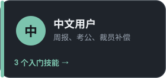</picture></a>
  <a href="docs/start/product-manager.md"><picture><source media="(prefers-color-scheme: dark)" srcset="docs/readme-assets/path-product-manager-zh.svg"><source media="(prefers-color-scheme: light)" srcset="docs/readme-assets/path-product-manager-zh-light.svg">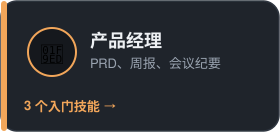</picture></a>
  <a href="docs/start/engineer.md"><picture><source media="(prefers-color-scheme: dark)" srcset="docs/readme-assets/path-engineer-zh.svg"><source media="(prefers-color-scheme: light)" srcset="docs/readme-assets/path-engineer-zh-light.svg">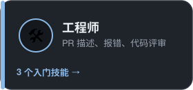</picture></a>
  <a href="docs/start/job-seeker.md"><picture><source media="(prefers-color-scheme: dark)" srcset="docs/readme-assets/path-job-seeker-zh.svg"><source media="(prefers-color-scheme: light)" srcset="docs/readme-assets/path-job-seeker-zh-light.svg">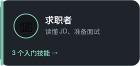</picture></a>
  <a href="docs/start/student.md"><picture><source media="(prefers-color-scheme: dark)" srcset="docs/readme-assets/path-student-zh.svg"><source media="(prefers-color-scheme: light)" srcset="docs/readme-assets/path-student-zh-light.svg">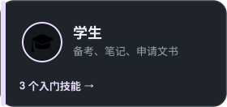</picture></a>
  <a href="docs/start/founder.md"><picture><source media="(prefers-color-scheme: dark)" srcset="docs/readme-assets/path-founder-zh.svg"><source media="(prefers-color-scheme: light)" srcset="docs/readme-assets/path-founder-zh-light.svg">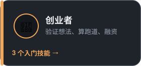</picture></a>
</p>

## 🗺️ 今天想做什么？

<table><tr><td width="72">
<picture>
  <source media="(prefers-color-scheme: dark)" srcset="docs/readme-assets/nib-point.svg">
  <source media="(prefers-color-scheme: light)" srcset="docs/readme-assets/nib-point-light.svg">
  
</picture>
</td><td><b>不知道自己算哪一类？</b> 从你今天想做的事出发，每个小方框就是一个技能包，点开即可。</td></tr></table>

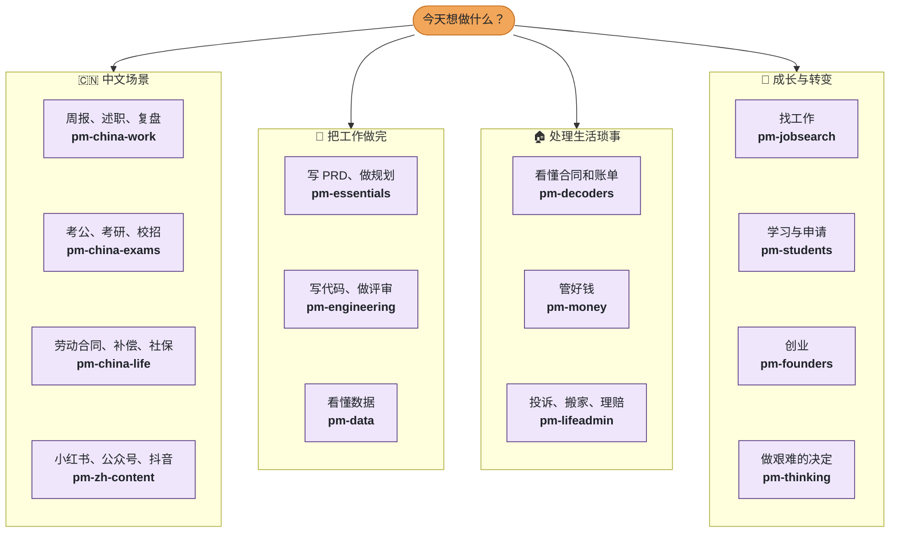

<sub>直接跳转：**中文** [pm-china-work](plugins/pm-china-work/) · [pm-china-exams](plugins/pm-china-exams/) · [pm-china-life](plugins/pm-china-life/) · [pm-zh-content](plugins/pm-zh-content/) · **工作** [pm-essentials](plugins/pm-essentials/) · [pm-engineering](plugins/pm-engineering/) · [pm-data](plugins/pm-data/) · **生活** [pm-decoders](plugins/pm-decoders/) · [pm-money](plugins/pm-money/) · [pm-lifeadmin](plugins/pm-lifeadmin/) · **成长** [pm-jobsearch](plugins/pm-jobsearch/) · [pm-students](plugins/pm-students/) · [pm-founders](plugins/pm-founders/) · [pm-thinking](plugins/pm-thinking/)</sub>

## 🧩 你是哪一类专业人士？

四个小问题，每题两个选项，不用注册，最后给你推荐一个技能包和三个先试的技能。（测验页面为英文。）

**第 1 题：今天是为什么而来？**

<a href="docs/quiz/q2.md"></a>
<a href="docs/quiz/q3.md"></a>

## 它是怎么工作的

<p align="center">
  <picture>
    <source media="(prefers-color-scheme: dark)" srcset="docs/readme-assets/how-it-works-zh.svg">
    <source media="(prefers-color-scheme: light)" srcset="docs/readme-assets/how-it-works-zh-light.svg">
    
  </picture>
</p>

例如问"公司要裁我，能拿多少补偿？"，AI 助手会加载 [`cn-severance-calculator`](skills/cn-severance-calculator/SKILL.md)：判断适用 N、N+1 还是 2N，一步步算清楚，并列出签字前要核对的事项。

<p align="center">
  <picture>
    <source media="(prefers-color-scheme: dark)" srcset="docs/readme-assets/before-after-zh.svg">
    <source media="(prefers-color-scheme: light)" srcset="docs/readme-assets/before-after-zh-light.svg">
    
  </picture>
</p>

MIT 开源协议，永久免费。没有运行时，没有遥测，不需要账号。

<p align="center">
  <a href="https://mohitagw15856.github.io/pm-claude-skills/live/skill-of-the-day-zh.html">
    <picture>
      <source media="(prefers-color-scheme: dark)" srcset="https://mohitagw15856.github.io/pm-claude-skills/live/skill-of-the-day-zh.svg">
      <source media="(prefers-color-scheme: light)" srcset="https://mohitagw15856.github.io/pm-claude-skills/live/skill-of-the-day-zh-light.svg">
      
    </picture>
  </a>
</p>

## 安装（全部走国内网络）

<p align="center">
  <picture>
    <source media="(prefers-color-scheme: dark)" srcset="docs/readme-assets/terminal-zh.svg">
    <source media="(prefers-color-scheme: light)" srcset="docs/readme-assets/terminal-zh-light.svg">
    
  </picture>
</p>

```bash
# Trae（也可以换成 qoder、lingma 通义灵码、codebuddy、claude）
npx --registry=https://registry.npmmirror.com pm-claude-skills add --agent trae

# 只装中文技能包
npx --registry=https://registry.npmmirror.com pm-claude-skills add --agent trae --bundle pm-china-work,pm-china-exams,pm-china-life
```

| 你想… | 国内地址 |
|---|---|
| 下载源码 | `git clone https://gitee.com/mohitagw/pm-claude-skills.git` |
| 在 Python 智能体里用 | `pip install -i https://pypi.tuna.tsinghua.edu.cn/simple pm-skills` |
| 在线试用 | [魔搭创空间](https://www.modelscope.ai/studios/mohitagw15856/pm-skills-playground)，用你自己的 DeepSeek、通义千问、Kimi、智谱或豆包 Key |
| 找到合适的技能 | [魔搭路由模型](https://www.modelscope.ai/models/mohitagw15856/pm-skills-router)，或 `npx pm-claude-skills find "写周报"` |
| 训练数据 | [魔搭数据集](https://www.modelscope.ai/datasets/mohitagw15856/pm-skills-instruct) |
| 在 Cherry Studio、Dify、FastGPT、MaxKB 里用 | 见 [在中国使用](docs/CHINA.md) |

<p>
  <a href="https://gitee.com/mohitagw/pm-claude-skills"></a>
  <a href="https://npmmirror.com/package/pm-claude-skills"></a>
  <a href="https://www.modelscope.ai/studios/mohitagw15856/pm-skills-playground"></a>
  <a href="https://www.modelscope.ai/datasets/mohitagw15856/pm-skills-instruct"></a>
</p>
<sub>状态每天从 GitHub 服务器检测一次，✅ 表示在线，⚠️ 表示当天没有响应；不代表国内访问速度。</sub>

## 🏆 任务清单

<table><tr><td width="72">
<picture>
  <source media="(prefers-color-scheme: dark)" srcset="docs/readme-assets/nib-idea.svg">
  <source media="(prefers-color-scheme: light)" srcset="docs/readme-assets/nib-idea-light.svg">
  
</picture>
</td><td><b>Nib 的小提示：</b> 第 1 关只要两分钟。随时可以停下，大多数人用不到第 5 关。</td></tr></table>

<details>
<summary> &nbsp;<b>第 1 关 · 新手：用上第一个技能</b></summary>

<br>

**任务：** 安装，然后提一个你这周真正需要解决的事。

```bash
npx --registry=https://registry.npmmirror.com pm-claude-skills add --agent trae   # 或 qoder / lingma / codebuddy / claude
```

然后用自己的话问：*"帮我把这些笔记整理成周报：……"*

**完成标准：** 你拿到的是一份写好的文档，而不是一堆建议。

</details>

<details>
<summary> &nbsp;<b>第 2 关 · 探索者：找到合适的技能</b></summary>

<br>

**任务：** 描述一件说不清楚该用哪个技能的事，让查找工具告诉你。

```bash
npx --registry=https://registry.npmmirror.com pm-claude-skills find "写述职报告"
```

也可以用 [魔搭路由模型](https://www.modelscope.ai/models/mohitagw15856/pm-skills-router)。

**完成标准：** 你用上了一个原本不知道存在的技能。

</details>

<details>
<summary> &nbsp;<b>第 3 关 · 收藏家：装上你的技能包</b></summary>

<br>

**任务：** 只装和你相关的中文技能包。

```bash
npx --registry=https://registry.npmmirror.com pm-claude-skills add --agent trae --bundle pm-china-work,pm-china-exams,pm-china-life
```

**完成标准：** 一周内用上其中三个技能。

</details>

<details>
<summary> &nbsp;<b>第 4 关 · 串联者：跑一条工作流</b></summary>

<br>

**任务：** 从 [WORKFLOWS.md](WORKFLOWS.md) 里挑一条工作流（比如 Run Discovery），在同一个对话里按顺序调用其中的技能。也可以用你自己的 Anthropic API Key 在命令行里一次跑完：

```bash
npx pm-claude-skills chain run-discovery --input notes.txt
```

**完成标准：** 放进去的是零散笔记，拿出来的是一整套成品文档。

</details>

<details>
<summary> &nbsp;<b>第 5 关 · 高手：做一个自己的技能</b></summary>

<br>

**任务：** 让 [make-me-a-skill](skills/make-me-a-skill/SKILL.md) 把你每周都要重复做的事变成一个 SKILL.md，然后检查它。

```bash
npx pm-claude-skills skillcheck --dir ./my-skills
```

**完成标准：** 你的技能通过检查，并且在你提出对应请求时会自动加载。想分享出来？看 [贡献指南](CONTRIBUTING.md)。

</details>


## 中文技能包

<p align="center">
  <a href="https://mohitagw15856.github.io/pm-claude-skills/listen.html">
    <picture>
      <source media="(prefers-color-scheme: dark)" srcset="docs/readme-assets/listen-banner.svg">
      <source media="(prefers-color-scheme: light)" srcset="docs/readme-assets/listen-banner-light.svg">
      
    </picture>
  </a>
  <br /><sub>GitHub 的说明页不能直接播放声音，点进去由浏览器自带的中文语音朗读，并逐句高亮。</sub>
</p>

| 技能包 | 内容 | 试着说 |
|---|---|---|
| [**pm-china-work**](plugins/pm-china-work/) 职场 | 周报 / 月报、述职、晋升答辩、复盘、需求评审、职级对标、公文、飞书、钉钉、企业微信 | "帮我把这些笔记整理成周报。" |
| [**pm-china-exams**](plugins/pm-china-exams/) 考试与求职 | 申论、结构化面试、考研、开题报告与参考文献、大厂技术面试、校招与三方协议、国企面试 | "下个月公务员面试，帮我模拟一轮。" |
| [**pm-china-life**](plugins/pm-china-life/) 生活事务 | 劳动合同、经济补偿金、个税汇算、五险一金、公积金提取、医保报销、积分落户、个体户报税、高考志愿 | "公司要裁我，能拿多少补偿？" |
| [**pm-china-compliance**](plugins/pm-china-compliance/) 合规 | 等保 2.0、数据出境、个人信息保护影响评估、大模型备案与 AI 内容标识 | "我们的系统要过等保三级，差在哪？" |
| [**pm-hk-tw**](plugins/pm-hk-tw/) 港台 | 香港強積金、台灣勞動基準法（繁體中文） | "被資遣可以拿多少資遣費？" |
| [**pm-zh-content**](plugins/pm-zh-content/) 内容平台 | 小红书、公众号、抖音脚本、直播带货 | "帮我写一篇小红书笔记。" |
| [**pm-chuhai**](plugins/pm-chuhai/) 出海 | 出海市场进入、Temu / TikTok Shop / 亚马逊选择与入驻、跨境 listing、PIPL 与 GDPR 对照 | "Temu 全托管还是亚马逊 FBA？" |
| [**pm-cv**](plugins/pm-cv/) 简历 | 按目标公司定制简历、中英文简历、导出 Word | "帮我做一份中英文简历，要投外企。" |

另外还有一千多个通用技能，覆盖产品、工程、数据、设计、市场、销售、人力、法律、财务等 35 个职业，见 [SKILLS.md](SKILLS.md)。[`skills-i18n/zh/`](skills-i18n/zh/) 有 73 个技能的简体中文版，[`skills-i18n/zh-TW/`](skills-i18n/zh-TW/) 有 27 个繁体中文版。

考试倒计时：

<p>
  <a href="https://mohitagw15856.github.io/pm-claude-skills/skill/cn-gaokao-planner.html"></a>
  <a href="https://mohitagw15856.github.io/pm-claude-skills/skill/cn-kaoyan-planner.html"></a>
  <a href="https://mohitagw15856.github.io/pm-claude-skills/skill/cn-civil-exam-essay.html"></a>
</p>

## 看一看

<table>
<tr>
<td width="50%" align="center">
<a href="https://mohitagw15856.github.io/pm-claude-skills/tech-tree/"></a>
<br /><sub><b>🌳 <a href="https://mohitagw15856.github.io/pm-claude-skills/tech-tree/">技能科技树</a></b>：整个技能库画成一棵科技树，可以搜索、复制安装命令、为想要的技能投票。</sub>
</td>
<td width="50%" align="center">
<a href="plugins/pm-3d-explorer/"></a>
<br /><sub><b>🧊 <a href="plugins/pm-3d-explorer/">3D 讲解页</a></b>：给一个主题，生成可以拆开看、点击看标注、还能做小测验的 3D 页面。</sub>
</td>
</tr>
<tr>
<td width="50%" align="center">
<a href="https://mohitagw15856.github.io/pm-claude-skills/find.html?q=%E5%B8%AE%E6%88%91%E5%86%99%E5%91%A8%E6%8A%A5">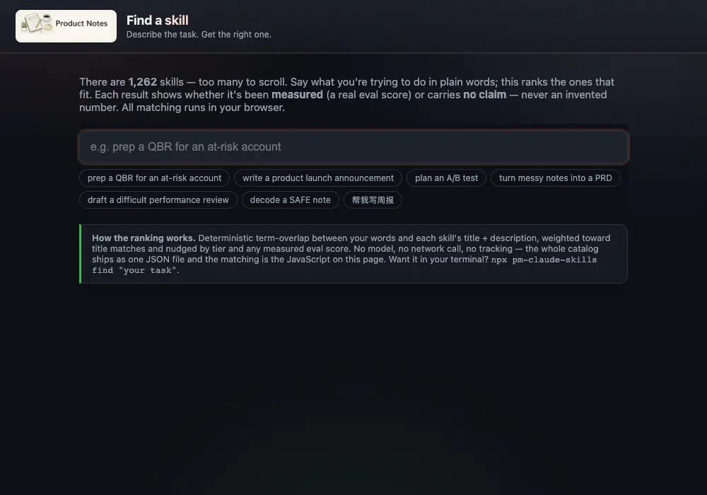</a>
<br /><sub><b>🔎 <a href="https://mohitagw15856.github.io/pm-claude-skills/find.html">找技能</a></b>：用自己的话描述任务，中英文都可以，在浏览器里本地匹配。</sub>
</td>
<td width="50%" align="center">
<a href="https://mohitagw15856.github.io/pm-claude-skills/city.html"></a>
<br /><sub><b>🏙 <a href="https://mohitagw15856.github.io/pm-claude-skills/city.html">技能城</a></b>：每个技能是一栋楼，用得越多，城市越亮。</sub>
</td>
</tr>
</table>

[🧧 拜年语生成器](https://mohitagw15856.github.io/pm-claude-skills/bainian.html)：选对象、选语气、选生肖年份，一键复制新春祝福。


## 质量

<p align="center">
  <a href="https://mohitagw15856.github.io/pm-claude-skills/modelbench.html?set=zh">
    <picture>
      <source media="(prefers-color-scheme: dark)" srcset="https://mohitagw15856.github.io/pm-claude-skills/live/modelbench-zh.svg">
      <source media="(prefers-color-scheme: light)" srcset="https://mohitagw15856.github.io/pm-claude-skills/live/modelbench-zh-light.svg">
      
    </picture>
  </a>
</p>

每个技能都经过结构检查（SkillSpec L3）、安全扫描和重复检测，并在 CI 中强制执行。涉及法律、税务、劳动的技能会给出明确的免责声明，并指向应当咨询的机构。

## 参与贡献

- 某个技能不符合国内实际情况？用中文提 Issue，[GitHub](https://github.com/mohitagw15856/pm-claude-skills/issues) 和 [Gitee](https://gitee.com/mohitagw/pm-claude-skills/issues) 都可以
- 想要新技能？在 [科技树](https://mohitagw15856.github.io/pm-claude-skills/tech-tree/) 上投票，或者开一个 `skill-request` Issue
- 想帮忙翻译？认领一个 [good first translation](https://github.com/mohitagw15856/pm-claude-skills/labels/good%20first%20translation)
- 想学怎么写技能？看 [开源小课](docs/learn-zh/README.md)

参见 [CONTRIBUTING.md](CONTRIBUTING.md)。项目地址：https://github.com/mohitagw15856/pm-claude-skills

## 协议

MIT。用吧，改吧，拿去工作里用。
