# PM Skills：1,255 個專業 Agent Skills，用中文提問就能用

<p align="center">
  <a href="https://mohitagw15856.github.io/pm-claude-skills/live/season-tw.html">
    
  </a>
</p>

<p align="center">
  <a href="README.md">English</a> · <a href="README.zh-CN.md">简体中文</a> · <b>繁體中文</b> · <a href="SKILLS.md">全部技能</a> · <a href="skills-i18n/zh-TW/">繁體中文譯本</a> · <a href="CHANGELOG.md">更新紀錄</a>
</p>

<p align="center">
  <picture>
    <source media="(prefers-color-scheme: dark)" srcset="docs/readme-assets/calligraphy-zh-tw.svg">
    <source media="(prefers-color-scheme: light)" srcset="docs/readme-assets/calligraphy-zh-tw-light.svg">
    
  </picture>
</p>

<p align="center">
  <a href="https://github.com/mohitagw15856/pm-claude-skills/stargazers"></a>
  <a href="https://www.npmjs.com/package/pm-claude-skills"></a>
  <a href="LICENSE"></a>
</p>

> **公司說要資遣你，你不確定資遣費該拿多少；轉工之後，舊公司的強積金不知道該怎麼處理；每個月加班，卻從沒算清楚加班費。**
> 通用 AI 像一個很有自信的實習生。**PM Skills** 是資深同事的筆記：1,255 份，每份一個 Markdown 檔案。（PM 指 Professional，各行各業的專業人士，不只是產品經理。）

MIT 開源授權，永久免費。沒有執行環境，沒有遙測，不需要帳號。

## 香港與台灣專用技能包：pm-hk-tw

[**pm-hk-tw**](plugins/pm-hk-tw/) 用繁體中文寫成，處理香港和台灣上班族最常碰到的事，另附一個粵語文案技能：

| 技能 | 處理什麼 | 可以這樣問 |
|---|---|---|
| [`hk-mpf-explainer`](skills-i18n/zh-TW/hk-mpf-explainer/SKILL.md) 香港強積金 | 按你的收入計算供款、核對僱主有沒有供足、提取途徑和條件、轉移和整合帳戶、可扣稅自願性供款、揀基金的框架（不推薦個別基金） | 「強積金點計？轉工之後舊戶口要唔要轉？」 |
| [`tw-labour-standards`](skills-i18n/zh-TW/tw-labour-standards/SKILL.md) 台灣勞動基準法 | 依勞基法檢查你的情況：工資、工時與加班費、特別休假、預告期間、勞退新制資遣費、勞退提繳，附計算過程與申訴管道 | 「被資遣可以拿多少資遣費？」 |
| [`hk-cantonese-copy`](skills/hk-cantonese-copy/SKILL.md) 粵語文案 | 為香港讀者寫 Instagram、Facebook、Threads 文案：書面語、口語化書面語或全粵語三種語氣，自然中英夾雜，檢查簡體字和台灣用語有沒有混進去 | 「幫我寫一則新店開張嘅 IG post，要地道啲。」 |

### 例子一：香港，強積金

> 「我月薪港幣 4 萬，老闆每個月供 1,500，啱唔啱？」

[`hk-mpf-explainer`](skills/hk-mpf-explainer/SKILL.md) 會這樣拆：

| 項目 | 計算 | 結果 |
|---|---|---|
| 有關入息 | 月薪 40,000，高於有關入息上限 30,000 | 以 30,000 計 |
| 僱主強制性供款 | 30,000 × 5% | 1,500 |
| 僱員強制性供款 | 30,000 × 5% | 1,500 |
| 核對 | 糧單和強積金月結單上每月各應見到 1,500 | 相符就沒問題；不相符先問僱主，再問受託人，最後找積金局 |

另外會提醒你：2025 年 5 月 1 日起，僱主不能再用該日之後的強制性供款抵銷遣散費和長期服務金（舊供款適用過渡安排，要個別核實）。所有上下限和扣稅上限都會標明「請向積金局核實最新數字」。

### 例子二：台灣，勞基法資遣費

> 「我在台北工作 4 年 3 個月，月薪 5 萬，公司說業務緊縮要資遣我，可以拿多少？」

[`tw-labour-standards`](skills/tw-labour-standards/SKILL.md) 會一步一步算（以勞退新制為例）：

| 項目 | 計算 | 金額 |
|---|---|---|
| 年資 | 4 年 3 個月 = 4.25 年 | |
| 資遣費 | 每滿 1 年給 1/2 個月平均工資，未滿 1 年按比例：4.25 × 0.5 = 2.125 個月 | 50,000 × 2.125 ≈ 106,250 元 |
| 上限 | 最多 6 個月平均工資 | 未達上限 |
| 預告期間 | 年資 3 年以上，應於 30 日前預告；未預告應給預告期間工資 | 另計 |

再加上：平均工資要用離職前 6 個月的工資總額計算、雇主每月至少提繳 6% 勞退、可以怎樣有禮貌地向雇主提出要求（引用條文），以及談不攏時找地方勞工局申請勞資爭議調解或撥打 1955 專線。每個數字都會註明需要核實。

## 安裝

香港和台灣可以直接連 npm，不需要鏡像：

```bash
# Claude Code：安裝全部技能（也可以換成 cursor、codex、windsurf、trae、qoder、codebuddy 等）
npx pm-claude-skills add --agent claude

# 只裝港台技能包
npx pm-claude-skills add --agent claude --bundle pm-hk-tw

# 港台 + 求職與簡歷
npx pm-claude-skills add --agent cursor --bundle pm-hk-tw,pm-cv
```

在 Claude Code 裡也可以輸入 `/plugin`，搜尋 **pm-skills**。

| 你想… | 怎麼做 |
|---|---|
| 不安裝，先試試 | [線上試用](https://mohitagw15856.github.io/pm-claude-skills/)，用你自己的模型 API Key，Key 只存在你的瀏覽器裡 |
| 找到合適的技能 | `npx pm-claude-skills find "加班費怎麼算"` |
| 下載原始碼 | `git clone https://github.com/mohitagw15856/pm-claude-skills.git` |
| 在 Python 智能體裡用 | `pip install pm-skills` |
| 在 Cherry Studio、Dify 等應用裡用 | 本機 MCP 服務：`npx -y -p pm-claude-skills pm-claude-skills-mcp`，詳見 [docs/CHINA.md](docs/CHINA.md) 第五節 |

## 用繁體中文版的技能

[`skills-i18n/zh-TW/`](skills-i18n/zh-TW/) 有 27 個技能的繁體中文譯本，英文版仍是規範版本。想讓 AI 直接讀繁體版，把譯本資料夾複製到技能目錄，取代同名的英文版即可：

```bash
git clone https://github.com/mohitagw15856/pm-claude-skills.git
cp -r pm-claude-skills/skills-i18n/zh-TW/hk-mpf-explainer ~/.claude/skills/
cp -r pm-claude-skills/skills-i18n/zh-TW/tw-labour-standards ~/.claude/skills/
```

不複製也沒關係：用中文提問，英文版的技能一樣會用中文回答。

| 類別 | 繁體中文譯本 |
|---|---|
| 港台 | [香港強積金](skills-i18n/zh-TW/hk-mpf-explainer/SKILL.md) · [台灣勞動基準法](skills-i18n/zh-TW/tw-labour-standards/SKILL.md) |
| 求職與轉職 | [中英文簡歷](skills-i18n/zh-TW/bilingual-cv-zh-en/SKILL.md) · [簡歷素材總庫](skills-i18n/zh-TW/career-inventory/SKILL.md) · [按公司定製簡歷](skills-i18n/zh-TW/company-tailored-cv/SKILL.md) · [簡歷技能](skills-i18n/zh-TW/resume/SKILL.md) · [求職信](skills-i18n/zh-TW/cover-letter/SKILL.md) · [面試準備](skills-i18n/zh-TW/interview-prep/SKILL.md) · [Offer 比較](skills-i18n/zh-TW/offer-comparison/SKILL.md) · [薪資談判](skills-i18n/zh-TW/salary-negotiation/SKILL.md) · [離職協議解讀](skills-i18n/zh-TW/severance-agreement-decoder/SKILL.md) · [自評](skills-i18n/zh-TW/self-review/SKILL.md) |
| 產品與專案 | [PRD 模板](skills-i18n/zh-TW/prd-template/SKILL.md) · [使用者故事撰寫](skills-i18n/zh-TW/user-story-writer/SKILL.md) · [使用者研究綜合](skills-i18n/zh-TW/user-research-synthesis/SKILL.md) · [競品分析](skills-i18n/zh-TW/competitive-analysis/SKILL.md) · [RICE 優先順序排序](skills-i18n/zh-TW/rice-prioritisation/SKILL.md) · [OKR 制定](skills-i18n/zh-TW/okr-builder/SKILL.md) · [指標體系](skills-i18n/zh-TW/metrics-framework/SKILL.md) · [上市（GTM）](skills-i18n/zh-TW/go-to-market/SKILL.md) · [產品釋出檢查清單](skills-i18n/zh-TW/product-launch-checklist/SKILL.md) · [技術規格模板](skills-i18n/zh-TW/technical-spec-template/SKILL.md) |
| 會議與溝通 | [會議紀要](skills-i18n/zh-TW/meeting-notes/SKILL.md) · [干係人彙報](skills-i18n/zh-TW/stakeholder-update/SKILL.md) · [迭代回顧分析](skills-i18n/zh-TW/retro-analysis/SKILL.md) · [故障覆盤](skills-i18n/zh-TW/incident-postmortem/SKILL.md) |
| 生活 | [押金追回](skills-i18n/zh-TW/security-deposit-recovery/SKILL.md) |

## 複製一句，馬上就用

裝好之後，把下面任何一句貼給你的 AI 助手（「……」換成你的情況）：

```text
強積金點計？我月薪三萬五，僱主同我每個月應該各供幾多？
```
→ [`hk-mpf-explainer`](skills/hk-mpf-explainer/SKILL.md)

```text
轉咗工，舊公司嘅強積金戶口點樣整合？eMPF 可以點做？
```
→ [`hk-mpf-explainer`](skills/hk-mpf-explainer/SKILL.md)

```text
我每天加班 3 小時，月薪 4 萬 2，加班費應該怎麼算？
```
→ [`tw-labour-standards`](skills/tw-labour-standards/SKILL.md)

```text
我到職滿 2 年 4 個月，特休應該有幾天？公司說沒休完就自動歸零，合法嗎？
```
→ [`tw-labour-standards`](skills/tw-labour-standards/SKILL.md)

```text
公司給我一份離職協議，要我簽名放棄所有請求，幫我看看有什麼風險。
```
→ [`severance-agreement-decoder`](skills/severance-agreement-decoder/SKILL.md)

```text
我手上有兩個 offer，一個在台北、一個在香港，幫我比較整體待遇。
```
→ [`offer-comparison`](skills/offer-comparison/SKILL.md)

```text
下週要談加薪，幫我準備說法和底線。
```
→ [`salary-negotiation`](skills/salary-negotiation/SKILL.md)

```text
房東不退押金，說牆壁要重新油漆，我該怎麼追回？
```
→ [`security-deposit-recovery`](skills/security-deposit-recovery/SKILL.md)

## 還有什麼

除了港台技能包，還有一千多個通用技能，涵蓋產品、工程、資料、設計、行銷、業務、人資、法律、財務等 35 個職業，見 [SKILLS.md](SKILLS.md)。在中國大陸工作或和大陸團隊合作，可以看 [简体中文說明](README.zh-CN.md) 裡的周報、需求評審、勞動合同、出海等技能包。

## 品質

每個技能都經過結構檢查（SkillSpec L3）、安全掃描和重複偵測，並在 CI 中強制執行。涉及法律、稅務、勞動的技能會附上明確的免責聲明，並指出應該諮詢的機構（香港積金局、台灣地方勞工局、律師）。它們能幫你把問題釐清、把資料準備好，但不能取代專業意見。

## 常見問題

<details>
<summary><b>這跟直接問 ChatGPT 有什麼不同？</b></summary>

直接問，模型憑印象回答，每次的結構和深度都不一樣。載入技能後，模型照著一份寫好的專業流程做：先問清楚缺的資料，再按固定結構產出，最後用清單自我檢查。數字會列出計算過程，並標明哪些需要向官方核實。
</details>

<details>
<summary><b>要付費嗎？資料會上傳嗎？</b></summary>

不用付費，MIT 授權，可以商用。技能庫本身不上傳任何東西：安裝後技能就是你電腦上的 Markdown 檔案，沒有執行環境、不需要帳號、預設沒有遙測。你的對話只會送到你自己選擇的 AI 工具和模型。
</details>

<details>
<summary><b>香港用粵語問可以嗎？</b></summary>

可以。`hk-mpf-explainer` 本身就認得「強積金點計」「幾時可以攞」這類說法，回答會用繁體中文。
</details>

<details>
<summary><b>法例改了怎麼辦？</b></summary>

技能會把需要核實的數字標出來，請以積金局和勞動部的最新公告為準。發現過時的地方，歡迎開 Issue 告訴我們。
</details>

## 參與貢獻

- 某個技能不符合香港或台灣的實際情況？用繁體中文開 [Issue](https://github.com/mohitagw15856/pm-claude-skills/issues) 就好
- 想幫忙翻譯？認領一個 [good first translation](https://github.com/mohitagw15856/pm-claude-skills/labels/good%20first%20translation)，譯本放在 `skills-i18n/zh-TW/`
- 想要港台的新技能（例如香港薪俸稅、台灣勞保、健保）？開一個 `skill-request` Issue

參見 [CONTRIBUTING.md](CONTRIBUTING.md)。專案網址：https://github.com/mohitagw15856/pm-claude-skills

## 授權

MIT。拿去用、拿去改、帶進工作裡用都可以。書法標題的字形來自 Make Me a Hanzi，採用 Arphic Public License，見 [docs/readme-assets/LICENCES.md](docs/readme-assets/LICENCES.md)。
