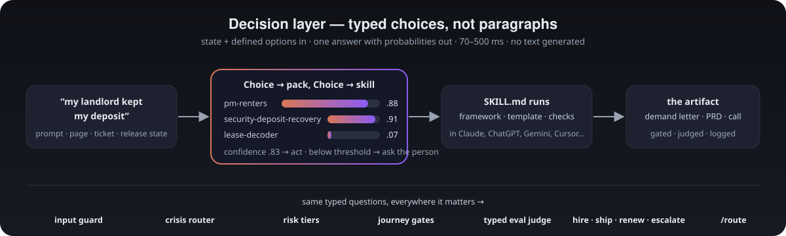

# What's new

The three most recent additions, in full. The short version is in the [README](../README.md#-whats-new) and every release is in the [changelog](../CHANGELOG.md).

## Design taste (v80.1.0)

Ask an assistant for a landing page and you get the same one everybody gets. The **[pm-design-taste](../plugins/pm-design-taste/)** bundle fixes the order of decisions instead of adding more rules: `ui-design-pipeline` runs five stages in sequence and hands each one to a specialist skill if you have it installed.

| Stage | What happens | Hands off to | Pointer skill |
|---|---|---|---|
| 1. Direction | Commit to an aesthetic stance from audience and purpose, before any code | frontend-design (Anthropic) | [`frontend-design-pointer`](../skills/frontend-design-pointer/SKILL.md) |
| 2. System | Lock the direction into a persisted design system file so later pages do not drift | ui-ux-pro-max (nextlevelbuilder) | [`ui-ux-pro-max-pointer`](../skills/ui-ux-pro-max-pointer/SKILL.md) |
| 3. Motion | Enter animations ease out, most motion under 300ms, animate only where it helps | emil-design-eng (Emil Kowalski) | [`emil-design-eng-pointer`](../skills/emil-design-eng-pointer/SKILL.md) |
| 4. Critique | Hierarchy, spacing, typography, and "too safe vs too loud" | impeccable (Paul Bakaus) | [`impeccable-pointer`](../skills/impeccable-pointer/SKILL.md) |
| 5. Verification | Real browser, mobile and desktop widths, screenshot each step, fix and re-check | playwright-cli (Microsoft) | [`playwright-cli-pointer`](../skills/playwright-cli-pointer/SKILL.md) |

The orchestrator is [`ui-design-pipeline`](../skills/ui-design-pipeline/SKILL.md). If a specialist skill is missing it uses its own built-in guidance and tells you the install command. It never loads all the design skills at once, because they give conflicting instructions.

```
/plugin install pm-design-taste@pm-claude-skills
```

Try it:

- "Run the design pipeline on this landing page."
- "This dashboard looks AI-generated. Fix it properly."
- "Which design skills do I have installed, and what is missing for the pipeline?"
- "Check the signup page in a real browser at mobile and desktop widths."

The five specialist skills are third-party projects. Nothing of theirs is copied here: the pointers give the install command and credit the author. Authors, licences and links are in [`THIRD_PARTY.md`](../plugins/pm-design-taste/THIRD_PARTY.md). More prompts in [`examples/pm-design-taste-example.md`](../examples/pm-design-taste-example.md).

## The promote loop (v80.0.0)

You have five prompts you type every week with small changes. Each one is a skill that hasn't been written down yet. The **[pm-skill-promoter](../plugins/pm-skill-promoter/)** bundle closes the loop: scan your own transcripts, pick a pattern, draft the skill, test its triggers, publish it. One command: `/promote ~/.claude/projects/my-project`.

Here is the loop on the fixture in [`examples/promoter/`](../examples/promoter/), a made-up three-week transcript with a few secrets planted in it:

```
$ python3 skills/promoter-scan/scripts/promoter_scan.py examples/promoter

| # | Pattern                            | Times | Score |
|---|------------------------------------|------:|------:|
| 1 | write release notes log            |    14 |    82 |   ← you asked for this FOURTEEN times
| 2 | draft update notes stakeholder     |     6 |    71 |
| 3 | summarise thread decisions owners  |     5 |    60 |

  "my api key is [api-key] please use it"      ← the planted secrets come out redacted
  "email the report to [email] and cc [phone]"
```

Pattern 1 becomes [`release-notes-from-git-log`](../examples/promoter/drafted-skill/SKILL.md): a trigger built from the phrases you actually typed, three worked examples with your product name removed, and the corrections you kept making ("shorter", "group by feature", "user-facing tone") turned into quality checks. Then the test:

```
$ python3 skills/promoter-test/scripts/promoter_test.py drafted-skill/SKILL.md drafted-skill/evals.json
precision 1.0  recall 1.0        ← fires on "changelog entry from these commits", stays quiet on "write a haiku about deploys"
```

Then [`promoter-publish`](../skills/promoter-publish/SKILL.md) prints the entire release package and asks once before pushing. The whole story, with every file: **[docs/PROMOTE-LOOP.md](PROMOTE-LOOP.md)**. Nothing leaves your machine during the scan; the redaction runs before anything is written.

## The decision layer (v79.0.0)

<p align="center">
  <a href="JEV-DECISION-LAYER.md"><picture><source media="(prefers-color-scheme: dark)" srcset="../web/docs-assets/decision-layer.svg"><source media="(prefers-color-scheme: light)" srcset="../web/docs-assets/decision-layer-light.svg"></picture></a>
</p>

Some questions deserve a **number, not a paragraph**: *which skill, out of more than a thousand?* · *is this input safe?* · *escalate or hold?* · *does this output clear the bar?* The library now answers those with typed questions — defined options in, one answer with a probability per option out — served by [TypeSafe Jev](https://docs.typesafe.ai) where you have access, and by a labelled Claude-backed adapter where you don't. Every piece falls back honestly; nothing breaks without a key. **[The full map, all 20 pieces →](JEV-DECISION-LAYER.md)**

```bash
npm run route -- "my landlord kept my deposit"
# security-deposit-recovery · pack pm-renters · tier high-stakes · confidence 0.83 · also: lease-decoder
```

| | |
|---|---|
| **Route** | a Claude Code [hook](../hooks/suggest-skill-jev.sh) · `POST /route` on the [worker](../mcp-remote/) · the [`pm-skills-jev-picker`](../integrations/jev/) npm package · the **[Skill Router](https://mohitagw15856.github.io/pm-claude-skills/router.html)** page: paste your week's prompts, see the skills you should have used |
| **Guard** | [input guard](../integrations/jev/guard.mjs) on the free runs · [crisis router](../integrations/jev/crisis.mjs) for public bots · [risk-tier second opinion](../scripts/classify-risk-tiers.mjs) · [human-review queue](HUMAN-REVIEW-QUEUE.md) ranked by harm |
| **Judge** | a [typed eval judge](../evals/jev-judge.mjs) · [sycophancy scan](../skillbench/SYCOPHANCY.md) · [route-bench](../skillbench/reports/route-bench.md): keyword floor 50.9% top-1 on 271 cases, the Claude adapter 62.4%, the Jev row waiting on a credential |
| **Decide** | **[pm-decisions](../plugins/pm-decisions/)** — [ship-or-slip](../skills/ship-or-slip/SKILL.md) · [escalate-or-hold](../skills/escalate-or-hold/SKILL.md) · [renew-or-churn-call](../skills/renew-or-churn-call/SKILL.md) · [hire-or-pass](../skills/hire-or-pass/SKILL.md): a state schema, defined options, thresholds, and a probability per option. A person still owns the call; the distribution is evidence |

No skill depends on a vendor. The SKILL.md files describe *contracts* any model can serve; the adapters live in [`integrations/jev/`](../integrations/jev/), and a CI gate keeps it that way.
