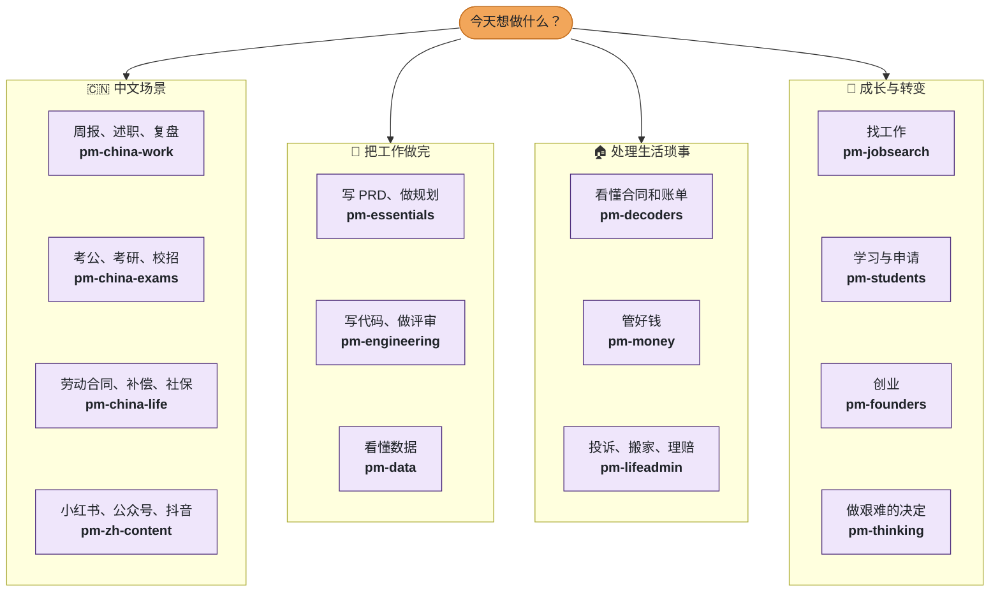

<!--
  README.zh-CN.md 的入门引导片段（Stream A）。按每段注释说明的位置粘贴。
  所有图片由 node scripts/build-readme-onboarding.mjs 生成（--check 可检查是否过期）。
  SVG 里的技能数和技能包数是实时读取的；下面标题里的 1,250 粘贴后由 scripts/check-drift.mjs 守护
  （注意：check-drift 目前不扫描 README.zh-CN.md，技能数变化时请手动更新这一处）。
  吉祥物：Nib（小笺），一张会挥手的小纸片。三个姿势：nib-wave、nib-point、nib-idea。
-->

<!-- ═══ 1. 一句话上手 ═══ 放在 H1 标题正下方，第一张图片之前。 -->

> **一句话上手** &nbsp; 安装：`npx --registry=https://registry.npmmirror.com pm-claude-skills add`（走国内镜像，任何工具都能用）· Claude Code 里输入 `/plugin` 搜索 **pm-skills**
> 然后直接说你要什么：*"帮我把这些笔记整理成周报。"*

<!-- ═══ 2. 漏斗图 ═══ 放在「## 它是怎么工作的」之前。 -->

## 🎯 1,250 个技能，你只需要 5 个

<p align="center">
  <picture>
    <source media="(prefers-color-scheme: dark)" srcset="docs/readme-assets/funnel-zh.svg">
    <source media="(prefers-color-scheme: light)" srcset="docs/readme-assets/funnel-zh-light.svg">
    
  </picture>
</p>

不用把整个库都装上。选一条路径，装一个技能包，平时最常用的那几个技能就能解决大部分事情。技能只在你的请求对得上时才会加载，其余的不占用任何上下文。

<!-- ═══ 3. 选择你的路径 ═══ 放在漏斗图之后、「## 它是怎么工作的」之前。 -->

## 🧑‍🤝‍🧑 选择你的路径

<table><tr><td width="72">
<picture>
  <source media="(prefers-color-scheme: dark)" srcset="docs/readme-assets/nib-wave.svg">
  <source media="(prefers-color-scheme: light)" srcset="docs/readme-assets/nib-wave-light.svg">
  
</picture>
</td><td><b>你好，我是 Nib（小笺）。</b> 中文用户直接点第一张卡片：三个入门技能，每个都附一句可以直接复制的提问。其他卡片的页面目前是英文。</td></tr></table>

<p align="center">
  <a href="docs/start/chinese.md"><picture><source media="(prefers-color-scheme: dark)" srcset="docs/readme-assets/path-chinese-zh.svg"><source media="(prefers-color-scheme: light)" srcset="docs/readme-assets/path-chinese-zh-light.svg"></picture></a>
  <a href="docs/start/product-manager.md"><picture><source media="(prefers-color-scheme: dark)" srcset="docs/readme-assets/path-product-manager-zh.svg"><source media="(prefers-color-scheme: light)" srcset="docs/readme-assets/path-product-manager-zh-light.svg"></picture></a>
  <a href="docs/start/engineer.md"><picture><source media="(prefers-color-scheme: dark)" srcset="docs/readme-assets/path-engineer-zh.svg"><source media="(prefers-color-scheme: light)" srcset="docs/readme-assets/path-engineer-zh-light.svg"></picture></a>
  <a href="docs/start/job-seeker.md"><picture><source media="(prefers-color-scheme: dark)" srcset="docs/readme-assets/path-job-seeker-zh.svg"><source media="(prefers-color-scheme: light)" srcset="docs/readme-assets/path-job-seeker-zh-light.svg"></picture></a>
  <a href="docs/start/student.md"><picture><source media="(prefers-color-scheme: dark)" srcset="docs/readme-assets/path-student-zh.svg"><source media="(prefers-color-scheme: light)" srcset="docs/readme-assets/path-student-zh-light.svg"></picture></a>
  <a href="docs/start/founder.md"><picture><source media="(prefers-color-scheme: dark)" srcset="docs/readme-assets/path-founder-zh.svg"><source media="(prefers-color-scheme: light)" srcset="docs/readme-assets/path-founder-zh-light.svg"></picture></a>
</p>

<!-- ═══ 4. 流程图 ═══ 放在「选择你的路径」之后。GitHub 和 Gitee 都能直接渲染 mermaid 代码块。
     从顶部出发，两次点击就能到达任何一个技能包；图下方的链接是不支持点击节点时的备用入口。 -->

## 🗺️ 今天想做什么？

<table><tr><td width="72">
<picture>
  <source media="(prefers-color-scheme: dark)" srcset="docs/readme-assets/nib-point.svg">
  <source media="(prefers-color-scheme: light)" srcset="docs/readme-assets/nib-point-light.svg">
  
</picture>
</td><td><b>不知道自己算哪一类？</b> 从你今天想做的事出发，每个小方框就是一个技能包，点开即可。</td></tr></table>



<sub>直接跳转：**中文** [pm-china-work](plugins/pm-china-work/) · [pm-china-exams](plugins/pm-china-exams/) · [pm-china-life](plugins/pm-china-life/) · [pm-zh-content](plugins/pm-zh-content/) · **工作** [pm-essentials](plugins/pm-essentials/) · [pm-engineering](plugins/pm-engineering/) · [pm-data](plugins/pm-data/) · **生活** [pm-decoders](plugins/pm-decoders/) · [pm-money](plugins/pm-money/) · [pm-lifeadmin](plugins/pm-lifeadmin/) · **成长** [pm-jobsearch](plugins/pm-jobsearch/) · [pm-students](plugins/pm-students/) · [pm-founders](plugins/pm-founders/) · [pm-thinking](plugins/pm-thinking/)</sub>

<!-- ═══ 5. 小测验 ═══ 放在流程图之后。测验页面目前只有英文版，这里如实说明。 -->

## 🧩 你是哪一类专业人士？

四个小问题，每题两个选项，不用注册，最后给你推荐一个技能包和三个先试的技能。（测验页面为英文。）

**第 1 题：今天是为什么而来？**

<a href="docs/quiz/q2.md"></a>
<a href="docs/quiz/q3.md"></a>

<!-- ═══ 6. 任务清单 ═══ 放在「## 安装（全部走国内网络）」一节之后、「## 中文技能包」之前。 -->

## 🏆 任务清单

<table><tr><td width="72">
<picture>
  <source media="(prefers-color-scheme: dark)" srcset="docs/readme-assets/nib-idea.svg">
  <source media="(prefers-color-scheme: light)" srcset="docs/readme-assets/nib-idea-light.svg">
  
</picture>
</td><td><b>Nib 的小提示：</b> 第 1 关只要两分钟。随时可以停下，大多数人用不到第 5 关。</td></tr></table>

<details>
<summary> &nbsp;<b>第 1 关 · 新手：用上第一个技能</b></summary>

<br>

**任务：** 安装，然后提一个你这周真正需要解决的事。

```bash
npx --registry=https://registry.npmmirror.com pm-claude-skills add --agent trae   # 或 qoder / lingma / codebuddy / claude
```

然后用自己的话问：*"帮我把这些笔记整理成周报：……"*

**完成标准：** 你拿到的是一份写好的文档，而不是一堆建议。

</details>

<details>
<summary> &nbsp;<b>第 2 关 · 探索者：找到合适的技能</b></summary>

<br>

**任务：** 描述一件说不清楚该用哪个技能的事，让查找工具告诉你。

```bash
npx --registry=https://registry.npmmirror.com pm-claude-skills find "写述职报告"
```

也可以用 [魔搭路由模型](https://www.modelscope.ai/models/mohitagw15856/pm-skills-router)。

**完成标准：** 你用上了一个原本不知道存在的技能。

</details>

<details>
<summary> &nbsp;<b>第 3 关 · 收藏家：装上你的技能包</b></summary>

<br>

**任务：** 只装和你相关的中文技能包。

```bash
npx --registry=https://registry.npmmirror.com pm-claude-skills add --agent trae --bundle pm-china-work,pm-china-exams,pm-china-life
```

**完成标准：** 一周内用上其中三个技能。

</details>

<details>
<summary> &nbsp;<b>第 4 关 · 串联者：跑一条工作流</b></summary>

<br>

**任务：** 从 [WORKFLOWS.md](WORKFLOWS.md) 里挑一条工作流（比如 Run Discovery），在同一个对话里按顺序调用其中的技能。也可以用你自己的 Anthropic API Key 在命令行里一次跑完：

```bash
npx pm-claude-skills chain run-discovery --input notes.txt
```

**完成标准：** 放进去的是零散笔记，拿出来的是一整套成品文档。

</details>

<details>
<summary> &nbsp;<b>第 5 关 · 高手：做一个自己的技能</b></summary>

<br>

**任务：** 让 [make-me-a-skill](skills/make-me-a-skill/SKILL.md) 把你每周都要重复做的事变成一个 SKILL.md，然后检查它。

```bash
npx pm-claude-skills skillcheck --dir ./my-skills
```

**完成标准：** 你的技能通过检查，并且在你提出对应请求时会自动加载。想分享出来？看 [贡献指南](CONTRIBUTING.md)。

</details>
