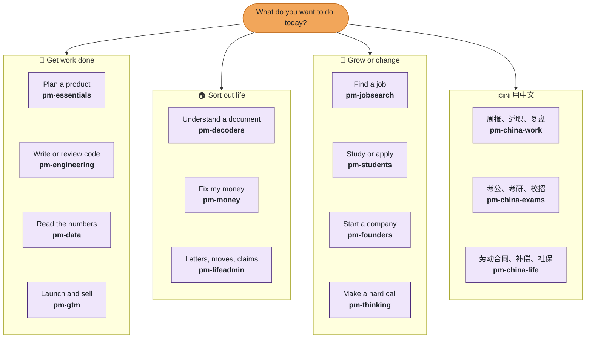

<!--
  Onboarding snippets for README.md (Stream A). Paste each block where its comment says.
  Every asset here is built by: node scripts/build-readme-onboarding.mjs   (check: --check)
  Counts inside the SVGs are read live; the two literal counts below (1,250 and the
  section title) are guarded by scripts/check-drift.mjs once they are in README.md.
  Mascot: Nib, a small friendly page. Three poses: nib-wave, nib-point, nib-idea.
-->

<!-- ═══ 1. TL;DR ═══ Insert directly under the H1 title, above the hero <p align="center"> block. -->

> **TL;DR** &nbsp; Install: `npx pm-claude-skills add` (any tool) · In Claude Code: `/plugin` → search **pm-skills**
> Then just say what you need: *"Decode this job ad and tell me where I am weak."*

<!-- ═══ 2. FUNNEL ═══ Insert directly above "## 🚪 Pick a door". -->

## 🎯 1,250 skills, you need 5

<p align="center">
  <picture>
    <source media="(prefers-color-scheme: dark)" srcset="docs/readme-assets/funnel.svg">
    <source media="(prefers-color-scheme: light)" srcset="docs/readme-assets/funnel-light.svg">
    
  </picture>
</p>

You never need the whole library. Pick a path below, install one bundle, and the few skills you reach for every week will do most of the work. Each skill loads only when your request fits it, so the rest cost you nothing.

<!-- ═══ 3. PICK YOUR PATH ═══ Insert directly after the "## 🚪 Pick a door" section (before "## 🇨🇳 中文支持"). -->

## 🧑‍🤝‍🧑 Pick your path

<table><tr><td width="72">
<picture>
  <source media="(prefers-color-scheme: dark)" srcset="docs/readme-assets/nib-wave.svg">
  <source media="(prefers-color-scheme: light)" srcset="docs/readme-assets/nib-wave-light.svg">
  
</picture>
</td><td><b>Hi, I'm Nib.</b> Pick the card that sounds most like you. Each one opens three starter skills with a prompt you can copy.</td></tr></table>

<p align="center">
  <a href="docs/start/product-manager.md"><picture><source media="(prefers-color-scheme: dark)" srcset="docs/readme-assets/path-product-manager.svg"><source media="(prefers-color-scheme: light)" srcset="docs/readme-assets/path-product-manager-light.svg"></picture></a>
  <a href="docs/start/engineer.md"><picture><source media="(prefers-color-scheme: dark)" srcset="docs/readme-assets/path-engineer.svg"><source media="(prefers-color-scheme: light)" srcset="docs/readme-assets/path-engineer-light.svg"></picture></a>
  <a href="docs/start/job-seeker.md"><picture><source media="(prefers-color-scheme: dark)" srcset="docs/readme-assets/path-job-seeker.svg"><source media="(prefers-color-scheme: light)" srcset="docs/readme-assets/path-job-seeker-light.svg"></picture></a>
  <a href="docs/start/student.md"><picture><source media="(prefers-color-scheme: dark)" srcset="docs/readme-assets/path-student.svg"><source media="(prefers-color-scheme: light)" srcset="docs/readme-assets/path-student-light.svg"></picture></a>
  <a href="docs/start/founder.md"><picture><source media="(prefers-color-scheme: dark)" srcset="docs/readme-assets/path-founder.svg"><source media="(prefers-color-scheme: light)" srcset="docs/readme-assets/path-founder-light.svg"></picture></a>
  <a href="docs/start/chinese.md"><picture><source media="(prefers-color-scheme: dark)" srcset="docs/readme-assets/path-chinese.svg"><source media="(prefers-color-scheme: light)" srcset="docs/readme-assets/path-chinese-light.svg"></picture></a>
</p>

<p align="center"><sub>All six on one page: <a href="docs/start/README.md">docs/start</a></sub></p>

<!-- ═══ 4. FLOWCHART ═══ Insert directly after "Pick your path". GitHub renders ```mermaid natively.
     Every bundle is two clicks from the top. The links under the chart are the fallback
     for viewers that do not make Mermaid nodes clickable. -->

## 🗺️ What do you want to do today?

<table><tr><td width="72">
<picture>
  <source media="(prefers-color-scheme: dark)" srcset="docs/readme-assets/nib-point.svg">
  <source media="(prefers-color-scheme: light)" srcset="docs/readme-assets/nib-point-light.svg">
  
</picture>
</td><td><b>Not a job title person?</b> Start from what you want to do. Every small box is one bundle; click it to open.</td></tr></table>



<sub>Jump straight there: **work** [pm-essentials](plugins/pm-essentials/) · [pm-engineering](plugins/pm-engineering/) · [pm-data](plugins/pm-data/) · [pm-gtm](plugins/pm-gtm/) · **life** [pm-decoders](plugins/pm-decoders/) · [pm-money](plugins/pm-money/) · [pm-lifeadmin](plugins/pm-lifeadmin/) · **grow** [pm-jobsearch](plugins/pm-jobsearch/) · [pm-students](plugins/pm-students/) · [pm-founders](plugins/pm-founders/) · [pm-thinking](plugins/pm-thinking/) · **中文** [pm-china-work](plugins/pm-china-work/) · [pm-china-exams](plugins/pm-china-exams/) · [pm-china-life](plugins/pm-china-life/)</sub>

<!-- ═══ 5. QUIZ ═══ Insert directly after the flowchart. Question 1 lives here; the rest
     are pages under docs/quiz/ (generated), ending at one of six result pages. -->

## 🧩 Which professional are you?

Four quick questions, two answers each, no sign-up. You land on one bundle and three skills to try first.

**Question 1 of 4: What brought you here today?**

<a href="docs/quiz/q2.md"></a>
<a href="docs/quiz/q3.md"></a>

<!-- ═══ 6. QUEST LOG ═══ Insert directly after the "## ⚡ Quick start" section (before "## 📚 The skills"). -->

## 🏆 Quest log

<table><tr><td width="72">
<picture>
  <source media="(prefers-color-scheme: dark)" srcset="docs/readme-assets/nib-idea.svg">
  <source media="(prefers-color-scheme: light)" srcset="docs/readme-assets/nib-idea-light.svg">
  
</picture>
</td><td><b>Tip from Nib:</b> level 1 takes two minutes. Stop wherever you like; most people never need level 5.</td></tr></table>

<details>
<summary> &nbsp;<b>Level 1 · Beginner: your first skill</b></summary>

<br>

**Task:** install, then ask for one real thing you need this week.

```bash
npx pm-claude-skills add          # any tool; in Claude Code use /plugin and search pm-skills
```

Then ask, in your own words: *"My landlord kept my deposit. What can I do?"*

**Done when** you get a finished document back, not advice about one.

</details>

<details>
<summary> &nbsp;<b>Level 2 · Explorer: find the right skill</b></summary>

<br>

**Task:** describe a fuzzy task and let the finder name the skill.

```bash
npx pm-claude-skills find "board meeting on Thursday"
```

No terminal? Use the [web finder](https://mohitagw15856.github.io/pm-claude-skills/find.html).

**Done when** you have used a skill you did not know existed.

</details>

<details>
<summary> &nbsp;<b>Level 3 · Collector: install your bundle</b></summary>

<br>

**Task:** install the whole bundle for your path (swap in yours from [Pick your path](docs/start/README.md)).

```bash
npx pm-claude-skills add --bundle pm-essentials
```

In Claude Code: `/plugin install pm-essentials@pm-claude-skills`

**Done when** you have used three skills from it in one week.

</details>

<details>
<summary> &nbsp;<b>Level 4 · Chainer: run a workflow</b></summary>

<br>

**Task:** pick a recipe from [WORKFLOWS.md](WORKFLOWS.md), such as Run Discovery, and run its skills in order in one conversation. Or run it headless with your own Anthropic API key:

```bash
npx pm-claude-skills chain run-discovery --input notes.txt
```

**Done when** raw notes went in and a folder of finished documents came out.

</details>

<details>
<summary> &nbsp;<b>Level 5 · Power user: make your own skill</b></summary>

<br>

**Task:** ask [make-me-a-skill](skills/make-me-a-skill/SKILL.md) to turn something you do every week into a SKILL.md, then lint it.

```bash
npx pm-claude-skills skillcheck --dir ./my-skills
```

**Done when** your skill passes the check and loads on its own when you ask for that task. Proud of it? [Contributing](CONTRIBUTING.md) explains how to share it.

</details>
