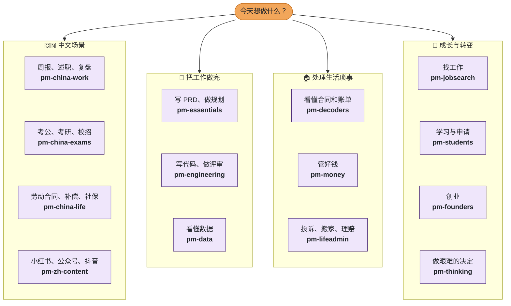

# 从这里开始（中文版导览）

<sub>[PM Skills](../../README.zh-CN.md) 的一部分。首页在 v82 精简成一页，这些内容原样搬到了这里（只调整了路径）。</sub>

## 🎯 1,285 个技能，你只需要 5 个

<p align="center">
  <picture>
    <source media="(prefers-color-scheme: dark)" srcset="../readme-assets/funnel-zh.svg">
    <source media="(prefers-color-scheme: light)" srcset="../readme-assets/funnel-zh-light.svg">
    
  </picture>
</p>

不用把整个库都装上。选一条路径，装一个技能包，平时最常用的那几个技能就能解决大部分事情。技能只在你的请求对得上时才会加载，其余的不占用任何上下文。


## 🗺️ 今天想做什么？

<table><tr><td width="72">
<picture>
  <source media="(prefers-color-scheme: dark)" srcset="../readme-assets/nib-point.svg">
  <source media="(prefers-color-scheme: light)" srcset="../readme-assets/nib-point-light.svg">
  
</picture>
</td><td><b>不知道自己算哪一类？</b> 从你今天想做的事出发，每个小方框就是一个技能包，点开即可。</td></tr></table>



<sub>直接跳转：**中文** [pm-china-work](../../plugins/pm-china-work/) · [pm-china-exams](../../plugins/pm-china-exams/) · [pm-china-life](../../plugins/pm-china-life/) · [pm-zh-content](../../plugins/pm-zh-content/) · **工作** [pm-essentials](../../plugins/pm-essentials/) · [pm-engineering](../../plugins/pm-engineering/) · [pm-data](../../plugins/pm-data/) · **生活** [pm-decoders](../../plugins/pm-decoders/) · [pm-money](../../plugins/pm-money/) · [pm-lifeadmin](../../plugins/pm-lifeadmin/) · **成长** [pm-jobsearch](../../plugins/pm-jobsearch/) · [pm-students](../../plugins/pm-students/) · [pm-founders](../../plugins/pm-founders/) · [pm-thinking](../../plugins/pm-thinking/)</sub>


## 🧩 你是哪一类专业人士？

四个小问题，每题两个选项，不用注册，最后给你推荐一个技能包和三个先试的技能。（测验页面为英文。）

**第 1 题：今天是为什么而来？**

<a href="../quiz/q2.md"></a>
<a href="../quiz/q3.md"></a>


## ☕ 打工人的一天

<p align="center">
  <picture>
    <source media="(prefers-color-scheme: dark)" srcset="../readme-assets/day-zh.svg">
    <source media="(prefers-color-scheme: light)" srcset="../readme-assets/day-zh-light.svg">
    
  </picture>
</p>

<p align="center"><sub>
<b>9:00</b> <a href="skills/async-standup-compiler/SKILL.md">站会</a> ·
<b>10:30</b> <a href="skills/cn-prd-review/SKILL.md">需求评审</a> ·
<b>14:00</b> <a href="skills/stakeholder-update/SKILL.md">向老板汇报</a> ·
<b>16:00</b> <a href="skills/cn-fupan/SKILL.md">项目复盘</a> ·
<b>17:30</b> <a href="skills/cn-weekly-report/SKILL.md">写周报</a> ·
<b>19:30</b> <a href="skills/cn-promotion-defence/SKILL.md">晋升答辩</a> ·
<b>21:30</b> <a href="skills/cn-kaoyan-planner/SKILL.md">下班后考研</a>
</sub></p>


### 支持的 AI 编程工具

<table>
<tr>
<td width="50%"><b>✅ Trae</b> <sub>写入 <code>.trae/rules/</code></sub><br><code>npx --registry=https://registry.npmmirror.com pm-claude-skills add --agent trae</code></td>
<td width="50%"><b>✅ 通义灵码 Lingma</b> <sub>写入 <code>.lingma/rules/</code></sub><br><code>npx --registry=https://registry.npmmirror.com pm-claude-skills add --agent lingma</code></td>
</tr>
<tr>
<td><b>✅ CodeBuddy</b> <sub>写入 <code>.codebuddy/rules/</code></sub><br><code>npx --registry=https://registry.npmmirror.com pm-claude-skills add --agent codebuddy</code></td>
<td><b>✅ Qoder</b> <sub>写入 <code>.qoder/rules/</code></sub><br><code>npx --registry=https://registry.npmmirror.com pm-claude-skills add --agent qoder</code></td>
</tr>
<tr>
<td><b>✅ Cursor</b> <sub>写入 <code>.cursor/rules/</code></sub><br><code>npx --registry=https://registry.npmmirror.com pm-claude-skills add --agent cursor</code></td>
<td><b>✅ Claude Code</b> <sub>写入 <code>~/.claude/skills/</code></sub><br><code>npx --registry=https://registry.npmmirror.com pm-claude-skills add --agent claude</code></td>
</tr>
<tr>
<td><b>✅ Codex</b> <sub>写入 <code>~/.codex/skills/</code></sub><br><code>npx --registry=https://registry.npmmirror.com pm-claude-skills add --agent codex</code></td>
<td><b>✅ Windsurf</b> <sub>写入 <code>.windsurf/rules/</code></sub><br><code>npx --registry=https://registry.npmmirror.com pm-claude-skills add --agent windsurf</code></td>
</tr>
</table>

<sub>另外支持 Kilo Code、Aider、Hermes、OpenClaw（<code>--agent kilocode</code> 等）。通义灵码单个规则文件上限 10,000 字符，超长的技能会被截断，安装时会列出。Qwen Code、Kimi CLI、文心快码（Comate）暂时还没有 <code>--agent</code> 选项；如果你用的工具支持 MCP，可以先接入本地 MCP 服务，见 <a href="../CHINA.md">在中国使用</a> 第五节。</sub>


## 🏆 任务清单

<table><tr><td width="72">
<picture>
  <source media="(prefers-color-scheme: dark)" srcset="../readme-assets/nib-idea.svg">
  <source media="(prefers-color-scheme: light)" srcset="../readme-assets/nib-idea-light.svg">
  
</picture>
</td><td><b>Nib 的小提示：</b> 第 1 关只要两分钟。随时可以停下，大多数人用不到第 5 关。</td></tr></table>

<details>
<summary> &nbsp;<b>第 1 关 · 新手：用上第一个技能</b></summary>

<br>

**任务：** 安装，然后提一个你这周真正需要解决的事。

```bash
npx --registry=https://registry.npmmirror.com pm-claude-skills add --agent trae   # 或 qoder / lingma / codebuddy / claude
```

然后用自己的话问：*"帮我把这些笔记整理成周报：……"*

**完成标准：** 你拿到的是一份写好的文档，而不是一堆建议。

</details>

<details>
<summary> &nbsp;<b>第 2 关 · 探索者：找到合适的技能</b></summary>

<br>

**任务：** 描述一件说不清楚该用哪个技能的事，让查找工具告诉你。

```bash
npx --registry=https://registry.npmmirror.com pm-claude-skills find "写述职报告"
```

也可以用 [魔搭路由模型](https://www.modelscope.ai/models/mohitagw15856/pm-skills-router)。

**完成标准：** 你用上了一个原本不知道存在的技能。

</details>

<details>
<summary> &nbsp;<b>第 3 关 · 收藏家：装上你的技能包</b></summary>

<br>

**任务：** 只装和你相关的中文技能包。

```bash
npx --registry=https://registry.npmmirror.com pm-claude-skills add --agent trae --bundle pm-china-work,pm-china-exams,pm-china-life
```

**完成标准：** 一周内用上其中三个技能。

</details>

<details>
<summary> &nbsp;<b>第 4 关 · 串联者：跑一条工作流</b></summary>

<br>

**任务：** 从 [WORKFLOWS.md](../../WORKFLOWS.md) 里挑一条工作流（比如 Run Discovery），在同一个对话里按顺序调用其中的技能。也可以用你自己的 Anthropic API Key 在命令行里一次跑完：

```bash
npx pm-claude-skills chain run-discovery --input notes.txt
```

**完成标准：** 放进去的是零散笔记，拿出来的是一整套成品文档。

</details>

<details>
<summary> &nbsp;<b>第 5 关 · 高手：做一个自己的技能</b></summary>

<br>

**任务：** 让 [make-me-a-skill](../../skills/make-me-a-skill/SKILL.md) 把你每周都要重复做的事变成一个 SKILL.md，然后检查它。

```bash
npx pm-claude-skills skillcheck --dir ./my-skills
```

**完成标准：** 你的技能通过检查，并且在你提出对应请求时会自动加载。想分享出来？看 [贡献指南](../../CONTRIBUTING.md)。

</details>


## 💬 复制一句，马上就用

<p align="center">
  <picture>
    <source media="(prefers-color-scheme: dark)" srcset="../readme-assets/chats-zh.svg">
    <source media="(prefers-color-scheme: light)" srcset="../readme-assets/chats-zh-light.svg">
    
  </picture>
</p>

装好以后，把下面任意一句发给你的 AI 助手（省略号换成你自己的情况），它会自动加载对应的技能。

<details open>
<summary><b>💼 职场</b></summary>

```text
帮我把这些笔记整理成周报：……
```
→ [`cn-weekly-report`](../../skills/cn-weekly-report/SKILL.md)

```text
明天开需求评审，帮我检查这份 PRD，研发和测试会问什么？
```
→ [`cn-prd-review`](../../skills/cn-prd-review/SKILL.md)

```text
下个月晋升答辩，从 P6 到 P7，帮我搭材料框架，再模拟评委提问。
```
→ [`cn-promotion-defence`](../../skills/cn-promotion-defence/SKILL.md)

```text
项目延期了一个月，帮我组织一次复盘，不要变成追责会。
```
→ [`cn-fupan`](../../skills/cn-fupan/SKILL.md)

```text
帮我写年终述职报告，这是我今年的 OKR 和完成情况：……
```
→ [`cn-year-end-review`](../../skills/cn-year-end-review/SKILL.md)

```text
阿里 P7 跳槽到字节，大概对应几级？这个 offer 算平跳还是升职？
```
→ [`cn-level-mapper`](../../skills/cn-level-mapper/SKILL.md)

```text
帮我写一份请示，申请增加下半年的培训经费，按公文格式排。
```
→ [`cn-official-document`](../../skills/cn-official-document/SKILL.md)

```text
项目要延期，我该怎么跟老板说，才能拿到他的支持？
```
→ [`managing-up`](../../skills/managing-up/SKILL.md)

</details>

<details>
<summary><b>📚 学业与考试</b></summary>

```text
离考研还有 100 天，目标 985 计算机，帮我排每天的复习计划。
```
→ [`cn-kaoyan-planner`](../../skills/cn-kaoyan-planner/SKILL.md)

```text
这是申论的给定资料和题目，帮我审题、列提纲，再写一段开头。
```
→ [`cn-civil-exam-essay`](../../skills/cn-civil-exam-essay/SKILL.md)

```text
下个月公务员面试，帮我模拟一轮结构化面试，答完给我打分。
```
→ [`cn-civil-exam-interview`](../../skills/cn-civil-exam-interview/SKILL.md)

```text
帮我写开题报告，研究方向是……，导师要求下周交。
```
→ [`cn-thesis-proposal`](../../skills/cn-thesis-proposal/SKILL.md)

```text
帮我把这些参考文献按 GB/T 7714 改成顺序编码制。
```
→ [`cn-citation-gbt7714`](../../skills/cn-citation-gbt7714/SKILL.md)

```text
明年秋招，计算机硕士，帮我列时间线和目标公司清单。
```
→ [`cn-campus-recruitment`](../../skills/cn-campus-recruitment/SKILL.md)

```text
下周字节二面，帮我模拟一轮项目深挖和系统设计。
```
→ [`cn-tech-interview-drill`](../../skills/cn-tech-interview-drill/SKILL.md)

</details>

<details>
<summary><b>🏠 生活</b></summary>

```text
公司要裁我，工作 6 年半，月薪 3 万，能拿多少补偿？
```
→ [`cn-severance-calculator`](../../skills/cn-severance-calculator/SKILL.md)

```text
帮我看看这份劳动合同，有没有对我不利的条款？
```
→ [`cn-labour-contract-decoder`](../../skills/cn-labour-contract-decoder/SKILL.md)

```text
个税年度汇算怎么做？年终奖单独计税还是并入综合所得更划算？
```
→ [`cn-iit-reconciliation`](../../skills/cn-iit-reconciliation/SKILL.md)

```text
在上海租房，公积金能提吗？每个月能提多少？
```
→ [`cn-housing-fund-withdrawal`](../../skills/cn-housing-fund-withdrawal/SKILL.md)

```text
我在上海工作 5 年，本科学历，积分落户还差多少分？
```
→ [`cn-hukou-points`](../../skills/cn-hukou-points/SKILL.md)

```text
换工作中间断了两个月社保，有什么影响？要不要自己补交？
```
→ [`cn-social-insurance-explainer`](../../skills/cn-social-insurance-explainer/SKILL.md)

```text
孩子高考 580 分，河南物理类，帮我做一份冲稳保的志愿方案。
```
→ [`cn-gaokao-planner`](../../skills/cn-gaokao-planner/SKILL.md)

</details>

<details>
<summary><b>🌏 出海</b></summary>

```text
我们做智能家居，想出海，东南亚和欧洲先去哪？帮我做第一年的计划。
```
→ [`chuhai-market-entry`](../../skills/chuhai-market-entry/SKILL.md)

```text
Temu 全托管、TikTok Shop 还是亚马逊 FBA？帮我对比一下。
```
→ [`crossborder-platform-playbook`](../../skills/crossborder-platform-playbook/SKILL.md)

```text
把这个产品的中文介绍改写成亚马逊美国站的 listing，不要直译。
```
→ [`cross-border-listing`](../../skills/cross-border-listing/SKILL.md)

```text
用户数据要同步到海外总部，PIPL 和 GDPR 分别要我们做什么？
```
→ [`pipl-gdpr-crosswalk`](../../skills/pipl-gdpr-crosswalk/SKILL.md)

```text
我们把国内用户数据传到新加坡服务器，要申报数据出境安全评估吗？
```
→ [`cn-data-export-assessment`](../../skills/cn-data-export-assessment/SKILL.md)

```text
帮我做一份中英文简历，要投外企。
```
→ [`bilingual-cv-zh-en`](../../skills/bilingual-cv-zh-en/SKILL.md)

</details>


## 看一看

<table>
<tr>
<td width="50%" align="center">
<a href="https://mohitagw15856.github.io/pm-claude-skills/tech-tree/"></a>
<br /><sub><b>🌳 <a href="https://mohitagw15856.github.io/pm-claude-skills/tech-tree/">技能科技树</a></b>：整个技能库画成一棵科技树，可以搜索、复制安装命令、为想要的技能投票。</sub>
</td>
<td width="50%" align="center">
<a href="../../plugins/pm-3d-explorer/"></a>
<br /><sub><b>🧊 <a href="../../plugins/pm-3d-explorer/">3D 讲解页</a></b>：给一个主题，生成可以拆开看、点击看标注、还能做小测验的 3D 页面。</sub>
</td>
</tr>
<tr>
<td width="50%" align="center">
<a href="https://mohitagw15856.github.io/pm-claude-skills/find.html?q=%E5%B8%AE%E6%88%91%E5%86%99%E5%91%A8%E6%8A%A5"></a>
<br /><sub><b>🔎 <a href="https://mohitagw15856.github.io/pm-claude-skills/find.html">找技能</a></b>：用自己的话描述任务，中英文都可以，在浏览器里本地匹配。</sub>
</td>
<td width="50%" align="center">
<a href="https://mohitagw15856.github.io/pm-claude-skills/city.html"></a>
<br /><sub><b>🏙 <a href="https://mohitagw15856.github.io/pm-claude-skills/city.html">技能城</a></b>：每个技能是一栋楼，用得越多，城市越亮。</sub>
</td>
</tr>
</table>

[🧧 拜年语生成器](https://mohitagw15856.github.io/pm-claude-skills/bainian.html)：选对象、选语气、选生肖年份，一键复制新春祝福。

[💌 祝福语生成器](https://mohitagw15856.github.io/pm-claude-skills/zhufu.html)（中秋、教师节、生日、送别、感谢） · [📋 年终总结与述职提纲](https://mohitagw15856.github.io/pm-claude-skills/nianzhong.html) · [🗓 调休规划器](https://mohitagw15856.github.io/pm-claude-skills/tiaoxiu.html) · [🪪 实时卡片嵌入](https://mohitagw15856.github.io/pm-claude-skills/live-cards.html)（每张卡片都有 PNG 版，可以直接发微信、微博和小红书）

终端里看今日技能：`npx pm-claude-skills today --lang zh`

🀄 [中文技能目录](https://mohitagw15856.github.io/pm-claude-skills/zh/)（每个中文技能一页，方便百度搜到） · [🏙 城市数据](https://mohitagw15856.github.io/pm-claude-skills/city-data.html)（各地社保基数和经济补偿金封顶，附官方来源） · [📰 本周周刊草稿](https://mohitagw15856.github.io/pm-claude-skills/live/zhoukan.html) · [LobeHub 助手导出](https://mohitagw15856.github.io/pm-claude-skills/lobehub/index.json) · 今日技能 [RSS 订阅](https://mohitagw15856.github.io/pm-claude-skills/live/skill-of-the-day-zh.rss) · 拼音也能搜：`npx pm-claude-skills find zhoubao`


<table><tr>
<td width="300"><a href="../readme-assets/poster-zh.png"></a></td>
<td><b>📱 扫码试用，转发给同事</b><br><br>
手机扫码打开 <a href="https://www.modelscope.ai/studios/mohitagw15856/pm-skills-playground">魔搭创空间</a>，不用安装就能试。<br><br>
想发小红书或朋友圈？点图片下载 <a href="../readme-assets/poster-zh.png">1080×1440 原图</a>。<br><br>
源码国内镜像：<a href="https://gitee.com/mohitagw/pm-claude-skills">gitee.com/mohitagw/pm-claude-skills</a></td>
</tr></table>


## 国内渠道在线记录

<p align="center">
  <a href="https://mohitagw15856.github.io/pm-claude-skills/live/season.html">
    
  </a>
</p>

<p align="center">
  <picture>
    <source media="(prefers-color-scheme: dark)" srcset="https://mohitagw15856.github.io/pm-claude-skills/live/cn-status-history.svg">
    <source media="(prefers-color-scheme: light)" srcset="https://mohitagw15856.github.io/pm-claude-skills/live/cn-status-history-light.svg">
    
  </picture>
</p>
