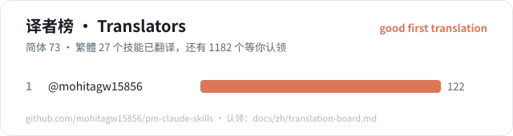

<!-- Generated by scripts/translation-board.mjs --write. Do not edit by hand. -->
# 翻译认领板 · Translation claim board

PM Skills 共有 1255 个技能，其中 **73** 个有简体中文翻译，**27** 个有繁體中文翻译。下面按"对中文用户有多大用处"排好了序，挑一个认领就可以开始。

## 怎么认领

1. 在下表里挑一个技能，点"认领"打开 GitHub Issue（模板已填好）。用不了 GitHub 的话，在 [Gitee Issue](https://gitee.com/mohitagw/pm-claude-skills/issues) 选"认领翻译"模板，或者直接留言。
2. 如果已经有人认领（看 [good first translation](https://github.com/mohitagw15856/pm-claude-skills/labels/good%20first%20translation) 标签下的 Issue），请换一个，或者在 Issue 下留言一起做。
3. 翻译放在 `skills-i18n/zh/<技能名>/SKILL.md`（简体）或 `skills-i18n/zh-TW/<技能名>/SKILL.md`（繁体）。二级标题数量与英文版一致，`name` 不变，加 `language:` 字段和"英文版本为规范版本"的说明。参考 [`skills-i18n/zh/cn-weekly-report/SKILL.md`](../../skills-i18n/zh/cn-weekly-report/SKILL.md)。
4. 不要逐字直译：把例子、货币、法规换成中文读者熟悉的说法；英文原文里只适用于美国的内容，在译文里注明。
5. 提交 PR，CI 会检查结构。合并后你的名字会出现在下面的译者榜上。

分数怎么算：中国本地化技能和技能包、求职与核心产品技能包优先；生产级技能、评测分高、已有中文简介、已有另一种中文版本的加分；依赖美国专属规则的减分。

## P0 · 最值得先翻译（11 个）

| 技能 | 中文简介 | 技能包 | 分数 | 也缺繁體 | 认领 |
|---|---|---|---:|:---:|---|
| [`cn-jargon-translator`](../../skills/cn-jargon-translator/SKILL.md) | 互联网黑话翻译器：把对齐、抓手、闭环、赋能等黑话翻译成人话，周报去黑话，也能反向生成大厂味文案 | pm-china-work | 95 | 是 | [认领](https://github.com/mohitagw15856/pm-claude-skills/issues/new?template=zh-translation.yml&labels=translation%2Cgood%20first%20translation&title=%5B%E7%BF%BB%E8%AF%91%5D%20cn-jargon-translator%20%E2%86%92%20zh) |
| [`cn-next-year-plan`](../../skills/cn-next-year-plan/SKILL.md) | 明年个人 OKR 或 KPI 与个人发展计划（IDP）：对齐上级目标、季度里程碑和目标沟通话术 | pm-china-yearend | 95 | 是 | [认领](https://github.com/mohitagw15856/pm-claude-skills/issues/new?template=zh-translation.yml&labels=translation%2Cgood%20first%20translation&title=%5B%E7%BF%BB%E8%AF%91%5D%20cn-next-year-plan%20%E2%86%92%20zh) |
| [`cn-shuzhi-deck`](../../skills/cn-shuzhi-deck/SKILL.md) | 述职 PPT 大纲与讲稿：每页结论先行、图表建议、按时长控制的讲稿和问答准备 | pm-china-yearend | 95 | 是 | [认领](https://github.com/mohitagw15856/pm-claude-skills/issues/new?template=zh-translation.yml&labels=translation%2Cgood%20first%20translation&title=%5B%E7%BF%BB%E8%AF%91%5D%20cn-shuzhi-deck%20%E2%86%92%20zh) |
| [`cn-year-end-bonus`](../../skills/cn-year-end-bonus/SKILL.md) | 年终奖怎么算、13薪和年终奖的区别、年终奖个税单独计税还是并入综合所得、离职后年终奖被扣怎么办 | pm-china-yearend | 95 | 是 | [认领](https://github.com/mohitagw15856/pm-claude-skills/issues/new?template=zh-translation.yml&labels=translation%2Cgood%20first%20translation&title=%5B%E7%BF%BB%E8%AF%91%5D%20cn-year-end-bonus%20%E2%86%92%20zh) |
| [`ab-test-planner`](../../skills/ab-test-planner/SKILL.md) | 设计 A/B 测试：假设、指标、样本量和显著性 | pm-delivery | 73 | 是 | [认领](https://github.com/mohitagw15856/pm-claude-skills/issues/new?template=zh-translation.yml&labels=translation%2Cgood%20first%20translation&title=%5B%E7%BF%BB%E8%AF%91%5D%20ab-test-planner%20%E2%86%92%20zh) |
| [`assumption-mapper`](../../skills/assumption-mapper/SKILL.md) | Assumption Mapper | pm-discovery | 65 | 是 | [认领](https://github.com/mohitagw15856/pm-claude-skills/issues/new?template=zh-translation.yml&labels=translation%2Cgood%20first%20translation&title=%5B%E7%BF%BB%E8%AF%91%5D%20assumption-mapper%20%E2%86%92%20zh) |
| [`churn-analysis`](../../skills/churn-analysis/SKILL.md) | 用户流失分析：流失率上升的原因、分群和留存改进 | pm-cs | 60 | 是 | [认领](https://github.com/mohitagw15856/pm-claude-skills/issues/new?template=zh-translation.yml&labels=translation%2Cgood%20first%20translation&title=%5B%E7%BF%BB%E8%AF%91%5D%20churn-analysis%20%E2%86%92%20zh) |
| [`cs-health-scorecard`](../../skills/cs-health-scorecard/SKILL.md) | Customer Health Scorecard | pm-cs | 55 | 是 | [认领](https://github.com/mohitagw15856/pm-claude-skills/issues/new?template=zh-translation.yml&labels=translation%2Cgood%20first%20translation&title=%5B%E7%BF%BB%E8%AF%91%5D%20cs-health-scorecard%20%E2%86%92%20zh) |
| [`user-interview-synthesis`](../../skills/user-interview-synthesis/SKILL.md) | 用户访谈总结：从访谈记录中提炼发现、原话和机会 | pm-discovery | 55 | 是 | [认领](https://github.com/mohitagw15856/pm-claude-skills/issues/new?template=zh-translation.yml&labels=translation%2Cgood%20first%20translation&title=%5B%E7%BF%BB%E8%AF%91%5D%20user-interview-synthesis%20%E2%86%92%20zh) |
| [`sprint-planning`](../../skills/sprint-planning/SKILL.md) | Sprint Planning | pm-delivery | 53 | 是 | [认领](https://github.com/mohitagw15856/pm-claude-skills/issues/new?template=zh-translation.yml&labels=translation%2Cgood%20first%20translation&title=%5B%E7%BF%BB%E8%AF%91%5D%20sprint-planning%20%E2%86%92%20zh) |
| [`cohort-analysis`](../../skills/cohort-analysis/SKILL.md) | Cohort Analysis | pm-data | 50 | 是 | [认领](https://github.com/mohitagw15856/pm-claude-skills/issues/new?template=zh-translation.yml&labels=translation%2Cgood%20first%20translation&title=%5B%E7%BF%BB%E8%AF%91%5D%20cohort-analysis%20%E2%86%92%20zh) |

## P1 · 很有用（82 个）

| 技能 | 中文简介 | 技能包 | 分数 | 也缺繁體 | 认领 |
|---|---|---|---:|:---:|---|
| [`customer-journey-map`](../../skills/customer-journey-map/SKILL.md) | Customer Journey Map | pm-discovery | 45 | 是 | [认领](https://github.com/mohitagw15856/pm-claude-skills/issues/new?template=zh-translation.yml&labels=translation%2Cgood%20first%20translation&title=%5B%E7%BF%BB%E8%AF%91%5D%20customer-journey-map%20%E2%86%92%20zh) |
| [`discovery-interview-guide`](../../skills/discovery-interview-guide/SKILL.md) | Discovery Interview Guide | pm-discovery | 45 | 是 | [认领](https://github.com/mohitagw15856/pm-claude-skills/issues/new?template=zh-translation.yml&labels=translation%2Cgood%20first%20translation&title=%5B%E7%BF%BB%E8%AF%91%5D%20discovery-interview-guide%20%E2%86%92%20zh) |
| [`job-story-mapper`](../../skills/job-story-mapper/SKILL.md) | Job Story Mapper | pm-discovery | 45 | 是 | [认领](https://github.com/mohitagw15856/pm-claude-skills/issues/new?template=zh-translation.yml&labels=translation%2Cgood%20first%20translation&title=%5B%E7%BF%BB%E8%AF%91%5D%20job-story-mapper%20%E2%86%92%20zh) |
| [`sprint-brief`](../../skills/sprint-brief/SKILL.md) | Sprint Brief | pm-delivery | 45 | 是 | [认领](https://github.com/mohitagw15856/pm-claude-skills/issues/new?template=zh-translation.yml&labels=translation%2Cgood%20first%20translation&title=%5B%E7%BF%BB%E8%AF%91%5D%20sprint-brief%20%E2%86%92%20zh) |
| [`win-loss-analysis`](../../skills/win-loss-analysis/SKILL.md) | Win/Loss Analysis | pm-pmm | 45 | 是 | [认领](https://github.com/mohitagw15856/pm-claude-skills/issues/new?template=zh-translation.yml&labels=translation%2Cgood%20first%20translation&title=%5B%E7%BF%BB%E8%AF%91%5D%20win-loss-analysis%20%E2%86%92%20zh) |
| [`roadmap-narrative`](../../skills/roadmap-narrative/SKILL.md) | Roadmap Narrative | pm-planning | 43 | 是 | [认领](https://github.com/mohitagw15856/pm-claude-skills/issues/new?template=zh-translation.yml&labels=translation%2Cgood%20first%20translation&title=%5B%E7%BF%BB%E8%AF%91%5D%20roadmap-narrative%20%E2%86%92%20zh) |
| [`api-docs-writer`](../../skills/api-docs-writer/SKILL.md) | API Docs Writer | pm-engineering | 40 | 是 | [认领](https://github.com/mohitagw15856/pm-claude-skills/issues/new?template=zh-translation.yml&labels=translation%2Cgood%20first%20translation&title=%5B%E7%BF%BB%E8%AF%91%5D%20api-docs-writer%20%E2%86%92%20zh) |
| [`architecture-decision-record`](../../skills/architecture-decision-record/SKILL.md) | Architecture Decision Record (ADR) | pm-engineering | 40 | 是 | [认领](https://github.com/mohitagw15856/pm-claude-skills/issues/new?template=zh-translation.yml&labels=translation%2Cgood%20first%20translation&title=%5B%E7%BF%BB%E8%AF%91%5D%20architecture-decision-record%20%E2%86%92%20zh) |
| [`changelog-generator`](../../skills/changelog-generator/SKILL.md) | Changelog Generator | pm-engineering | 40 | 是 | [认领](https://github.com/mohitagw15856/pm-claude-skills/issues/new?template=zh-translation.yml&labels=translation%2Cgood%20first%20translation&title=%5B%E7%BF%BB%E8%AF%91%5D%20changelog-generator%20%E2%86%92%20zh) |
| [`code-review-checklist`](../../skills/code-review-checklist/SKILL.md) | Code Review Checklist | pm-engineering | 40 | 是 | [认领](https://github.com/mohitagw15856/pm-claude-skills/issues/new?template=zh-translation.yml&labels=translation%2Cgood%20first%20translation&title=%5B%E7%BF%BB%E8%AF%91%5D%20code-review-checklist%20%E2%86%92%20zh) |
| [`runbook-writer`](../../skills/runbook-writer/SKILL.md) | Runbook Writer | pm-engineering | 40 | 是 | [认领](https://github.com/mohitagw15856/pm-claude-skills/issues/new?template=zh-translation.yml&labels=translation%2Cgood%20first%20translation&title=%5B%E7%BF%BB%E8%AF%91%5D%20runbook-writer%20%E2%86%92%20zh) |
| [`skill-security-auditor`](../../skills/skill-security-auditor/SKILL.md) | Skill Security Auditor | pm-engineering | 40 | 是 | [认领](https://github.com/mohitagw15856/pm-claude-skills/issues/new?template=zh-translation.yml&labels=translation%2Cgood%20first%20translation&title=%5B%E7%BF%BB%E8%AF%91%5D%20skill-security-auditor%20%E2%86%92%20zh) |
| [`technical-debt-register`](../../skills/technical-debt-register/SKILL.md) | Technical Debt Register | pm-engineering | 40 | 是 | [认领](https://github.com/mohitagw15856/pm-claude-skills/issues/new?template=zh-translation.yml&labels=translation%2Cgood%20first%20translation&title=%5B%E7%BF%BB%E8%AF%91%5D%20technical-debt-register%20%E2%86%92%20zh) |
| [`writing-great-skills`](../../skills/writing-great-skills/SKILL.md) | Writing Great Skills | pm-engineering | 40 | 是 | [认领](https://github.com/mohitagw15856/pm-claude-skills/issues/new?template=zh-translation.yml&labels=translation%2Cgood%20first%20translation&title=%5B%E7%BF%BB%E8%AF%91%5D%20writing-great-skills%20%E2%86%92%20zh) |
| [`cs-escalation-brief`](../../skills/cs-escalation-brief/SKILL.md) | Customer Escalation Brief | pm-cs | 37 | 是 | [认领](https://github.com/mohitagw15856/pm-claude-skills/issues/new?template=zh-translation.yml&labels=translation%2Cgood%20first%20translation&title=%5B%E7%BF%BB%E8%AF%91%5D%20cs-escalation-brief%20%E2%86%92%20zh) |
| [`customer-success-plan`](../../skills/customer-success-plan/SKILL.md) | Customer Success Plan | pm-cs | 37 | 是 | [认领](https://github.com/mohitagw15856/pm-claude-skills/issues/new?template=zh-translation.yml&labels=translation%2Cgood%20first%20translation&title=%5B%E7%BF%BB%E8%AF%91%5D%20customer-success-plan%20%E2%86%92%20zh) |
| [`qbr-deck`](../../skills/qbr-deck/SKILL.md) | QBR Deck | pm-cs | 37 | 是 | [认领](https://github.com/mohitagw15856/pm-claude-skills/issues/new?template=zh-translation.yml&labels=translation%2Cgood%20first%20translation&title=%5B%E7%BF%BB%E8%AF%91%5D%20qbr-deck%20%E2%86%92%20zh) |
| [`renewal-playbook`](../../skills/renewal-playbook/SKILL.md) | Renewal Playbook | pm-cs | 37 | 是 | [认领](https://github.com/mohitagw15856/pm-claude-skills/issues/new?template=zh-translation.yml&labels=translation%2Cgood%20first%20translation&title=%5B%E7%BF%BB%E8%AF%91%5D%20renewal-playbook%20%E2%86%92%20zh) |
| [`code-explainer`](../../skills/code-explainer/SKILL.md) | Code Explainer | pm-engineering | 35 | 是 | [认领](https://github.com/mohitagw15856/pm-claude-skills/issues/new?template=zh-translation.yml&labels=translation%2Cgood%20first%20translation&title=%5B%E7%BF%BB%E8%AF%91%5D%20code-explainer%20%E2%86%92%20zh) |
| [`hk-mpf-explainer`](../../skills/hk-mpf-explainer/SKILL.md) | 當被問到強積金點計、強積金幾時可以攞、轉強積金計劃、僱主有冇供強積金、自願供款扣稅、eMPF 點用，或想了解香港強制性公… | pm-hk-tw | 35 |  | [认领](https://github.com/mohitagw15856/pm-claude-skills/issues/new?template=zh-translation.yml&labels=translation%2Cgood%20first%20translation&title=%5B%E7%BF%BB%E8%AF%91%5D%20hk-mpf-explainer%20%E2%86%92%20zh) |
| [`press-release`](../../skills/press-release/SKILL.md) | 写新闻稿：新品发布、公司公告的通稿 | pm-cross | 35 | 是 | [认领](https://github.com/mohitagw15856/pm-claude-skills/issues/new?template=zh-translation.yml&labels=translation%2Cgood%20first%20translation&title=%5B%E7%BF%BB%E8%AF%91%5D%20press-release%20%E2%86%92%20zh) |
| [`tw-labour-standards`](../../skills/tw-labour-standards/SKILL.md) | 當被問到加班費怎麼算、特休有幾天、被資遣可以拿多少、預告期間是多久、勞退 6% 雇主有沒有提繳、這樣合法嗎，或想依勞動基… | pm-hk-tw | 35 |  | [认领](https://github.com/mohitagw15856/pm-claude-skills/issues/new?template=zh-translation.yml&labels=translation%2Cgood%20first%20translation&title=%5B%E7%BF%BB%E8%AF%91%5D%20tw-labour-standards%20%E2%86%92%20zh) |
| [`dependency-conflict-resolver`](../../skills/dependency-conflict-resolver/SKILL.md) | Dependency Conflict Resolver | pm-engineering | 33 | 是 | [认领](https://github.com/mohitagw15856/pm-claude-skills/issues/new?template=zh-translation.yml&labels=translation%2Cgood%20first%20translation&title=%5B%E7%BF%BB%E8%AF%91%5D%20dependency-conflict-resolver%20%E2%86%92%20zh) |
| [`sql-query-explainer`](../../skills/sql-query-explainer/SKILL.md) | SQL Query Explainer | pm-data | 33 | 是 | [认领](https://github.com/mohitagw15856/pm-claude-skills/issues/new?template=zh-translation.yml&labels=translation%2Cgood%20first%20translation&title=%5B%E7%BF%BB%E8%AF%91%5D%20sql-query-explainer%20%E2%86%92%20zh) |
| [`performance-review`](../../skills/performance-review/SKILL.md) | 绩效考核评语：给下属写绩效评估，或准备年度考核 | pm-people | 30 | 是 | [认领](https://github.com/mohitagw15856/pm-claude-skills/issues/new?template=zh-translation.yml&labels=translation%2Cgood%20first%20translation&title=%5B%E7%BF%BB%E8%AF%91%5D%20performance-review%20%E2%86%92%20zh) |
| [`regex-builder`](../../skills/regex-builder/SKILL.md) | Regex Builder & Explainer | pm-engineering | 30 | 是 | [认领](https://github.com/mohitagw15856/pm-claude-skills/issues/new?template=zh-translation.yml&labels=translation%2Cgood%20first%20translation&title=%5B%E7%BF%BB%E8%AF%91%5D%20regex-builder%20%E2%86%92%20zh) |
| [`competitive-intelligence-monitor`](../../skills/competitive-intelligence-monitor/SKILL.md) | Competitive Intelligence Monitor | pm-strategy | 28 | 是 | [认领](https://github.com/mohitagw15856/pm-claude-skills/issues/new?template=zh-translation.yml&labels=translation%2Cgood%20first%20translation&title=%5B%E7%BF%BB%E8%AF%91%5D%20competitive-intelligence-monitor%20%E2%86%92%20zh) |
| [`academic-cv`](../../skills/academic-cv/SKILL.md) | Academic CV | pm-cv | 25 | 是 | [认领](https://github.com/mohitagw15856/pm-claude-skills/issues/new?template=zh-translation.yml&labels=translation%2Cgood%20first%20translation&title=%5B%E7%BF%BB%E8%AF%91%5D%20academic-cv%20%E2%86%92%20zh) |
| [`application-tracker`](../../skills/application-tracker/SKILL.md) | Application Tracker | pm-cv | 25 | 是 | [认领](https://github.com/mohitagw15856/pm-claude-skills/issues/new?template=zh-translation.yml&labels=translation%2Cgood%20first%20translation&title=%5B%E7%BF%BB%E8%AF%91%5D%20application-tracker%20%E2%86%92%20zh) |
| [`ats-detector`](../../skills/ats-detector/SKILL.md) | ATS Detector | pm-cv | 25 | 是 | [认领](https://github.com/mohitagw15856/pm-claude-skills/issues/new?template=zh-translation.yml&labels=translation%2Cgood%20first%20translation&title=%5B%E7%BF%BB%E8%AF%91%5D%20ats-detector%20%E2%86%92%20zh) |
| [`boolean-search-builder`](../../skills/boolean-search-builder/SKILL.md) | Boolean Search Builder | pm-recruiting | 25 | 是 | [认领](https://github.com/mohitagw15856/pm-claude-skills/issues/new?template=zh-translation.yml&labels=translation%2Cgood%20first%20translation&title=%5B%E7%BF%BB%E8%AF%91%5D%20boolean-search-builder%20%E2%86%92%20zh) |
| [`brag-doc`](../../skills/brag-doc/SKILL.md) | Brag Doc | pm-career | 25 | 是 | [认领](https://github.com/mohitagw15856/pm-claude-skills/issues/new?template=zh-translation.yml&labels=translation%2Cgood%20first%20translation&title=%5B%E7%BF%BB%E8%AF%91%5D%20brag-doc%20%E2%86%92%20zh) |
| [`burnout-recovery-plan`](../../skills/burnout-recovery-plan/SKILL.md) | Burnout Recovery Plan | pm-career | 25 | 是 | [认领](https://github.com/mohitagw15856/pm-claude-skills/issues/new?template=zh-translation.yml&labels=translation%2Cgood%20first%20translation&title=%5B%E7%BF%BB%E8%AF%91%5D%20burnout-recovery-plan%20%E2%86%92%20zh) |
| [`candidate-scorecard`](../../skills/candidate-scorecard/SKILL.md) | Candidate Scorecard | pm-recruiting | 25 | 是 | [认领](https://github.com/mohitagw15856/pm-claude-skills/issues/new?template=zh-translation.yml&labels=translation%2Cgood%20first%20translation&title=%5B%E7%BF%BB%E8%AF%91%5D%20candidate-scorecard%20%E2%86%92%20zh) |
| [`career-changer-cv`](../../skills/career-changer-cv/SKILL.md) | Career-Changer CV | pm-cv | 25 | 是 | [认领](https://github.com/mohitagw15856/pm-claude-skills/issues/new?template=zh-translation.yml&labels=translation%2Cgood%20first%20translation&title=%5B%E7%BF%BB%E8%AF%91%5D%20career-changer-cv%20%E2%86%92%20zh) |
| [`career-ladder-map`](../../skills/career-ladder-map/SKILL.md) | Career Ladder Map | pm-career | 25 | 是 | [认领](https://github.com/mohitagw15856/pm-claude-skills/issues/new?template=zh-translation.yml&labels=translation%2Cgood%20first%20translation&title=%5B%E7%BF%BB%E8%AF%91%5D%20career-ladder-map%20%E2%86%92%20zh) |
| [`career-pivot-plan`](../../skills/career-pivot-plan/SKILL.md) | Career Pivot Plan | pm-career | 25 | 是 | [认领](https://github.com/mohitagw15856/pm-claude-skills/issues/new?template=zh-translation.yml&labels=translation%2Cgood%20first%20translation&title=%5B%E7%BF%BB%E8%AF%91%5D%20career-pivot-plan%20%E2%86%92%20zh) |
| [`civil-service-application`](../../skills/civil-service-application/SKILL.md) | Civil Service and NHS Application | pm-cv | 25 | 是 | [认领](https://github.com/mohitagw15856/pm-claude-skills/issues/new?template=zh-translation.yml&labels=translation%2Cgood%20first%20translation&title=%5B%E7%BF%BB%E8%AF%91%5D%20civil-service-application%20%E2%86%92%20zh) |
| [`cohort-curve-model`](../../skills/cohort-curve-model/SKILL.md) | Cohort Curve Model | pm-calculators | 25 | 是 | [认领](https://github.com/mohitagw15856/pm-claude-skills/issues/new?template=zh-translation.yml&labels=translation%2Cgood%20first%20translation&title=%5B%E7%BF%BB%E8%AF%91%5D%20cohort-curve-model%20%E2%86%92%20zh) |
| [`competitor-teardown`](../../skills/competitor-teardown/SKILL.md) | Competitor Teardown | pm-gtm | 25 | 是 | [认领](https://github.com/mohitagw15856/pm-claude-skills/issues/new?template=zh-translation.yml&labels=translation%2Cgood%20first%20translation&title=%5B%E7%BF%BB%E8%AF%91%5D%20competitor-teardown%20%E2%86%92%20zh) |
| [`consulting-banking-cv`](../../skills/consulting-banking-cv/SKILL.md) | Consulting and Banking CV | pm-cv | 25 | 是 | [认领](https://github.com/mohitagw15856/pm-claude-skills/issues/new?template=zh-translation.yml&labels=translation%2Cgood%20first%20translation&title=%5B%E7%BF%BB%E8%AF%91%5D%20consulting-banking-cv%20%E2%86%92%20zh) |
| [`content-repurposer`](../../skills/content-repurposer/SKILL.md) | Content Repurposer | pm-creator | 25 | 是 | [认领](https://github.com/mohitagw15856/pm-claude-skills/issues/new?template=zh-translation.yml&labels=translation%2Cgood%20first%20translation&title=%5B%E7%BF%BB%E8%AF%91%5D%20content-repurposer%20%E2%86%92%20zh) |
| [`country-cv-format`](../../skills/country-cv-format/SKILL.md) | Country CV Format | pm-cv | 25 | 是 | [认领](https://github.com/mohitagw15856/pm-claude-skills/issues/new?template=zh-translation.yml&labels=translation%2Cgood%20first%20translation&title=%5B%E7%BF%BB%E8%AF%91%5D%20country-cv-format%20%E2%86%92%20zh) |
| [`creator-brand-kit`](../../skills/creator-brand-kit/SKILL.md) | Creator Brand Kit | pm-creator | 25 | 是 | [认领](https://github.com/mohitagw15856/pm-claude-skills/issues/new?template=zh-translation.yml&labels=translation%2Cgood%20first%20translation&title=%5B%E7%BF%BB%E8%AF%91%5D%20creator-brand-kit%20%E2%86%92%20zh) |
| [`cv-docx-export`](../../skills/cv-docx-export/SKILL.md) | CV Word Export | pm-cv | 25 | 是 | [认领](https://github.com/mohitagw15856/pm-claude-skills/issues/new?template=zh-translation.yml&labels=translation%2Cgood%20first%20translation&title=%5B%E7%BF%BB%E8%AF%91%5D%20cv-docx-export%20%E2%86%92%20zh) |
| [`cv-honesty-check`](../../skills/cv-honesty-check/SKILL.md) | CV Honesty Check | pm-cv | 25 | 是 | [认领](https://github.com/mohitagw15856/pm-claude-skills/issues/new?template=zh-translation.yml&labels=translation%2Cgood%20first%20translation&title=%5B%E7%BF%BB%E8%AF%91%5D%20cv-honesty-check%20%E2%86%92%20zh) |
| [`data-analysis-standard`](../../skills/data-analysis-standard/SKILL.md) | Data Analysis Standard | pm-analytics | 25 | 是 | [认领](https://github.com/mohitagw15856/pm-claude-skills/issues/new?template=zh-translation.yml&labels=translation%2Cgood%20first%20translation&title=%5B%E7%BF%BB%E8%AF%91%5D%20data-analysis-standard%20%E2%86%92%20zh) |
| [`executive-cv`](../../skills/executive-cv/SKILL.md) | Executive CV | pm-cv | 25 | 是 | [认领](https://github.com/mohitagw15856/pm-claude-skills/issues/new?template=zh-translation.yml&labels=translation%2Cgood%20first%20translation&title=%5B%E7%BF%BB%E8%AF%91%5D%20executive-cv%20%E2%86%92%20zh) |
| [`feature-prioritisation`](../../skills/feature-prioritisation/SKILL.md) | Feature Prioritisation | pm-planning | 25 | 是 | [认领](https://github.com/mohitagw15856/pm-claude-skills/issues/new?template=zh-translation.yml&labels=translation%2Cgood%20first%20translation&title=%5B%E7%BF%BB%E8%AF%91%5D%20feature-prioritisation%20%E2%86%92%20zh) |
| [`federal-resume`](../../skills/federal-resume/SKILL.md) | Federal Resume | pm-cv | 25 | 是 | [认领](https://github.com/mohitagw15856/pm-claude-skills/issues/new?template=zh-translation.yml&labels=translation%2Cgood%20first%20translation&title=%5B%E7%BF%BB%E8%AF%91%5D%20federal-resume%20%E2%86%92%20zh) |
| [`first-hire-plan`](../../skills/first-hire-plan/SKILL.md) | First-Hire Plan | pm-career | 25 | 是 | [认领](https://github.com/mohitagw15856/pm-claude-skills/issues/new?template=zh-translation.yml&labels=translation%2Cgood%20first%20translation&title=%5B%E7%BF%BB%E8%AF%91%5D%20first-hire-plan%20%E2%86%92%20zh) |
| [`git-troubleshooter`](../../skills/git-troubleshooter/SKILL.md) | Git Troubleshooter | pm-engineering | 25 | 是 | [认领](https://github.com/mohitagw15856/pm-claude-skills/issues/new?template=zh-translation.yml&labels=translation%2Cgood%20first%20translation&title=%5B%E7%BF%BB%E8%AF%91%5D%20git-troubleshooter%20%E2%86%92%20zh) |
| [`graduate-cv`](../../skills/graduate-cv/SKILL.md) | Graduate CV | pm-cv | 25 | 是 | [认领](https://github.com/mohitagw15856/pm-claude-skills/issues/new?template=zh-translation.yml&labels=translation%2Cgood%20first%20translation&title=%5B%E7%BF%BB%E8%AF%91%5D%20graduate-cv%20%E2%86%92%20zh) |
| [`informational-interview-prep`](../../skills/informational-interview-prep/SKILL.md) | Informational-Interview Prep | pm-career | 25 | 是 | [认领](https://github.com/mohitagw15856/pm-claude-skills/issues/new?template=zh-translation.yml&labels=translation%2Cgood%20first%20translation&title=%5B%E7%BF%BB%E8%AF%91%5D%20informational-interview-prep%20%E2%86%92%20zh) |
| [`interview-question-bank`](../../skills/interview-question-bank/SKILL.md) | Interview Question Bank | pm-recruiting | 25 | 是 | [认领](https://github.com/mohitagw15856/pm-claude-skills/issues/new?template=zh-translation.yml&labels=translation%2Cgood%20first%20translation&title=%5B%E7%BF%BB%E8%AF%91%5D%20interview-question-bank%20%E2%86%92%20zh) |
| [`jd-gap-score`](../../skills/jd-gap-score/SKILL.md) | JD Gap Score | pm-cv | 25 | 是 | [认领](https://github.com/mohitagw15856/pm-claude-skills/issues/new?template=zh-translation.yml&labels=translation%2Cgood%20first%20translation&title=%5B%E7%BF%BB%E8%AF%91%5D%20jd-gap-score%20%E2%86%92%20zh) |
| [`layoff-first-72-hours`](../../skills/layoff-first-72-hours/SKILL.md) | Layoff: First 72 Hours | pm-career | 25 | 是 | [认领](https://github.com/mohitagw15856/pm-claude-skills/issues/new?template=zh-translation.yml&labels=translation%2Cgood%20first%20translation&title=%5B%E7%BF%BB%E8%AF%91%5D%20layoff-first-72-hours%20%E2%86%92%20zh) |
| [`networking-outreach`](../../skills/networking-outreach/SKILL.md) | Networking Outreach | pm-career | 25 | 是 | [认领](https://github.com/mohitagw15856/pm-claude-skills/issues/new?template=zh-translation.yml&labels=translation%2Cgood%20first%20translation&title=%5B%E7%BF%BB%E8%AF%91%5D%20networking-outreach%20%E2%86%92%20zh) |
| [`offer-letter`](../../skills/offer-letter/SKILL.md) | Offer Letter | pm-recruiting | 25 | 是 | [认领](https://github.com/mohitagw15856/pm-claude-skills/issues/new?template=zh-translation.yml&labels=translation%2Cgood%20first%20translation&title=%5B%E7%BF%BB%E8%AF%91%5D%20offer-letter%20%E2%86%92%20zh) |
| [`one-on-one-prep`](../../skills/one-on-one-prep/SKILL.md) | One-on-One Prep | pm-career | 25 | 是 | [认领](https://github.com/mohitagw15856/pm-claude-skills/issues/new?template=zh-translation.yml&labels=translation%2Cgood%20first%20translation&title=%5B%E7%BF%BB%E8%AF%91%5D%20one-on-one-prep%20%E2%86%92%20zh) |

还有 22 个，运行 `node scripts/translation-board.mjs --json` 查看全部。

## P2 · 其他（1089 个）

其余技能同样欢迎翻译，运行 `node scripts/translation-board.mjs --json` 查看完整排序。

## 繁體中文：已有简体版，只差繁體

这些技能已经有简体中文翻译，转写成繁體并按台湾、香港用语调整即可。

[`executive-summary`](https://github.com/mohitagw15856/pm-claude-skills/issues/new?template=zh-translation.yml&labels=translation%2Cgood%20first%20translation&title=%5B%E7%BF%BB%E8%AF%91%5D%20executive-summary%20%E2%86%92%20zh-TW) · [`cn-campus-recruitment`](https://github.com/mohitagw15856/pm-claude-skills/issues/new?template=zh-translation.yml&labels=translation%2Cgood%20first%20translation&title=%5B%E7%BF%BB%E8%AF%91%5D%20cn-campus-recruitment%20%E2%86%92%20zh-TW) · [`cn-citation-gbt7714`](https://github.com/mohitagw15856/pm-claude-skills/issues/new?template=zh-translation.yml&labels=translation%2Cgood%20first%20translation&title=%5B%E7%BF%BB%E8%AF%91%5D%20cn-citation-gbt7714%20%E2%86%92%20zh-TW) · [`cn-civil-exam-essay`](https://github.com/mohitagw15856/pm-claude-skills/issues/new?template=zh-translation.yml&labels=translation%2Cgood%20first%20translation&title=%5B%E7%BF%BB%E8%AF%91%5D%20cn-civil-exam-essay%20%E2%86%92%20zh-TW) · [`cn-civil-exam-interview`](https://github.com/mohitagw15856/pm-claude-skills/issues/new?template=zh-translation.yml&labels=translation%2Cgood%20first%20translation&title=%5B%E7%BF%BB%E8%AF%91%5D%20cn-civil-exam-interview%20%E2%86%92%20zh-TW) · [`cn-data-export-assessment`](https://github.com/mohitagw15856/pm-claude-skills/issues/new?template=zh-translation.yml&labels=translation%2Cgood%20first%20translation&title=%5B%E7%BF%BB%E8%AF%91%5D%20cn-data-export-assessment%20%E2%86%92%20zh-TW) · [`cn-fupan`](https://github.com/mohitagw15856/pm-claude-skills/issues/new?template=zh-translation.yml&labels=translation%2Cgood%20first%20translation&title=%5B%E7%BF%BB%E8%AF%91%5D%20cn-fupan%20%E2%86%92%20zh-TW) · [`cn-gaokao-planner`](https://github.com/mohitagw15856/pm-claude-skills/issues/new?template=zh-translation.yml&labels=translation%2Cgood%20first%20translation&title=%5B%E7%BF%BB%E8%AF%91%5D%20cn-gaokao-planner%20%E2%86%92%20zh-TW) · [`cn-genai-filing`](https://github.com/mohitagw15856/pm-claude-skills/issues/new?template=zh-translation.yml&labels=translation%2Cgood%20first%20translation&title=%5B%E7%BF%BB%E8%AF%91%5D%20cn-genai-filing%20%E2%86%92%20zh-TW) · [`cn-housing-fund-withdrawal`](https://github.com/mohitagw15856/pm-claude-skills/issues/new?template=zh-translation.yml&labels=translation%2Cgood%20first%20translation&title=%5B%E7%BF%BB%E8%AF%91%5D%20cn-housing-fund-withdrawal%20%E2%86%92%20zh-TW) · [`cn-hukou-points`](https://github.com/mohitagw15856/pm-claude-skills/issues/new?template=zh-translation.yml&labels=translation%2Cgood%20first%20translation&title=%5B%E7%BF%BB%E8%AF%91%5D%20cn-hukou-points%20%E2%86%92%20zh-TW) · [`cn-iit-reconciliation`](https://github.com/mohitagw15856/pm-claude-skills/issues/new?template=zh-translation.yml&labels=translation%2Cgood%20first%20translation&title=%5B%E7%BF%BB%E8%AF%91%5D%20cn-iit-reconciliation%20%E2%86%92%20zh-TW) · [`cn-kaoyan-planner`](https://github.com/mohitagw15856/pm-claude-skills/issues/new?template=zh-translation.yml&labels=translation%2Cgood%20first%20translation&title=%5B%E7%BF%BB%E8%AF%91%5D%20cn-kaoyan-planner%20%E2%86%92%20zh-TW) · [`cn-labour-contract-decoder`](https://github.com/mohitagw15856/pm-claude-skills/issues/new?template=zh-translation.yml&labels=translation%2Cgood%20first%20translation&title=%5B%E7%BF%BB%E8%AF%91%5D%20cn-labour-contract-decoder%20%E2%86%92%20zh-TW) · [`cn-level-mapper`](https://github.com/mohitagw15856/pm-claude-skills/issues/new?template=zh-translation.yml&labels=translation%2Cgood%20first%20translation&title=%5B%E7%BF%BB%E8%AF%91%5D%20cn-level-mapper%20%E2%86%92%20zh-TW) · [`cn-medical-insurance-claim`](https://github.com/mohitagw15856/pm-claude-skills/issues/new?template=zh-translation.yml&labels=translation%2Cgood%20first%20translation&title=%5B%E7%BF%BB%E8%AF%91%5D%20cn-medical-insurance-claim%20%E2%86%92%20zh-TW) · [`cn-mlps-checklist`](https://github.com/mohitagw15856/pm-claude-skills/issues/new?template=zh-translation.yml&labels=translation%2Cgood%20first%20translation&title=%5B%E7%BF%BB%E8%AF%91%5D%20cn-mlps-checklist%20%E2%86%92%20zh-TW) · [`cn-official-document`](https://github.com/mohitagw15856/pm-claude-skills/issues/new?template=zh-translation.yml&labels=translation%2Cgood%20first%20translation&title=%5B%E7%BF%BB%E8%AF%91%5D%20cn-official-document%20%E2%86%92%20zh-TW) · [`cn-pipl-pia`](https://github.com/mohitagw15856/pm-claude-skills/issues/new?template=zh-translation.yml&labels=translation%2Cgood%20first%20translation&title=%5B%E7%BF%BB%E8%AF%91%5D%20cn-pipl-pia%20%E2%86%92%20zh-TW) · [`cn-prd-review`](https://github.com/mohitagw15856/pm-claude-skills/issues/new?template=zh-translation.yml&labels=translation%2Cgood%20first%20translation&title=%5B%E7%BF%BB%E8%AF%91%5D%20cn-prd-review%20%E2%86%92%20zh-TW) · [`cn-promotion-defence`](https://github.com/mohitagw15856/pm-claude-skills/issues/new?template=zh-translation.yml&labels=translation%2Cgood%20first%20translation&title=%5B%E7%BF%BB%E8%AF%91%5D%20cn-promotion-defence%20%E2%86%92%20zh-TW) · [`cn-severance-calculator`](https://github.com/mohitagw15856/pm-claude-skills/issues/new?template=zh-translation.yml&labels=translation%2Cgood%20first%20translation&title=%5B%E7%BF%BB%E8%AF%91%5D%20cn-severance-calculator%20%E2%86%92%20zh-TW) · [`cn-small-business-tax`](https://github.com/mohitagw15856/pm-claude-skills/issues/new?template=zh-translation.yml&labels=translation%2Cgood%20first%20translation&title=%5B%E7%BF%BB%E8%AF%91%5D%20cn-small-business-tax%20%E2%86%92%20zh-TW) · [`cn-social-insurance-explainer`](https://github.com/mohitagw15856/pm-claude-skills/issues/new?template=zh-translation.yml&labels=translation%2Cgood%20first%20translation&title=%5B%E7%BF%BB%E8%AF%91%5D%20cn-social-insurance-explainer%20%E2%86%92%20zh-TW) · [`cn-soe-interview`](https://github.com/mohitagw15856/pm-claude-skills/issues/new?template=zh-translation.yml&labels=translation%2Cgood%20first%20translation&title=%5B%E7%BF%BB%E8%AF%91%5D%20cn-soe-interview%20%E2%86%92%20zh-TW) · [`cn-tech-interview-drill`](https://github.com/mohitagw15856/pm-claude-skills/issues/new?template=zh-translation.yml&labels=translation%2Cgood%20first%20translation&title=%5B%E7%BF%BB%E8%AF%91%5D%20cn-tech-interview-drill%20%E2%86%92%20zh-TW) · [`cn-thesis-proposal`](https://github.com/mohitagw15856/pm-claude-skills/issues/new?template=zh-translation.yml&labels=translation%2Cgood%20first%20translation&title=%5B%E7%BF%BB%E8%AF%91%5D%20cn-thesis-proposal%20%E2%86%92%20zh-TW) · [`cn-weekly-report`](https://github.com/mohitagw15856/pm-claude-skills/issues/new?template=zh-translation.yml&labels=translation%2Cgood%20first%20translation&title=%5B%E7%BF%BB%E8%AF%91%5D%20cn-weekly-report%20%E2%86%92%20zh-TW) · [`cn-year-end-review`](https://github.com/mohitagw15856/pm-claude-skills/issues/new?template=zh-translation.yml&labels=translation%2Cgood%20first%20translation&title=%5B%E7%BF%BB%E8%AF%91%5D%20cn-year-end-review%20%E2%86%92%20zh-TW) · [`chuhai-market-entry`](https://github.com/mohitagw15856/pm-claude-skills/issues/new?template=zh-translation.yml&labels=translation%2Cgood%20first%20translation&title=%5B%E7%BF%BB%E8%AF%91%5D%20chuhai-market-entry%20%E2%86%92%20zh-TW)

## 译者榜

| 名次 | 译者 | 翻译的技能 | 提交 |
|---:|---|---:|---:|
| 1 | [@mohitagw15856](https://github.com/mohitagw15856) | 122 | 11 |

统计 `skills-i18n/` 下每位作者提交过的翻译文件数，不含机器人。用别的名字提交过？把名字加进 [`data/translators.json`](../../data/translators.json)。
