> [incident-postmortem](../../../skills/incident-postmortem/SKILL.md) 的繁體中文翻譯，英文版本為規範版本。

# 故障覆盤

這個技能按行業標準格式，產出一份完整、不指責個人的故障覆盤文件。產出始終堅持不指責的框架（關注系統缺口而不是個人失誤），並推動形成具體、可關閉的行動項，而不是含糊的流程承諾。

## 提議的操作

行動項不必只停留在紙面上：把它們交給 [`action-runner`](../../../skills/action-runner/SKILL.md)，它會先預覽（試執行、標註風險），只透過已連線的操作類 MCP 執行你批准的內容，並把做過的事記回大腦。典型做法：**為每個行動項建一個跟進任務**（🟡），分配給負責人並設截止日期。這個技能只提議；由 action-runner 把關並執行，絕不悄悄進行。

## 它在流程中的位置：把故障變成修復

故障響應主線的第三步：**`/slo-error-budget`（框定）→ `/debugging-log-analyser` → `incident-postmortem` → `/oncall-runbook`**。它從 `/debugging-log-analyser` 接收**根因診斷**（讀它，而不是重新診斷），並把**促成因素和按優先順序排列的行動項**交給 `/oncall-runbook`；`/slo-error-budget` 的錯誤預算決定這些行動有多緊急。*不指責*、*根本原因與促成因素*和*行動項*統一定義在 [`docs/craft/incident-response.md`](../../../docs/craft/incident-response.md)；不指責是承重的規則。

## 迴圈

覆盤一旦開始指責，就失敗了：真實的資料會枯竭，以後的每次故障都會被少報。第一階段確立這個框架；其餘一切都依賴它。

1. **先確立不指責的框架。** 開篇就說明：這裡審視的是讓一個稱職的人做出那個操作的*系統*，而不是那個人。這不是客氣，而是後面需要的真實時間線的前提。
   **完成標準：** 框架是明確的，文件中沒有一句話指責個人；失敗歸因於系統缺口。
2. **用證據建立時間線。** 用真實的時間戳（來自診斷和日誌，而不是記憶）還原開始 → 發現 → 緩解 → 解決。發現、緩解和解決是不同的事件，分別記錄。
   **完成標準：** 時間線有真實時間戳，區分了發現、緩解和解決，影響已量化（使用者、時長、範圍）。
3. **找出根本原因，以及促成因素。** 根本原因只有一個；促成因素是讓它影響到使用者並持續下去的東西（缺失的告警、跳過的灰度、不清楚的運維手冊）。只有根本原因、沒有促成因素的覆盤，說明找得還不夠深。
   **完成標準：** 至少寫明瞭承重的促成因素，每個都指向一個可以修復的系統缺口。
4. **推動形成有負責人、有日期的行動項，並以預算為準。** 把各個因素轉成具體的行動項，每項都有負責人和日期；"改進監控"這樣的含糊事項會爛尾。按錯誤預算排優先順序（已耗盡 → 現在；健康 → 儘快）。
   **完成標準：** 每個行動項都有負責人和日期，`/oncall-runbook` 無需重新分析故障就能把發現和緩解的經驗寫成條目。

## 所需輸入

如未提供，請向使用者詢問：
- **故障標題 / 編號**
- **嚴重級別**（P1 / P2 / P3 或 SEV1 / SEV2 / SEV3）
- **故障日期和持續時間**
- **發生了什麼**（粗略筆記就可以，技能會整理）
- **受影響的服務或系統**
- **客戶影響**（多少使用者，什麼功能下降）
- **如何發現的**
- **如何解決的**
- **對根本原因的初步看法**
- **已經確定的行動項**（可選）
- **響應人員**（誰在值班或參與響應，姓名或角色；用於時間線，不用於指責）
- **已發出的客戶或對外溝通**（可選，任何帶時間戳的狀態頁更新、郵件或客服訊息）

## 從大腦讀取 / 寫入大腦

如果存在 [`professional-brain`](../../../skills/professional-brain/SKILL.md)（`brain/`），先用它再提問：

- **先讀：** 受影響系統的 `entities/` 檔案，以及相關的以往 `decisions/` 或歷史故障（反覆出現的根本原因是最需要指出的）。
- **之後寫：** 把行動項和決策記入 `decisions/`，把根因經驗記入 `knowledge/`：測量得到的原因標為 `[data]`，懷疑的原因標為 `[hunch]`，絕不反過來。

## 延伸材料

- **`references/root-cause-digging.md`**：正確使用五個為什麼（停在一個可以改變的系統屬性上，分成原因、發現、響應三條鏈）、需要逐項排查的促成因素分類，以及把指責式語言改寫為系統性語言的示例。寫根本原因部分時使用，也用來改寫帶有指責的輸入筆記。
- **`templates/review-meeting-agenda.md`**：45 分鐘、以文件為先的覆盤評審會議程，附基本規則和行動項品質關卡。與完成的覆盤一起提供。

## 輸出格式

---

# 故障覆盤：[故障標題]

**故障編號：** [編號]
**嚴重級別：** [P1/P2/P3]
**日期：** [日期]
**持續時間：** [開始時間 → 解決時間，總時長]
**狀態：** [已解決 / 觀察中 / 進行中]
**作者：** [留空由使用者填寫]
**最後更新：** [日期]

---

## 執行摘要

[3 到 5 句。描述發生了什麼、誰受到影響、做了什麼來解決。寫給非技術的干係人。不用術語。不指責。]

---

## 影響

| 維度 | 詳情 |
|---|---|
| **受影響使用者** | [數量或百分比] |
| **降級的服務** | [列出受影響的服務] |
| **業務影響** | [收入、違反 SLA、客服工單等，如知道] |
| **持續時間** | [從首次發現到完全解決的總時間] |

---

## 時間線

按時間順序列出事件。每條：`[HH:MM UTC]：[發生了什麼。誰做了什麼。什麼發生了變化。]`

時間線條目的規則：
- 使用被動或以系統為中心的語言，避免"X 犯了錯誤"
- 包括：最初的症狀、發現、升級、驗證過的假設、實施的修復、確認解決
- 標出關鍵事件之間的間隔（例如"從發現到升級用了 22 分鐘"）

**畫出來的時間線**：同時用 Mermaid 甘特圖畫出故障時間線，讓間隔（例如發現 → 升級）一目瞭然（它在 Playground 中實時渲染，並可匯出為 PNG）。用故障階段作為條形；保持不指責、以系統為中心：

```mermaid
gantt
    title Incident timeline (UTC)
    dateFormat HH:mm
    axisFormat %H:%M
    section Phases
        Undetected impact   :22:00, 18m
        Detection           :milestone, 22:18, 0m
        Investigation       :22:18, 22m
        Mitigation          :22:40, 15m
        Resolved            :milestone, 22:55, 0m
```

---

## 根本原因

**主要根本原因：** [一句清楚的話。技術性但通俗。"一個配置錯誤的部署配置導致了……"]

**促成因素：**
- [因素 1，例如沒有灰度釋出，變更立即影響 100% 的流量]
- [因素 2，例如告警閾值設得太高，沒能捕捉到最初的效能下降]
- [因素 3，有多少相關的就寫多少]

**為什麼現有的防護沒能阻止它？**
[誠實的一段話，解釋為什麼監控、測試或流程沒有更早發現。這是不指責分析最重要的地方：關注系統缺口，而不是個人失誤。]

---

## 發現

- **最初是如何發現的？** [客戶反饋 / 自動告警 / 內部監控 / 人工觀察]
- **從故障開始到發現的時間：** [X 分鐘]
- **我們本應更快發現嗎？** [是 / 否，以及為什麼]

---

## 解決

**是什麼修復了它？** [對實際修復的清楚描述，一段]
**為什麼有效？** [簡短的技術解釋]
**完全解決之前有臨時緩解措施嗎？** [是 / 否，如是請描述]

---

## 行動項

| # | 行動 | 負責人 | 截止日期 | 優先順序 |
|---|---|---|---|---|
| 1 | [具體、可驗證的行動] | [團隊或個人] | [日期] | P1/P2/P3 |

行動項的規則：
- 每個行動都要具體到可以判斷"完成"或"沒完成"：不要"改進監控"這樣含糊的事項
- 區分：**防止復發**（修復根本原因）、**改進發現**（下次更快發現）、**改進響應**（下次更快解決）
- 分配真實的負責人：儘量不寫"團隊"或"待定"
- 把 P1 行動標為阻止故障被標記為完全關閉的事項

---

## 做得好的地方

[關於響應的 3 到 5 條真誠觀察。包括：快速協作、用上了好的運維手冊、有效的升級、清楚的溝通。這一部分建立團隊信心，強化好習慣。]

---

## 經驗教訓

[這次故障中值得分享給本團隊以外的 3 到 5 條關鍵洞察。寫成可遷移的經驗，例如"我們的資料庫故障切換手冊沒有考慮只讀副本延遲。所有涉及資料庫故障切換的手冊都應複查。"]

---

## 溝通記錄

[可選：列出已發出的對外溝通：狀態頁更新、客戶郵件、客服回覆。附時間戳。]

---

## 評分量表（0 到 40）

交付前給這個技能的任何產出打分；32 分以上才算可以交付。

| 維度 | 0 | 5 | 10 |
|---|---|---|---|
| 不指責且真實 | 點名批評，或粉飾到故事消失 | 措辭不指責，但個人的行為被模糊了 | 在系統框架內如實寫出個人的行為：既誠實又安全 |
| 根因深度 | 停在症狀或"人為失誤" | 點出了系統缺口，但只問了一層"為什麼" | 根本原因加促成因素，解釋了系統為什麼允許它發生，而不只是什麼壞了 |
| 時間線的取證品質 | 稀疏、無序，或缺少從發現到解決的關鍵節點 | 完整但沒有時間戳或決策點 | 有時間戳，包括髮現延遲、決策點和實際排查過的死衚衕 |
| 行動項問責 | 含糊的改進，沒有負責人 | 分配了負責人，但事項無法建任務或沒有日期 | 每個事項都可以建任務，有負責人和截止日期，並對應到一個根本原因或促成因素 |

## 品質檢查

- [ ] 時間線沒有指責性的語言
- [ ] 根本原因具體（不是"人為失誤"）
- [ ] 根本原因回答"為什麼會發生？"而不只是"發生了什麼？"：它點出系統或流程缺口，而不是症狀
- [ ] 促成因素解釋了系統性缺口
- [ ] 每個行動項都有負責人和截止日期
- [ ] "做得好的地方"是真誠的，不是走形式
- [ ] 沒有行動項包含"改進監控"、"提高韌性"或"更好的測試"這樣含糊的語言：每項都必須寫明具體的改變
- [ ] 執行摘要非技術領導層也能讀懂

## 反模式

- [ ] 不要指責個人：覆盤必須聚焦於系統和流程的失敗
- [ ] 不要用"改進監控"這樣含糊的語言寫行動項：每項都必須寫明具體、可以有人負責的改變
- [ ] 不要跳過促成因素：只看根本原因會漏掉讓故障得以發生的系統性問題
- [ ] 不要省略發現的時間線：多久才發現和多久才解決同樣重要
- [ ] 在所有行動項都有具名負責人和截止日期之前，不要把覆盤視為關閉

## 使用示例
- "為 [故障名稱] 宕機寫一份覆盤"
- "幫我寫一份 P1 故障報告"
- "為 [服務] 在 [日期] 宕機生成根因分析文件"
- "根據這些筆記起草一份不指責的覆盤：[貼上筆記]"

## 示例觸發語

- “寫一份事故檢討。”
- “寫事故報告。”
- “寫 P1 事故回顧。”
- “針對這次服務中斷做根因分析。”