> [incident-postmortem](../../../skills/incident-postmortem/SKILL.md) 的简体中文翻译，英文版本为规范版本。

# 故障复盘

这个技能按行业标准格式，产出一份完整、不指责个人的故障复盘文档。产出始终坚持不指责的框架（关注系统缺口而不是个人失误），并推动形成具体、可关闭的行动项，而不是含糊的流程承诺。

## 提议的操作

行动项不必只停留在纸面上：把它们交给 [`action-runner`](../../../skills/action-runner/SKILL.md)，它会先预览（试运行、标注风险），只通过已连接的操作类 MCP 执行你批准的内容，并把做过的事记回大脑。典型做法：**为每个行动项建一个跟进任务**（🟡），分配给负责人并设截止日期。这个技能只提议；由 action-runner 把关并执行，绝不悄悄进行。

## 它在流程中的位置：把故障变成修复

故障响应主线的第三步：**`/slo-error-budget`（框定）→ `/debugging-log-analyser` → `incident-postmortem` → `/oncall-runbook`**。它从 `/debugging-log-analyser` 接收**根因诊断**（读它，而不是重新诊断），并把**促成因素和按优先级排列的行动项**交给 `/oncall-runbook`；`/slo-error-budget` 的错误预算决定这些行动有多紧急。*不指责*、*根本原因与促成因素*和*行动项*统一定义在 [`docs/craft/incident-response.md`](../../../docs/craft/incident-response.md)；不指责是承重的规则。

## 循环

复盘一旦开始指责，就失败了：真实的数据会枯竭，以后的每次故障都会被少报。第一阶段确立这个框架；其余一切都依赖它。

1. **先确立不指责的框架。** 开篇就说明：这里审视的是让一个称职的人做出那个操作的*系统*，而不是那个人。这不是客气，而是后面需要的真实时间线的前提。
   **完成标准：** 框架是明确的，文档中没有一句话指责个人；失败归因于系统缺口。
2. **用证据建立时间线。** 用真实的时间戳（来自诊断和日志，而不是记忆）还原开始 → 发现 → 缓解 → 解决。发现、缓解和解决是不同的事件，分别记录。
   **完成标准：** 时间线有真实时间戳，区分了发现、缓解和解决，影响已量化（用户、时长、范围）。
3. **找出根本原因，以及促成因素。** 根本原因只有一个；促成因素是让它影响到用户并持续下去的东西（缺失的告警、跳过的灰度、不清楚的运维手册）。只有根本原因、没有促成因素的复盘，说明找得还不够深。
   **完成标准：** 至少写明了承重的促成因素，每个都指向一个可以修复的系统缺口。
4. **推动形成有负责人、有日期的行动项，并以预算为准。** 把各个因素转成具体的行动项，每项都有负责人和日期；"改进监控"这样的含糊事项会烂尾。按错误预算排优先级（已耗尽 → 现在；健康 → 尽快）。
   **完成标准：** 每个行动项都有负责人和日期，`/oncall-runbook` 无需重新分析故障就能把发现和缓解的经验写成条目。

## 所需输入

如未提供，请向用户询问：
- **故障标题 / 编号**
- **严重级别**（P1 / P2 / P3 或 SEV1 / SEV2 / SEV3）
- **故障日期和持续时间**
- **发生了什么**（粗略笔记就可以，技能会整理）
- **受影响的服务或系统**
- **客户影响**（多少用户，什么功能下降）
- **如何发现的**
- **如何解决的**
- **对根本原因的初步看法**
- **已经确定的行动项**（可选）
- **响应人员**（谁在值班或参与响应，姓名或角色；用于时间线，不用于指责）
- **已发出的客户或对外沟通**（可选，任何带时间戳的状态页更新、邮件或客服消息）

## 从大脑读取 / 写入大脑

如果存在 [`professional-brain`](../../../skills/professional-brain/SKILL.md)（`brain/`），先用它再提问：

- **先读：** 受影响系统的 `entities/` 文件，以及相关的以往 `decisions/` 或历史故障（反复出现的根本原因是最需要指出的）。
- **之后写：** 把行动项和决策记入 `decisions/`，把根因经验记入 `knowledge/`：测量得到的原因标为 `[data]`，怀疑的原因标为 `[hunch]`，绝不反过来。

## 延伸材料

- **`references/root-cause-digging.md`**：正确使用五个为什么（停在一个可以改变的系统属性上，分成原因、发现、响应三条链）、需要逐项排查的促成因素分类，以及把指责式语言改写为系统性语言的示例。写根本原因部分时使用，也用来改写带有指责的输入笔记。
- **`templates/review-meeting-agenda.md`**：45 分钟、以文档为先的复盘评审会议程，附基本规则和行动项质量关卡。与完成的复盘一起提供。

## 输出格式

---

# 故障复盘：[故障标题]

**故障编号：** [编号]
**严重级别：** [P1/P2/P3]
**日期：** [日期]
**持续时间：** [开始时间 → 解决时间，总时长]
**状态：** [已解决 / 观察中 / 进行中]
**作者：** [留空由用户填写]
**最后更新：** [日期]

---

## 执行摘要

[3 到 5 句。描述发生了什么、谁受到影响、做了什么来解决。写给非技术的干系人。不用术语。不指责。]

---

## 影响

| 维度 | 详情 |
|---|---|
| **受影响用户** | [数量或百分比] |
| **降级的服务** | [列出受影响的服务] |
| **业务影响** | [收入、违反 SLA、客服工单等，如知道] |
| **持续时间** | [从首次发现到完全解决的总时间] |

---

## 时间线

按时间顺序列出事件。每条：`[HH:MM UTC]：[发生了什么。谁做了什么。什么发生了变化。]`

时间线条目的规则：
- 使用被动或以系统为中心的语言，避免"X 犯了错误"
- 包括：最初的症状、发现、升级、验证过的假设、实施的修复、确认解决
- 标出关键事件之间的间隔（例如"从发现到升级用了 22 分钟"）

**画出来的时间线**：同时用 Mermaid 甘特图画出故障时间线，让间隔（例如发现 → 升级）一目了然（它在 Playground 中实时渲染，并可导出为 PNG）。用故障阶段作为条形；保持不指责、以系统为中心：

```mermaid
gantt
    title Incident timeline (UTC)
    dateFormat HH:mm
    axisFormat %H:%M
    section Phases
        Undetected impact   :22:00, 18m
        Detection           :milestone, 22:18, 0m
        Investigation       :22:18, 22m
        Mitigation          :22:40, 15m
        Resolved            :milestone, 22:55, 0m
```

---

## 根本原因

**主要根本原因：** [一句清楚的话。技术性但通俗。"一个配置错误的部署配置导致了……"]

**促成因素：**
- [因素 1，例如没有灰度发布，变更立即影响 100% 的流量]
- [因素 2，例如告警阈值设得太高，没能捕捉到最初的性能下降]
- [因素 3，有多少相关的就写多少]

**为什么现有的防护没能阻止它？**
[诚实的一段话，解释为什么监控、测试或流程没有更早发现。这是不指责分析最重要的地方：关注系统缺口，而不是个人失误。]

---

## 发现

- **最初是如何发现的？** [客户反馈 / 自动告警 / 内部监控 / 人工观察]
- **从故障开始到发现的时间：** [X 分钟]
- **我们本应更快发现吗？** [是 / 否，以及为什么]

---

## 解决

**是什么修复了它？** [对实际修复的清楚描述，一段]
**为什么有效？** [简短的技术解释]
**完全解决之前有临时缓解措施吗？** [是 / 否，如是请描述]

---

## 行动项

| # | 行动 | 负责人 | 截止日期 | 优先级 |
|---|---|---|---|---|
| 1 | [具体、可验证的行动] | [团队或个人] | [日期] | P1/P2/P3 |

行动项的规则：
- 每个行动都要具体到可以判断"完成"或"没完成"：不要"改进监控"这样含糊的事项
- 区分：**防止复发**（修复根本原因）、**改进发现**（下次更快发现）、**改进响应**（下次更快解决）
- 分配真实的负责人：尽量不写"团队"或"待定"
- 把 P1 行动标为阻止故障被标记为完全关闭的事项

---

## 做得好的地方

[关于响应的 3 到 5 条真诚观察。包括：快速协作、用上了好的运维手册、有效的升级、清楚的沟通。这一部分建立团队信心，强化好习惯。]

---

## 经验教训

[这次故障中值得分享给本团队以外的 3 到 5 条关键洞察。写成可迁移的经验，例如"我们的数据库故障切换手册没有考虑只读副本延迟。所有涉及数据库故障切换的手册都应复查。"]

---

## 沟通记录

[可选：列出已发出的对外沟通：状态页更新、客户邮件、客服回复。附时间戳。]

---

## 评分量表（0 到 40）

交付前给这个技能的任何产出打分；32 分以上才算可以交付。

| 维度 | 0 | 5 | 10 |
|---|---|---|---|
| 不指责且真实 | 点名批评，或粉饰到故事消失 | 措辞不指责，但个人的行为被模糊了 | 在系统框架内如实写出个人的行为：既诚实又安全 |
| 根因深度 | 停在症状或"人为失误" | 点出了系统缺口，但只问了一层"为什么" | 根本原因加促成因素，解释了系统为什么允许它发生，而不只是什么坏了 |
| 时间线的取证质量 | 稀疏、无序，或缺少从发现到解决的关键节点 | 完整但没有时间戳或决策点 | 有时间戳，包括发现延迟、决策点和实际排查过的死胡同 |
| 行动项问责 | 含糊的改进，没有负责人 | 分配了负责人，但事项无法建任务或没有日期 | 每个事项都可以建任务，有负责人和截止日期，并对应到一个根本原因或促成因素 |

## 质量检查

- [ ] 时间线没有指责性的语言
- [ ] 根本原因具体（不是"人为失误"）
- [ ] 根本原因回答"为什么会发生？"而不只是"发生了什么？"：它点出系统或流程缺口，而不是症状
- [ ] 促成因素解释了系统性缺口
- [ ] 每个行动项都有负责人和截止日期
- [ ] "做得好的地方"是真诚的，不是走形式
- [ ] 没有行动项包含"改进监控"、"提高韧性"或"更好的测试"这样含糊的语言：每项都必须写明具体的改变
- [ ] 执行摘要非技术领导层也能读懂

## 反模式

- [ ] 不要指责个人：复盘必须聚焦于系统和流程的失败
- [ ] 不要用"改进监控"这样含糊的语言写行动项：每项都必须写明具体、可以有人负责的改变
- [ ] 不要跳过促成因素：只看根本原因会漏掉让故障得以发生的系统性问题
- [ ] 不要省略发现的时间线：多久才发现和多久才解决同样重要
- [ ] 在所有行动项都有具名负责人和截止日期之前，不要把复盘视为关闭

## 使用示例
- "为 [故障名称] 宕机写一份复盘"
- "帮我写一份 P1 故障报告"
- "为 [服务] 在 [日期] 宕机生成根因分析文档"
- "根据这些笔记起草一份不指责的复盘：[粘贴笔记]"
